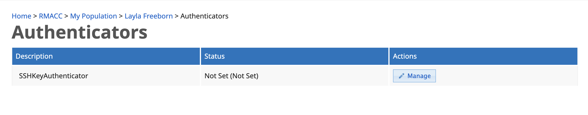
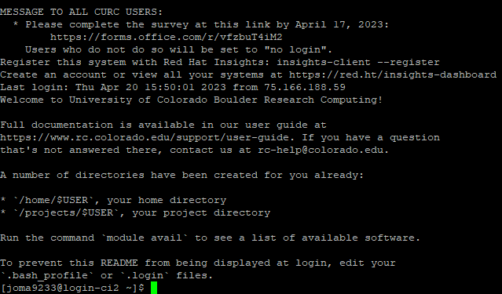

## Login Instructions for CU Anschutz

### *Prerequisites:*
* If you do not already have an XSEDE/ACCESS account, follow the instructions [here]( https://identity.access-ci.org/new-user) for new user registration. Please direct any questions about new accounts to the ACCESS ticketing system (https://access-ci.atlassian.net/servicedesk/customer/portal/2/create/30).
* Sign and fill out CU Anschutz's Alpine form: https://ucdenverdata.formstack.com/forms/alpine_eua_and_intake
* You will receive an email from hpcsupport@cuanschutz.edu in approximately 1-2 weeks confirming your CURC account has been created.
* You must be connected to a CU Anschutz network or the CU Anshutz VPN.

.. note::
A download link for GlobalProtect VPN and setup instructions for CU Anschutz affiliates are available from https://www.ucdenver.edu/regression-testing/bootstrap-4-testing/tools-services/remote-access-vpn. 
Once the VPN is configured, a web login will require you to enter your CU Anschutz username and password and accept the Duo prompt.

### *Step 1: Enroll in the RMACC CILogon Registry*

Shortly after your CURC account is created (see bullet point above), you will receive an email from <registry@cilogon.org> inviting you to enroll in the RMACC Registry. 
<br>


Follow the invitation URL and click 'Accept'.


You will be automatically routed to the login page. Select 'ACCESS CI (XSEDE)' from the Identity Provider dropdown menu and click 'Log On'.
<br>


Enter your ACCESS/XSEDE username and password and click 'Login'.
<br>


<br>

Accept the Duo push from your device.

> **_IMPORTANT:_** You can move on to Step 2, but please make sure 10 minutes have elapsed between completing Step 1 and beginning Step 3.

### *Step 2: Generate an ssh key*

You are strongly encouraged to set a passphrase for your key pair. You will be prompted to enter the passphrase each time you log in. 

SSH Key Generation for Windows Users: 
Using command prompt, PowerShell, or Windows Terminal: https://www.howtogeek.com/762863/how-to-generate-ssh-keys-in-windows-10-and-windows-11/
Using PuTTY: https://devops.ionos.com/tutorials/use-ssh-keys-with-putty-on-windows/

SSH Key Generation for Mac Users: 
https://docs.tritondatacenter.com/public-cloud/getting-started/ssh-keys/generating-an-ssh-key-manually/manually-generating-your-ssh-key-in-mac-os-x


### *Step 3: Upload your ssh key to [registry.cilogon.org](https://registry.cilogon.org/registry/)*

After logging into [registry.cilogon.org](https://registry.cilogon.org/registry/) with your ACCESS 
credentials, click on the dropdown menu in the upper right hand corner by your name. 
Select 'MY PROFILE (RMACC)'.

Select 'Authenticators' from the menu on the right. 
<br>


<br>

Click 'Manage' in the SSHKeyAuthenticator row. 


Select 'Add SSH Key'.


Click 'Choose File'. If you store your SSH keys in a hidden directory (e.g. `~/.ssh`), it may be difficult to locate your public key using a Finder/File Explorer window. As a workaround, you can copy your public key to an easily discoverable location using the Terminal App/Windows Command Prompt: <br>`cp ~/.ssh/id_rsa.pub ~/Desktop`
<br>

Locate your __public__ key (`<keyname>.pub`) on your local drive, then click 'UPLOAD'.


<br>

A green message box will notify you that your SSH key was successfully added to your account.
<br>


After a few minutes you can proceed to Step 4.

### *Step 4: Sign in from a terminal or terminal emulator*
<br>

> **_NOTE:_** You must be on the University of Colorado Anschutz Medical Campus VPN or network. See *Prerequisites* above.

SSH into the CURC CI login node by entering the following in your terminal or terminal emulator:
```
ssh -i <privatekey_file> <username>@xsede.org@login-ci.rc.colorado.edu
```
The `-i` flag is used to point to the location of your __private__ key on your local system. The private key must correspond to the public key you uploaded to your RMACC CILogon profile.
For example, if I uploaded `id_rsa.pub` to my profile, I would login as such:
```
ssh -i ~/.ssh/id_rsa lrf20@xsede.org@login-ci.rc.colorado.edu
```

You will be prompted to enter your passphrase if you set one during key generation.


c) Once you are logged in, you will see the CURC Message of the Day and your prompt will change to `<username>@login-ci[1-2]`. The Message of the Day contains important information and reminders about CURC systems, so please take time to read this on regular basis.
<br>




### Deleting or Replacing SSH Keys in RMACC CILogon Registry

Log in at [registry.cilogon.org](https://registry.cilogon.org/registry/) and navigate to the 'Authenticators' section of your profile (see Step 3, above). Click 'Delete', then repeat the process for adding a new key. It will take a few minutes before you can log in with your new key.


### Troubleshooting

* If you receive an error message indicating that you are not in the COmanage registry (see screenshot below), please email <rc-help@colorado.edu>.


<br>

<br>

<br>

Alpine is jointly funded by the University of Colorado Boulder, the University of Colorado Anschutz, Colorado State University, and the National Science Foundation (award 2201538).

Couldn't find what you need? [Provide feedback on these docs!](https://forms.gle/bSQEeFrdvyeQWPtW9)
