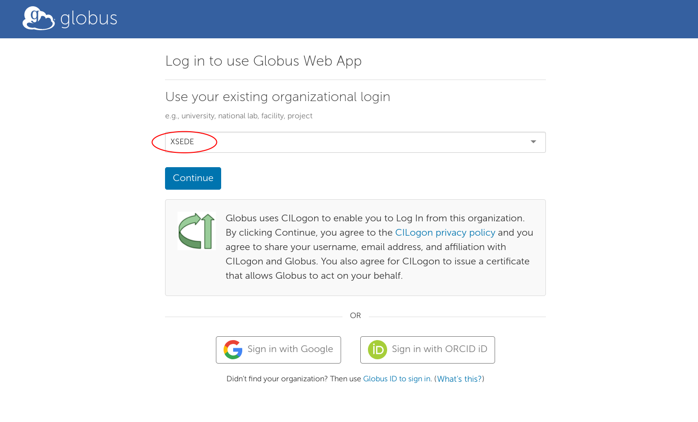

## RMACC Access to Summit

If you are at an RMACC institution other than CU Boulder or CSU and would like to use Summit, please see the below steps to apply for access.  


### Getting an XSEDE account

Visit the [XSEDE User Portal](https://portal.xsede.org) and use the “Create Account” button. Complete the form and follow the instructions to create an XSEDE account. As part of the process, you will select an XSEDE username, which will be used to access the XSEDE User Portal and the XSEDE SSO Hub.

  

  

### Configuring Duo

Once your XSEDE account has been created, follow the [Multi-Factor Authentication setup instructions on the XSEDE website](https://portal.xsede.org/mfa). Multi-factor authentication with Duo is required for access to the XSEDE SSO Hub, which provides access to RMACC Summit.


### Getting authorization for RMACC Summit

Send an email from your institutional email address to <rc-help@colorado.edu> requesting access to RMACC Summit via XSEDE. Include the full name of your home institution, specific department within the institution, a short summary of why you require access to RMACC Summit, and your XSEDE username. You will receive a response indicating whether your account has been added to the rmacc-summit.colorado.xsede.org project.

> _Note: Some institutions may require additional setup (verification or paperwork from their users accessing Summit) which may require additional time._

### Logging in to CU Boulder RC using the XSEDE SSO Hub

Use an [ssh client](../access/logging-in.html#logging-in-from-a-windows-machine) to connect to the XSEDE SSO Hub using your XSEDE credentials. You will be prompted to authenticate both using your XSEDE password and via Duo.

```
ssh -l <your-xsede-username> login.xsede.org
```

From there, use gsissh (available in the SSO Hub environment) to log into rmacc-summit, which serves as an alias for the CU Boulder RC login environment. [More information on the XSEDE SSO hub](https://portal.xsede.org/web/xup/single-sign-on-hub).

<!---->

```
gsissh rmacc-summit
```
#### Login example from Mac terminal:

1. user1234 first logs into the XSEDE SSO Hub from their terminal application, using a Duo Mobile push (option 1) for authentication:
	```
	$ ssh -l user1234 login.xsede.org

	Please login to this system using your XSEDE username and password:
	password:
	Duo two-factor login for user1234 

	Enter a passcode or select one of the following options:

	 1. Duo Push to XXX-XXX-1234
	 2. Phone call to XXX-XXX-1234

	Passcode or option (1-2): 1
	Success. Logging you in...
	#  Welcome to the XSEDE Single Sign-On (SSO) Hub!
	...
	[user1234@ssohub ~]$
	```
2. user1234 then logs into rmacc-summit using `gsissh`:
	```
	[user1234@ssohub ~]$ gsissh rmacc-summit
	Welcome to CU-Boulder Research Computing.
	...
	[user1234@xsede.org@login13 ~]$
	```
	user1234 is now logged into a Research Computing login node, which serves as a gateway to both Summit and Blanca.

### Data Transfer

Traditional command line file transfer tools such as scp, sftp, and rsync won't work for xsede users because they cannot bypass the XSEDE SSO. For that reason, **Globus is the RC recommended data transfer method** for XSEDE users. 

[Sign into Globus Connect](https://www.globus.org/app/login) by selecting `XSEDE` from the dropdown menu and by logging in using your XSEDE username and password.
> **_Note:_** As an XSEDE user, you **must** use the `XSEDE` oganization option to login to Globus and **not** the `University of Colorado at Boulder` option.



Once you are logged into Globus and have your personal endpoint established, you can connect to our filesystems using the "CU Research Computing XSEDE Endpoint". Further instructions to setup Globus endpoints, configuring a local endpoint, and Globus shared collections can be found [here](../compute/data-transfer.html#globus). 

### Other useful information

* [Your personal directories](../compute/filesystems.html)
* [Available software (modules)](../compute/modules.html)
* [Compiling software](../compute/compiling.html)
* [Node Types](../compute/node-types.html)


Couldn't find what you need? [Provide feedback on these docs!](https://forms.gle/bSQEeFrdvyeQWPtW9)
