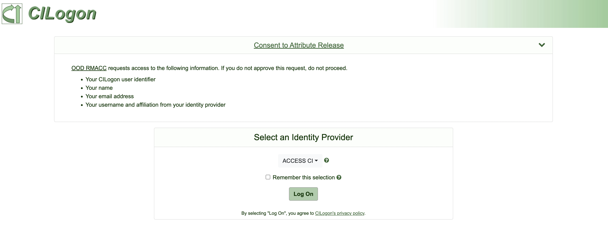
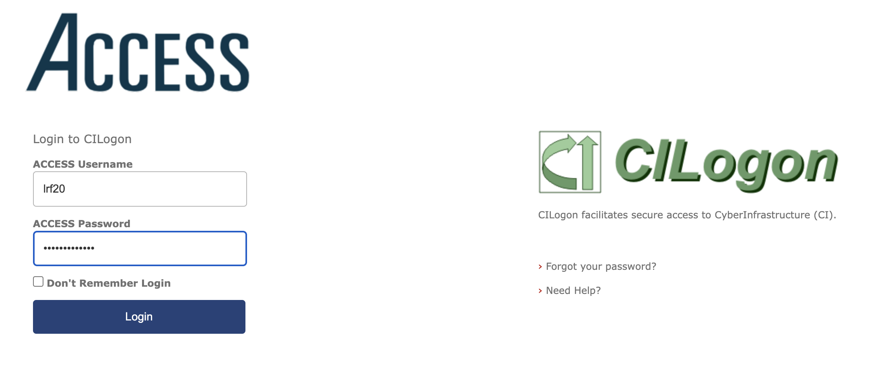
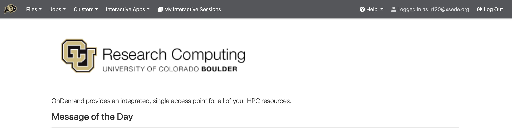
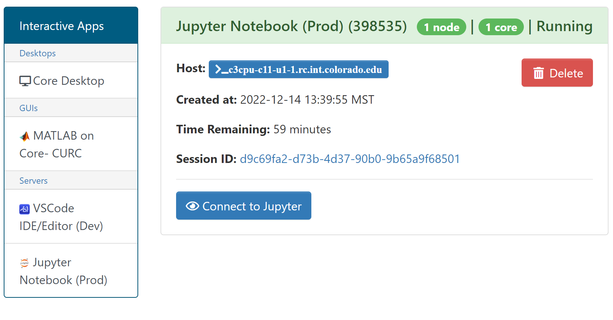
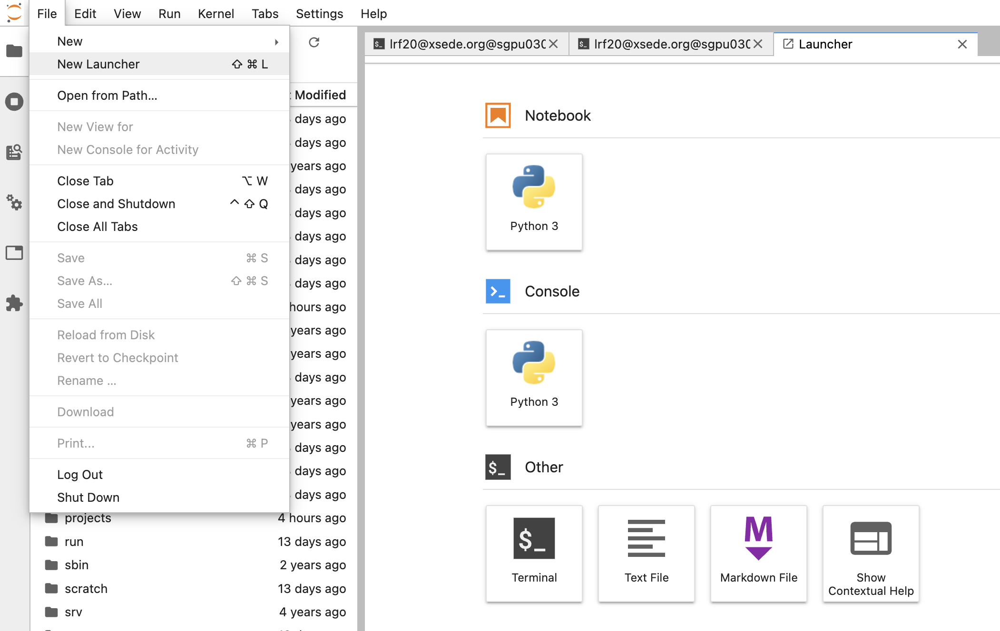

# RMACC Access to Summit 

Starting September 1, 2022, when XSEDE transitions to ACCESS, Rocky Mountain Advanced Computing Consortium (RMACC) members will be unable to use the XSEDE SSO Hub to log in to CURC systems. To this end, CURC has leveraged the power and convenience of Open OnDemand to provide RMACC users with streamlined access to our resources.

Note: This documentation assumes that **prior to August 23, 2022** you have (1) an XSEDE account, (2) Duo two-factor authentication configured through XSEDE, and (3) authorization to RMACC Summit. 

**We will provide updated instructions for creating and using ACCESS accounts after the new User Portal launches.**

## Logging in to Open OnDemand

- Visit [https://ondemand-rmacc.rc.colorado.edu](url).
You will be redirected to CILogon.

- Select "ACCESS CI" from the list of identity providers then "Log On". This will redirect you to the ACCESS login page. 
 

- Enter your XSEDE username and password.
- Select "Login", then accept the Duo push notification from your device to be directed to the RMACC Open OnDemand homepage.

 

## Shell Access to Summit Compute Nodes  

**The shells visible in the 'Clusters' dropdown menu are currently unavailable. Shell access is only available through the JupyterHub terminal.**

- Select "Jupyter Notebook (Summit)" from the drop-down list under _Interactive Apps_.
- Enter the desired number of hours and nodes. Leaving the account and partition fields empty will default to the `ucb-general` account and the `shas` partition. 
- Once the interactive session begins running, you can access the terminal in two ways:
    1. click on the blue button next to **Host:**. This will launch a shell in a new browser tab. 
    2. select "Connect to Jupyter" to start a Notebook, then click "Terminal" in the launcher tab. You can open additional terminal tabs from the _File_ menu (_File_ -> _New Launcher_).

 

### Other Features and Tools

Additional features and tools in RMACC Open OnDemand are under active development. Please see [CURC Open OnDemand documentation](https://curc.readthedocs.io/en/latest/gateways/OnDemand.html?highlight=Open%20OnDemand#jobs) for information about monitoring, creating, and editing jobs using the _Jobs_
menu. 
  
**_Notes on data transfer_**:
  - `scp` and Globus are currently unavailable to RMACC users
  - File transfer using Open OnDemand's _Files_ menu is  limited to < 10 GB per file

  

**_Notes on logging out_**:

- You must **completely quit your browser in order for “logout” to occur**. If after reopening your browser you are still logged in, please clear your cookies. If you are on a Chromebook or Chromebox, you will need to reboot your device in order to “quit the browser” and thus “logout”.
- **Using a “private browsing mode”** window while using OnDemand is a great way to handle “auto-logout”, as closing your browser window will remove all associated cookies and session information.

 

Couldn’t find what you need? [Provide feedback on these docs!](https://docs.google.com/forms/d/e/1FAIpQLSeaoraGl8x_ubyGNEYe3WP2cw_wg6aZM7Dy0v4X5s2ND-06RA/viewform)
