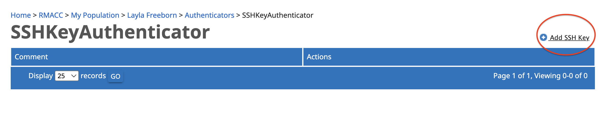
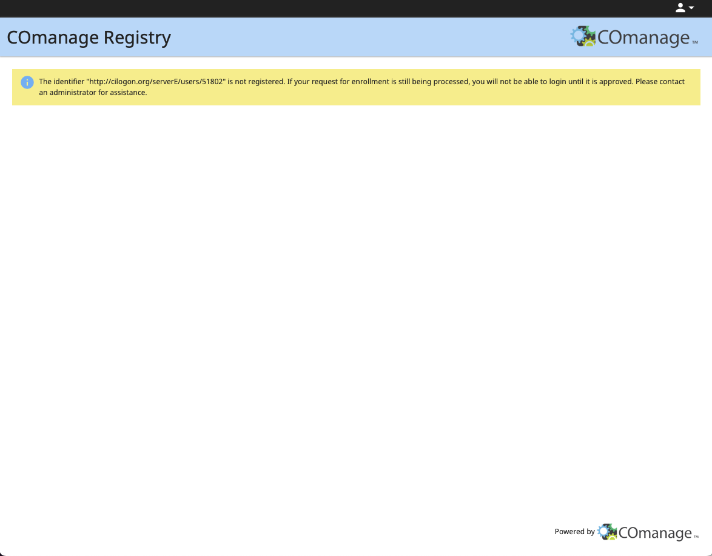

# SSH Key-Based Authentication for Anschutz Medical Campus 

Anschutz Medical Campus users can access the Alpine Supercomputer using ssh keys. Please contact <hpcsupport@cuanschutz.edu> to initiate this process.

## *Prerequisites:*
* You must have a valid CURC account to access Alpine. For instructions on obtaining a CURC account, please follow our [Getting a CURC account](../getting_started/logging-in.html?tabset-logging-in=logging-in-amc#tabset-ref-get-account){.external} documentation under the AMC tab.
* Make sure to fill out the Alpine Anschutz ssh request form: : <https://ucdenverdata.formstack.com/forms/Alpine_ssh_request_form>
* Ssh on-boarding meetings are hosted monthly. You will not be able to get ssh access until you attend this meeting. You can notify the team you are interested in attending the next on-boarding session by emailing us at hpcsupport@cuanschutz.edu. Also feel free to reach out should you have any questions!
* You must be connected to the CU Anschutz Wi-Fi network or the CU Anschutz VPN for Alpine ssh to work.

Steps 1-4 below should be completed during an on-boarding zoom session with a team member present


```{note}
A download link for GlobalProtect VPN and setup instructions for CU Anschutz affiliates are available from <https://www.cuanschutz.edu/offices/office-of-information-technology/tools-services/remote-access-vpn>. Once the VPN is configured, a web login will require you to enter your CU Anschutz username and password and accept the Duo prompt.
```

## *Step 1: Enroll in the RMACC CILogon Registry*

You will receive an email from <registry@cilogon.org> inviting you to enroll in the RMACC Registry. 
<br>


Follow the invitation URL and click "Accept". __The invitation link becomes invalid once you click "Accept", so complete all of [Step 1](#step-1-enroll-in-the-rmacc-cilogon-registry) before closing your browser tab.__ 


You will be automatically routed to the login page. Select "ACCESS CI (XSEDE)" from the Identity Provider dropdown menu and click "Log On".
<br>


Enter your ACCESS/XSEDE username and password and click "Login".
<br>


<br>

Accept the Duo push from your device.

```{important}
You can move on to [Step 2](#step-2-generate-an-ssh-key), but please make sure 10 minutes have elapsed between completing [Step 1](#step-1-enroll-in-the-rmacc-cilogon-registry) and beginning [Step 3](#step-3-upload-your-ssh-key-to-registrycilogonorg).
```
## *Step 2: Generate an ssh key*

You are strongly encouraged to set a passphrase for your key pair. You will be prompted to enter the passphrase each time you log in. 

SSH Key Generation for Windows Users: 
- Using the command prompt, PowerShell, or Windows Terminal: <https://www.howtogeek.com/762863/how-to-generate-ssh-keys-in-windows-10-and-windows-11/>
- Using PuTTY: <https://devops.ionos.com/tutorials/use-ssh-keys-with-putty-on-windows/>

SSH Key Generation for Mac Users: 
<https://docs.tritondatacenter.com/public-cloud/getting-started/ssh-keys/generating-an-ssh-key-manually/manually-generating-your-ssh-key-in-mac-os-x>


## *Step 3: Upload your ssh key to [registry.cilogon.org](https://registry.cilogon.org/registry/)*

After logging into [registry.cilogon.org](https://registry.cilogon.org/registry/) with your ACCESS 
credentials, click on the dropdown menu in the upper right-hand corner by your name. 
Select "MY PROFILE (RMACC)".

Select "Authenticators" from the menu on the right. 
<br>


<br>

Click "Manage" in the SSHKeyAuthenticator row. 


Select "Add SSH Key".


Click "Choose File". If you store your SSH keys in a hidden directory (e.g. `~/.ssh`), it may be difficult to locate your public key using a Finder/File Explorer window. As a workaround, you can copy your public key to an easily discoverable location using the Terminal App/Windows Command Prompt: <br>`cp ~/.ssh/id_rsa.pub ~/Desktop`
<br>

Locate your __public__ key (`<keyname>.pub`) on your local drive, then click "UPLOAD".


<br>

A green message box will notify you that your SSH key has been successfully added to your account.
<br>


After a few minutes, you can proceed to [Step 4](#step-4-sign-in-from-a-terminal-or-terminal-emulator).

## *Step 4: Sign in from a terminal or terminal emulator*

```{warning}
You must be on the University of Colorado Anschutz Medical Campus VPN or network. See [prerequisites](#prerequisites) above.
```

SSH into the CURC CI login node by entering the following in your terminal or terminal emulator:
```
ssh -i <privatekey_file> <username>@xsede.org@login-ci.rc.colorado.edu
```
The `-i` flag is used to point to the location of your __private__ key on your local system. The private key must correspond to the public key you uploaded to your RMACC CILogon profile.
For example, if I uploaded `id_rsa.pub` to my profile, I would log in as such:
```
ssh -i ~/.ssh/id_rsa lrf20@xsede.org@login-ci.rc.colorado.edu
```

You will be prompted to enter your passphrase if you set one during key generation.


Once you are logged in, you will see the CURC Message of the Day and your prompt will change to `<username>@login-ci[1-2]`. The Message of the Day contains important information and reminders about CURC systems, so please take time to read this on a regular basis.
<br>


## Deleting or Replacing SSH Keys in RMACC CILogon Registry

Log in at [registry.cilogon.org](https://registry.cilogon.org/registry/) and navigate to the "Authenticators" section of your profile (see [Step 3](#step-3-upload-your-ssh-key-to-registrycilogonorg), above). Click "Delete", then repeat the process for adding a new key. It will take a few minutes before you can log in with your new key.


## Troubleshooting

* If you are able to get through [Step 3](#step-3-upload-your-ssh-key-to-registrycilogonorg) but unable to ssh in from your terminal, check that the ssh key in your command is the same key you uploaded to the registry.
* If you are prompted for a **__passphrase__** (not a password) when signing in from your terminal, this refers to the passphrase you set when you generated your ssh key. If you don't remember it then you will have to generate and upload a new ssh key to the registry. If you are prompted for a **__password__**, please contact <rc-help@colorado.edu>, as this indicates an issue with your CILogon enrollment. Please include a screenshot of the error message and the date/time of your last login attempt.
* If you receive an error message indicating that you are not in the COmanage registry (see screenshot below), please email <rc-help@colorado.edu>. Please include a screenshot of the error message and the date/time of your last login attempt.


<br>

<br>

<br>

Alpine is jointly funded by the University of Colorado Boulder, the University of Colorado Anschutz, Colorado State University, and the National Science Foundation (award 2201538).

