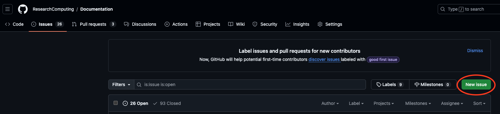
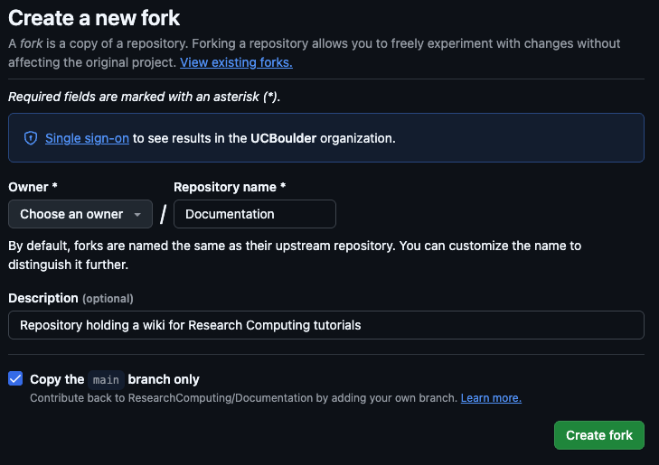
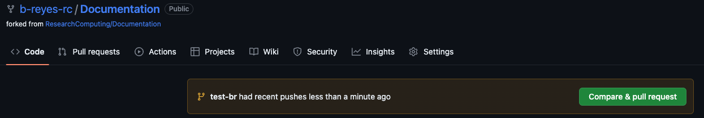
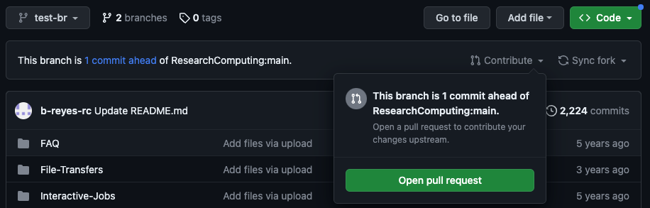
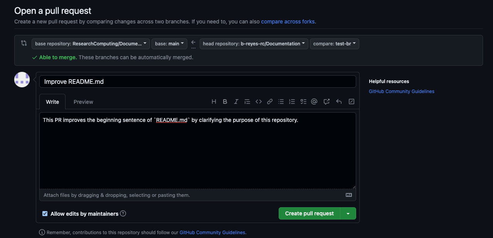
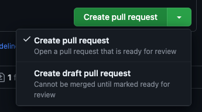
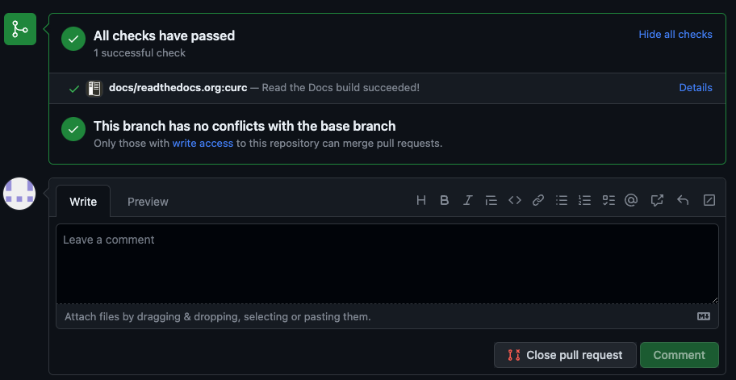
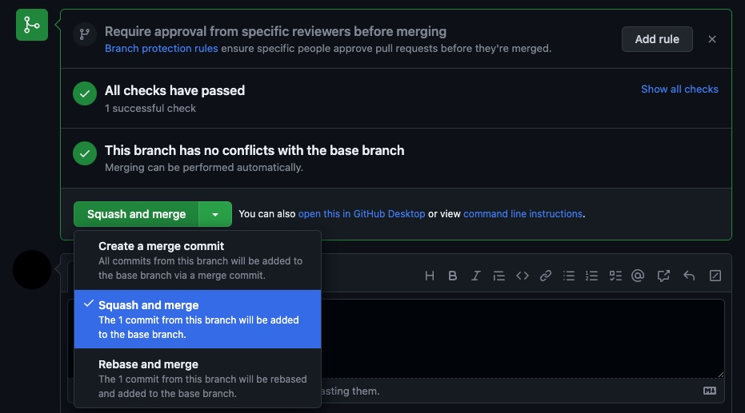
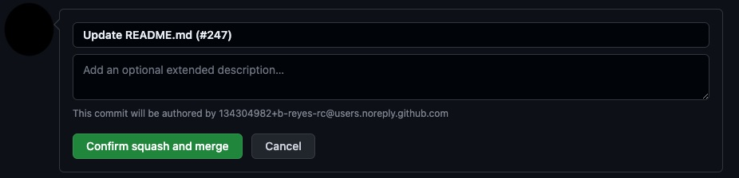

# Contributing to CURC Documentation 

At CURC we welcome all contributions. If you see something within our documentation that is not correct, can be improved, or if you have an idea for content, then [GitHub issues](https://docs.github.com/en/issues/tracking-your-work-with-issues/about-issues) are a great way to let your voice be heard and contribute to our documentation! See [Submitting an issue ](#submitting-an-issue) below for more information. Although not necessary, if you would like to personally make changes to documentation and submit them for our review, you can do this through [pull requests (PRs)](https://docs.github.com/en/pull-requests/collaborating-with-pull-requests/proposing-changes-to-your-work-with-pull-requests/about-pull-requests). For more information on making pull requests and associated guidelines, please see [Submitting pull requests ](#submitting-pull-requests) below.  

## Submitting an issue 

Before creating a new issue, please review all currently open and closed issues by navigating to our [GitHub issues](https://github.com/ResearchComputing/Documentation/issues) page. If you do not see an issue that addresses your topic, you can create a new issue by following the details in the drop-down box below.

::::{dropdown} Click to show details on creating an issue
:icon: mark-github

Creating an issue is straightforward. To create an issue, first navigate to our [GitHub issues](https://github.com/ResearchComputing/Documentation/issues) page, select the green **"New Issue"** button, and login into your GitHub account.



Once the new issue screen has been opened, please fill out the following two items: 
- [ ] In the **"Add a title"** section, create a succinct title for your issue that clearly states what the issue is about. 
- [ ] In the **"Add a description"** section, provide a description of what you would like this issue to address. Please provide as much detail as possible. 
    - For content that is not correct, provide the page and content that is incorrect and what you believe should be provided. 
    - If you believe some content can be improved, provide the page(s) where this content is and state how you think it could be improved. 
    - For ideas you have for content, please provide where you think this would best fit in the documentation and what the structure of this content would look like. 

Once you have completed the above items, you can submit the issue by selecting the green **"Submit new issue"** button. 

::::

## Submitting pull requests 

Before creating a pull request please review all guidelines provided in the [CURC documentation guidelines](#curc-documentation-guidelines) section below. For those individuals who have not submitted a pull request before or need a refresher on this process, please see the content in the drop-down box below. 

::::{dropdown} Click to show steps for creating a pull request 
:icon: git-pull-request

1. **Fork the Documentation:** The first time you follow this process you will need to fork the RC documentation repo. Once forked, you will not need to fork again.
    
    **To fork:** 
    - Navigate to [ResearchComputing/Documentation](https://github.com/ResearchComputing/Documentation) and make sure that you are signed into your GitHub account
    - Click the **"Fork"** button in the upper right corner of the page

        

    - You may then leave all of the default settings (select yourself as the owner) and click the green button **"Create fork"**
    
        

    - Once executed, this will create your own version of the Documentation repo under your GitHub

2. **Create a new feature branch:** This can be done by cloning the **forked** repo locally and creating a branch (using `git checkout -b mybranch main`) or using the drop-down menu for the branch on GitHub.
    :::{note}
    If you choose to clone to your local computer, be sure to do one of the following:
    - `git remote add upstream https://github.com/ResearchComputing/Documentation.git` if you are **not** using ssh keys
    - `git remote add upstream git@github.com:ResearchComputing/Documentation.git` if you are using ssh keys
    - You should almost always create a new branch using the **“main”** branch (unless you are trying to change older versions)
    - Name your branch something specific to the change you will be making, e.g. **“add_alpine_docs”** or **“update_petalibrary_docs”**
    :::

3. **Make changes/additions** to your feature branch:
    - Try to keep changes/additions small. This will help keep things manageable especially if there are multiple folks working on docs.
    - If you are working locally, you will need to perform a `git add`

4. **Commit any changes** with relevant commit messages

5. **Push commits**, if you are working on your local version and not on GitHub. On GitHub, once you commit the changes will be automatically **"pushed"**

6. **Create a pull request:** By creating a pull request, this allows others the chance to review or comment on your additions. Additionally, once a pull request is created the documentation will also be generated.

    **Opening a pull request** from GitHub can be done in one of two ways:
    - If you have just committed and pushed you will see the following message in your forked repo (**this will disappear after some time**), click on **"Compare & pull request"**

        

    - If the above message has disappeared, you can also open a pull request by selecting your branch clicking the drop-down **"Contribute"** menu and then clicking on **"Open pull request"**

        

    **Creating the pull request** from GitHub can be done once you have opened up the pull request and have added a descriptive title and description by selecting the **"Create pull request"** button

    

    :::{important}
    - Make sure that you are merging into the **"main"** branch of the official repository
    - If the changes you have made are not done, you can also choose to create a draft pull request. This notifies others that the pull request is in progress. To do this select **"Create draft pull request"** from the green drop-down

        

    :::

7. **View documentation:** The rendered documentation for the changes in the pull request can be seen once the pull request has been created. To view them go to the bottom of the pull request and select **"show all checks"** and then select **"Details"** next to the readthedocs check. This will automatically open up the documentation (you can right click and open up this in a new tab if you want).

    

8. **Ready to merge:** If you have the appropriate permissions and all checks have passed, you can then **squash and merge** in your changes. This can be done by selecting the **"Squash and merge"** option from the drop-down menu and then clicking it.

    

    Once **"Squash and merge"** has been selected, you can merge in the pull request by selecting **"Confirm squash and merge"**:

    

    :::{note}
    - The PR branch must be up-to-date with the base branch (**"main"**).
    - All conflicts with the **"main"** branch must be resolved. 
    - At least one review needs to be completed and all comments addressed. 
    - Be sure to delete the old branch in your forked repository, if you do not want to keep it anymore.
    :::

9. Once the PR has been merged, changes typically take 10-15 minutes to propagate to the official documentation page

10. **Sync fork with upstream:** once the PR has been merged into **"main"**, it is good practice to sync your fork with the upstream repository. This can be done via the command line as follows: 
    ```
    cd <path-to-forked-repository>
    git checkout main
    git pull upstream main
    git push origin main 
    ```

::::

### CURC documentation guidelines 

To ensure that our documentation is uniform and is easily digestible for users, please ensure that all documentation changes adhere to the following guidelines. 

```{tip}
- These guidelines are always evolving, please refer to them each time you add documentation. 
- Click the boxes below to add or remove a check mark.
```

- [ ] Ensure that formatting and styling look good in both light and dark mode, in addition to, widescreen and mobile views of the documentation. 
- [ ] When referencing material provided in this documentation, please use an appropriate cross-reference. For more information on creating these references, please expand the drop-down box below. 
    ::::{dropdown} Click to show how to cross-reference documentation
    :icon: note
    By referencing documentation correctly, our build scripts are able to detect broken links. To correctly reference other documentation pages or sections, please use a relative path. For example, let's say we are on the page `docs/getting_started/logging-in.md` and we want to reference the main Alpine page. To do this, we would utilize the following cross-reference: 
    ```
    [Alpine](../clusters/alpine/index.md)
    ```
    Now, let's say that we want to reference a particular heading on a page. To do this, we can append `#` along with the section title (all in lower-case, with punctuation marks removed, and spaces replaced with `-`). For example, if we are trying to reference the section **"What should I read next?"** on the Open OnDemand index page, we would do the following:
    ```
    [What should I read next?](../open_ondemand/index.md#what-should-i-read-next)
    ```
    ::::
- [ ] Define any acronyms when they are first introduced.
- [ ] If there is a related topic in our documentation, link to it.
- [ ] Avoid links such as `[here]()` instead of using `here`, provide a title. 
- [ ] For each new topic, provide at least a small introduction to the topic. The focus is on informing the user in a complete and clear way, not just stating information. 
- [ ] When adding images, create a folder for common images and make it have the suffix `_images`. Additionally, make sure that each image is clearly labelled. 
- [ ] No file in the documentation should have spaces in the file name. Instead of using spaces `_` should be used. 
- [ ] Put all FAQs on the main FAQ page (`docs/getting_started/faq.md`). Please put the question under the appropriate section and create a section, if necessary. 
- [ ] Any reference to code filepaths or directories should be highlighted using the code syntax i.e. the back ticks.
- [ ] Ensure all flowcharts are integrated into the documentation correctly. Items to consider when integrating flowcharts into the documentation can be viewed in the drop-down box below. 
    :::::{dropdown} Click to show how to include flowcharts
    :icon: note

    Although there exists a Graphviz extension for Sphinx, it is not adequate. For example, it does not allow 
    you to easily modify the background color of the graphs or make them transparent. Additionally, removing 
    built-in functionality like tooltips is not possible. To make these flowcharts as customizable as possible, 
    we build all flowcharts using `dot`, the main software used for standard Graphviz graphs. The software `dot`
    will then generate an SVG image that is highly customizable. The major drawback to this is that we have to 
    create these flowcharts according to a specific structure. Below we provide key items that must be completed 
    when integrating a flowchart into the documentation. 

    - [ ] All flowcharts (graphs) should be created from a `.dot` file. For more information on creating `.dot` files, 
    please see [Graphviz's documentation](https://graphviz.org/doc/info/lang.html). 

    - [ ] All `.dot` files must be put in the path `graphviz_flowcharts/dot_files` and must have an extension of `.dot`.
        - This is incredibly important because there are automatic routines that will generate an SVG for you and put it 
        in the directory `graphviz_flowcharts/generated_images`.

    - [ ] To reference a flowchart you have created within the documentation, you should point to the file under 
    `graphviz_flowcharts/generated_images` (using a relative path) and import it as a raw file using rst. For example, 
    in `docs/getting_started/navigating_docs.md` we reference the HPC flowchart as follows: 
        ````
        ```{eval-rst}
        .. raw:: html
            :file: ../../graphviz_flowcharts/generated_images/getting_started_hpc_flowchart.svg
        ```
        ````

    - [ ] You can make graph nodes clickable and once clicked, they will navigate to a page. However, this must be in a specific format. 
    For example, to create a node with label `CURC Policies` that opens a new page that links to our internal documentation, you 
    would add a node `policies` with the following format. 
        ```
        policies [label="CURC Policies", href="../additional-resources/policies.html", target="_blank", id="clickable"];
        ```
        - Note that the provided `href` MUST BE a relative path from the file you are referencing the SVG from AND you must 
        use `.html` NOT `.md`.
        - The `href` must be in this style so that our custom check can ensure that a reference exists. 

    - [ ] So that styling of the flowcharts is consistent with all other documentation, we suggest the following be included in 
    your dot file:
        ```
        bgcolor="transparent";
        ranksep="0.5 equally";
        graph [id="doc-flowchart"];
        node [fontname="Verdana", fontsize="12", color="#CFB87C", style="filled", fillcolor="#121212", penwidth="2", fontcolor="white"];
        edge [color="#CFB87C", fillcolor="#121212", penwidth="1.5"];
        ```

    ::::: 


- [ ] Use tabs where appropriate. Tabs can be really powerful at separating information so that it is more digestible for the user. All tabs should fit a particular structure. For more information on this structure, click the drop-down box below. 
    :::::::{dropdown} Click to show how to format tabs
    :icon: note

    For our tabs we use [sphinx-design tabs](https://sphinx-design.readthedocs.io/en/furo-theme/tabs.html). These tabs look better than normal tabs and they also allow you to reference tabs throughout our documentation. To allow these tabs to be referenced, it is best if all tabs are in a specific format. Below we provide what format these tabs should be in, an example of tabs, and how to reference these tabs. 

    - [ ] A reference to the tabset should be included e.g. `(tabset-ref-<descriptive-name>)=`.
    - [ ] The `:sync-group:` should be included and start with `tabset` followed by the descriptive name you choose e.g. `:sync-group: tabset-<descriptive-name>`.
    - [ ] Each tab should include a `:sync:` and begin with the descriptive name followed by a way to reference the tab e.g. `:sync: <descriptive-name>-<tab-name>`

        **Example tab syntax:**
        ``````
        (tabset-ref-curc-contrib)=
        `````{tab-set}
        :sync-group: tabset-curc-contrib

        ````{tab-item} CU Boulder
        :sync: curc-contrib-ucb

        CU Boulder specific items

        ````

        ````{tab-item} RMACC
        :sync: curc-contrib-rmacc

        RMACC specific items

        ```{tip}
        You can use admonition and code blocks within tabs!
        ```

        ````
        `````
        ``````

        **Rendered example tabs:**

        (tabset-ref-curc-contrib)=
        `````{tab-set}
        :sync-group: tabset-curc-contrib

        ````{tab-item} CU Boulder
        :sync: curc-contrib-ucb

        CU Boulder specific items

        ````

        ````{tab-item} RMACC
        :sync: curc-contrib-rmacc

        RMACC specific items

        ```{tip}
        You can use admonition and code blocks within tabs!
        ```

        ````
        `````

        **Referencing tabs:**

        Using the above format, we can now reference tabs. We have an automatic routine that checks tab references exist. For this code to work as intended, the references must be in a specific format. 

        - To reference tabs within the same page, utilize the following in the markdown reference followed by `{.external}`:
            ````
            ?tabset-<descriptive-name>=<descriptive-name>-<tab-name>#tabset-ref-<descriptive-name>
            ````
            For example, we can reference our example tabs using 
            ```
            [example RMACC tab](?tabset-curc-contrib=curc-contrib-rmacc#tabset-ref-curc-contrib){.external}
            ```
            Providing the rendered version: [example RMACC tab](?tabset-curc-contrib=curc-contrib-rmacc#tabset-ref-curc-contrib){.external}. 
        - To reference tabs on another page, utilize the following in the markdown reference followed by `{.external}`: 
            ````
            ./relative/path/to/page.html?tabset-<descriptive-name>=<descriptive-name>-<tab-name>#tabset-ref-<descriptive-name>
            ````
            For example, we can reference the tabs in the logging in page using
            ````
            [getting a CURC account for CSU users](../getting_started/logging-in.html?tabset-logging-in=logging-in-csu#tabset-ref-get-account){.external}
            ````
            Providing the rendered version: [getting a CURC account for CSU users](../getting_started/logging-in.html?tabset-logging-in=logging-in-csu#tabset-ref-get-account){.external}. 

    :::::::

- [ ] admonitions 
- [ ] Use double quotes, it is best to bold this using `**<content>**`
- [ ] Inserting an image 
- [ ] Using a drop-down box. 

