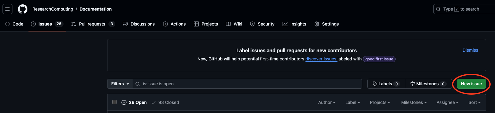
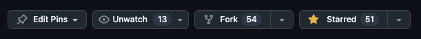
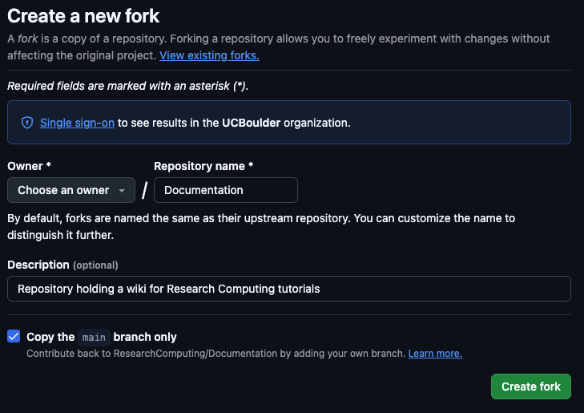
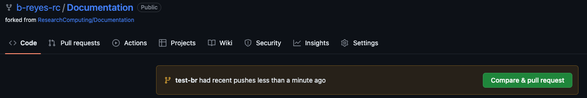
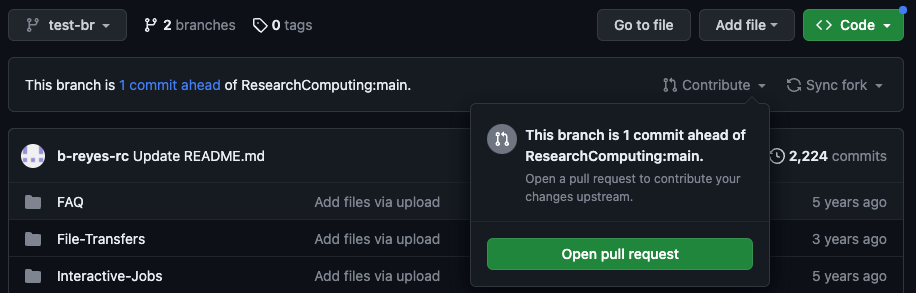
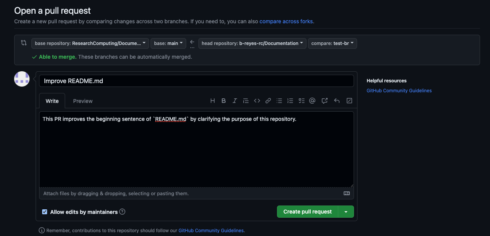
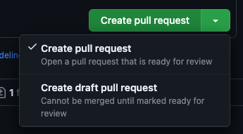
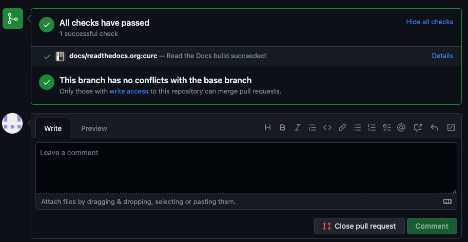
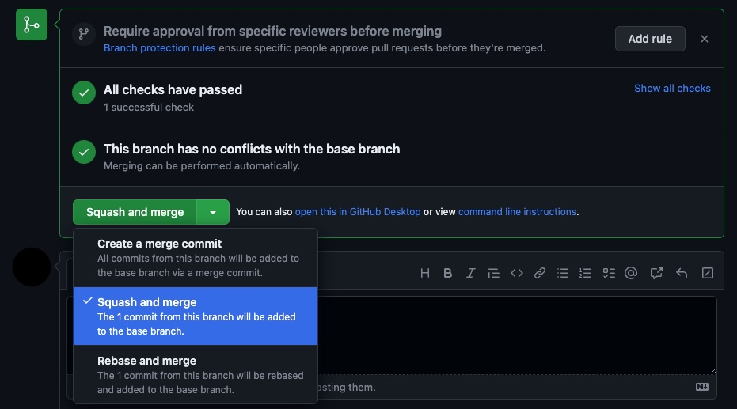
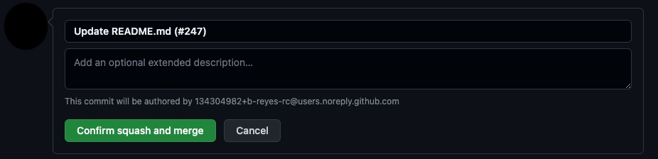

# Contributing to CURC Documentation 

At CURC we welcome all contributions. If you see something within our documentation that is not correct, can be improved, or if you have an idea for content, then [GitHub issues](https://docs.github.com/en/issues/tracking-your-work-with-issues/about-issues) are a great way to let your voice be heard and contribute to our documentation! See [Submitting an issue ](#submitting-an-issue) below for more information. Although not necessary, if you would like to personally make changes to documentation and submit them for our review, you can do this through [pull requests (PRs)](https://docs.github.com/en/pull-requests/collaborating-with-pull-requests/proposing-changes-to-your-work-with-pull-requests/about-pull-requests). For more information on making pull requests and associated guidelines, please see [Submitting pull requests ](#submitting-pull-requests) below.  

## Submitting an issue 

Before creating a new issue, please review all currently open and closed issues by navigating to our [GitHub issues](https://github.com/ResearchComputing/Documentation/issues) page. If you do not see an issue that addresses your topic, you can create a new issue by following the details in the drop-down box below.

::::{dropdown} Show details on creating an issue
:icon: mark-github

Creating an issue is straightforward. To create an issue, first navigate to our [GitHub issues](https://github.com/ResearchComputing/Documentation/issues) page, select the green **"New Issue"** button, and login into your GitHub account.



Once the new issue screen has been opened, please fill out the following two items: 
- [ ] In the **"Add a title"** section, create a succinct title for your issue that clearly states what the issue is about. 
- [ ] In the **"Add a description"** section, provide a description of what you would like this issue to address. Please provide as much detail as possible. 
    - For content that is not correct, provide the page and content that is incorrect and what you believe should be provided. 
    - If you believe some content can be improved, provide the page(s) where this content is and state how you think it could be improved. 
    - For ideas you have for content, please provide where you think this would best fit in the documentation and what the structure of this content would look like. 

Once you have completed the above items, you can submit the issue by selecting the green **"Submit new issue"** button. 

::::

## Submitting pull requests 

Before creating a pull request please review all guidelines provided in the [CURC documentation guidelines](#curc-documentation-guidelines) section below. For those individuals who have not submitted a pull request before or need a refresher on this process, please see the content in the drop-down box below. 

::::{dropdown} Show steps for creating a pull request 
:icon: git-pull-request

1. **Fork the Documentation:** The first time you follow this process you will need to fork the RC documentation repo. Once forked, you will not need to fork again.
    
    **To fork:** 
    - Navigate to [ResearchComputing/Documentation](https://github.com/ResearchComputing/Documentation) and make sure that you are signed into your GitHub account
    - Click the **"Fork"** button in the upper right corner of the page

        

    - You may then leave all of the default settings (select yourself as the owner) and click the green button **"Create fork"**
    
        

    - Once executed, this will create your own version of the Documentation repo under your GitHub

2. **Create a new feature branch:** This can be done by cloning the **forked** repo locally and creating a branch (using `git checkout -b mybranch main`) or using the drop-down menu for the branch on GitHub.
    :::{note}
    If you choose to clone to your local computer, be sure to do one of the following:
    - `git remote add upstream https://github.com/ResearchComputing/Documentation.git` if you are **not** using ssh keys
    - `git remote add upstream git@github.com:ResearchComputing/Documentation.git` if you are using ssh keys
    - You should almost always create a new branch using the **“main”** branch (unless you are trying to change older versions)
    - Name your branch something specific to the change you will be making, e.g. **“add_alpine_docs”** or **“update_petalibrary_docs”**
    :::

3. **Make changes/additions** to your feature branch:
    - Try to keep changes/additions small. This will help keep things manageable, especially if there are multiple folks working on docs.
    - If you are working locally, you will need to perform a `git add`

4. **Commit any changes** with relevant commit messages

5. **Push commits**, if you are working on your local version and not on GitHub. On GitHub, once you commit, the changes will be automatically **"pushed"**

6. **Create a pull request:** By creating a pull request, this allows others the chance to review or comment on your additions. Additionally, once a pull request is created the documentation will also be generated.

    **Opening a pull request** from GitHub can be done in one of two ways:
    - If you have just committed and pushed, you will see the following message in your forked repo (**this will disappear after some time**). To create a pull request from here, click on **"Compare & pull request"**.

        

    - If the above message has disappeared, you can also open a pull request by selecting your branch, clicking the drop-down **"Contribute"** menu, and then clicking on **"Open pull request"**

        

    **Creating the pull request** from GitHub can be done once you have opened up the pull request and have added a descriptive title and description by selecting the **"Create pull request"** button.

    

    :::{important}
    - Make sure that you are merging into the **"main"** branch of the official repository.
    - If the changes you have made are not done, you can also choose to create a draft pull request. This notifies others that the pull request is in progress. To do this, select **"Create draft pull request"** from the green drop-down.

        

    :::

7. **View documentation:** The rendered documentation for the changes in the pull request can be seen once the pull request has been created. To view them go to the bottom of the pull request and select **"show all checks"** and then select **"Details"** next to the readthedocs check. This will automatically open up the documentation (you can right click and open up this in a new tab if you want).

    

8. **Ready to merge:** If you have the appropriate permissions and all checks have passed, you can then **squash and merge** in your changes. This can be done by selecting the **"Squash and merge"** option from the drop-down menu and then clicking it.

    

    Once **"Squash and merge"** has been selected, you can merge in the pull request by selecting **"Confirm squash and merge"**:

    

    :::{note}
    - The PR branch must be up-to-date with the base branch (**"main"**).
    - All conflicts with the **"main"** branch must be resolved. 
    - At least one review needs to be completed and all comments addressed. 
    - Be sure to delete the old branch in your forked repository, if you do not want to keep it anymore.
    :::

9. Once the PR has been merged, changes typically take 10-15 minutes to propagate to the official documentation page

10. **Sync fork with upstream:** once the PR has been merged into **"main"**, it is good practice to sync your fork with the upstream repository. This can be done via the command line as follows: 
    ```
    cd <path-to-forked-repository>
    git checkout main
    git pull upstream main
    git push origin main 
    ```

    :::{note}
    (CURC team members only) After merging documentation updates, make sure to add a link to the PR in the auto-generated Slack thread.
    :::

::::

### CURC documentation guidelines 

To ensure that our documentation is uniform and is easily digestible for users, please ensure that all documentation changes adhere to the following guidelines. 

```{tip}
- These guidelines are always evolving, please refer to them each time you add documentation. 

```

::::::{card} General Formatting 

:::::{dropdown} Writing Style 
:icon: pencil

- ***Readability***: Ensure that formatting and styling are readable in both light and dark mode, in addition to, widescreen and mobile views of the documentation. 
- ***Acronyms***: Define any acronyms when they are first introduced.
- ***Common Terms***: Ensure the following common terms utilize the approved spelling and style: 
    - High-Performance Computing : First letter is capitalized in each word and includes a hyphen
    - HPC : Acronym for High-Performance Computing. Each letter must be capitalized.
- ***Filepaths***: Any reference to filepaths or directories, like in code examples, should be highlighted using the code syntax i.e. the back ticks (`` ` ` ``).
- ***New Topics***: For each new topic, provide at least a small introduction to the topic. The focus is on informing the user in a complete and clear way, not just stating information. 

:::::


:::::{dropdown} File Organization 
:icon: file-directory-open-fill

- ***File Names***: Use underscores, not spaces, in multi-word file names (e.g. `` `file_name_here` ``).
- ***Image Directories***: When adding images, create a folder in the same subdirectory as the page(s) that will include the images. The images folder should have unique name with the suffix `_images` (e.g. `/training_images`)
- ***Frequently Asked Questions***: Put all FAQs on the main FAQ page (`docs/getting_started/faq.md`) under the appropriate section or, if necessary, under a new FAQ section.

:::::

:::::{dropdown} Links & References
:icon: link

- ***HyperLink Text***: Avoid links such as `[here]()` instead of using `here`, provide a title. For example, instead of saying "You can find more about sacct `[here]()`", explicitly state the linked page's title "You can find more iinformation on `[Slurm's sacct Documentation Page]()`.
- ***Related Topics & Cross-References***: If there is a related topic in our documentation, link to it using an appropriate cross-reference. Properly formatted cross-references ensure the documentation build scripts are able to detect and warn of broken links.   
    ::::{dropdown} How to include cross-references
    :icon: note
    To correctly reference other documentation pages or sections, please use a relative path. For example, let's say we are on the page `docs/getting_started/logging-in.md` and we want to reference the main Alpine page. To do this, we would utilize the following cross-reference: 
    ```
    [Alpine](../clusters/alpine/index.md)
    ```
    Now, let's say that we want to reference a particular heading on a page. To do this, we can append `#` along with the section title (all in lower-case, with punctuation marks removed, and spaces replaced with `-`). For example, if we are trying to reference the section **"What should I read next?"** on the Open OnDemand index page, we would do the following:
    ```
    [What should I read next?](../open_ondemand/index.md#what-should-i-read-next)
    ```
    ::::

:::::

::::::

::::::{card} Components

:::::{dropdown} Tabs
:icon: tab-external

Use tabs where appropriate. Tabs can be really powerful at separating information so that it is more digestible for the user. For our tabs we use [sphinx-design tabs](https://sphinx-design.readthedocs.io/en/furo-theme/tabs.html), which provide improved styling over normal tabs and the ability to reference specific tabs. Below we provide instructions for properly formatting and referencing tabs in our documentation. 

```````{grid} 2
``````{grid-item-card}  Example tabset syntax
    ``````
    (tabset-ref-curc-contrib)=
    `````{tab-set}
    :sync-group: tabset-curc-contrib

    ````{tab-item} CU Boulder
    :sync: curc-contrib-ucb

    CU Boulder specific items

    ````

    ````{tab-item} RMACC
    :sync: curc-contrib-rmacc

    RMACC specific items

    ```{tip}
    You can use admonition and code blocks within tabs!
    ```

    ````
    `````
    ``````

``````
``````{grid-item-card}  Rendered example tabset

(tabset-ref-curc-contrib)=
`````{tab-set}
:sync-group: tabset-curc-contrib

````{tab-item} CU Boulder
:sync: curc-contrib-ucb

CU Boulder specific items

````

````{tab-item} RMACC
:sync: curc-contrib-rmacc

RMACC specific items

```{tip}
You can use admonition and code blocks within tabs!
```

````
`````
``````
```````

**Referencing tabs** 

* In order to cross-reference and/or provide external links to specific tabs, you must include the following three fields in your tabsets: `(target)=`, `sync-group`, `sync`. Each field is described in the dropdown section below.

    ::::{dropdown} Tab fields explained

    | Field&nbsp;Name | Purpose |
    | ---------- | ------- |
    | ***(target)=*** | To cross-reference the tabset, you must add a target tag for the Myst parser. The naming convention for our tab targets is `(tabset-ref-<descriptive-name>)=`. You can learn more about targetes in [Myst's Online Documentation](https://myst-parser.readthedocs.io/en/v0.17.2/syntax/syntax.html#targets-and-cross-referencing). |
    | ***sync&#8209;group*** | The `:sync-group:` should be included and start with `tabset` followed by the descriptive name you choose e.g. `:sync-group: tabset-<descriptive-name>`. |
    | ***sync*** | Each tab should include a `:sync:` and begin with the descriptive name followed by a way to reference the tab e.g. `:sync: <descriptive-name>-<tab-name>` |

    ```{note}
    The `sync-group` and `sync` fields are primarily meant for syncing up tabs across multiple tabsets. For example, for the [login page](../getting_started/logging-in.md) the tabs are grouped by university (UCB, AMC, CSU, RMACCC). The `sync-group` and `sync` are currently also required to reference a specific tab within a tabset. So even if you are not syncing tabs across multiple tabsets, you should still add the `sync-group` and `sync` options to enable proper cross-references of tabs. 

    ```

    ::::
 
- To reference tabs within the same page, utilize the following in the markdown reference followed by `{.external}`:
    ````
    ?tabset-<descriptive-name>=<descriptive-name>-<tab-name>#tabset-ref-<descriptive-name>
    ````
    For example, we can reference our example tabs using 
    ```
    [example RMACC tab](?tabset-curc-contrib=curc-contrib-rmacc#tabset-ref-curc-contrib){.external}
    ```
    Providing the rendered version: [example RMACC tab](?tabset-curc-contrib=curc-contrib-rmacc#tabset-ref-curc-contrib){.external}. 

- To reference tabs on another page, utilize the following in the markdown reference followed by `{.external}`: 
    ````
    ./relative/path/to/page.html?tabset-<descriptive-name>=<descriptive-name>-<tab-name>#tabset-ref-<descriptive-name>
    ````
    For example, we can reference the tabs in the logging in page using
    ````
    [getting a CURC account for CSU users](../getting_started/logging-in.html?tabset-logging-in=logging-in-csu#tabset-ref-get-account){.external}
    ````
    Providing the rendered version: [getting a CURC account for CSU users](../getting_started/logging-in.html?tabset-logging-in=logging-in-csu#tabset-ref-get-account){.external}. 

```{important}
Links must follow this format to ensure the build scripts are able to verify each link and provide an appropriate warning for borken links. documentation's automatic routine will be able to checks tab references exist. Please ensure to always reference tabs using the provided format.
```

```{seealso}
You can learn more in the [Sphinx tabs documentation](https://sphinx-design.readthedocs.io/en/latest/tabs.html#synchronised-tabs).
```

:::::


:::::{dropdown} Flowcharts
:icon: git-branch 

Although there exists a Graphviz extension for Sphinx, it has limited customization options (e.g. changing a graph or nodes background color or turning off built-in features like tooltips). To make these flowcharts as customizable as possible, we build all flowcharts as SVG images using `dot`, the main software used for standard Graphviz graphs. The major drawback to this is that we have to create these flowcharts according to a specific structure, which is covered below: 

- ***Flowchart Files***: All flowcharts (graphs) should be created from a `.dot` file. All `.dot` files must be put in the path `graphviz_flowcharts/dot_files` and must have an extension of `.dot`. This is incredibly important because there are automatic routines that will generate an SVG for you and put it in the directory `graphviz_flowcharts/generated_images`. 

- ***Flowchart References***: To reference a flowchart you have created within the documentation, you should point to the file under `graphviz_flowcharts/generated_images` (using a relative path) and import it as a raw file using rst. For example, in `docs/getting_started/navigating_docs.md` we reference the HPC flowchart as follows: 
    ````
    ```{eval-rst}
    .. raw:: html
        :file: ../../graphviz_flowcharts/generated_images/getting_started_hpc_flowchart.svg
    ```
    ````

- ***Flowchart Hyperlinks***: You can make graph nodes act as clickable hyperlinks; however, this must be done in a specific format. For example, to create a hyperlink node with the label `CURC Policies` that opens to our policies page, you would add a node named `policies` with the following format. 
    ```
    policies [label="CURC Policies", href="../additional-resources/policies.html", target="_blank", id="clickable"];
    ```

    - Note that the provided `href` MUST BE a relative path from the documentation page that is importing/displaying the graph. The path must also end with `.html`, not `.md`. This format ensures the build scripts can check the reference and raise a warning if the link should ever break. 

- ***Flowchart Styling***: To ensure consistent flowchart styling across all of our documentation, we suggest the following style settings be included in your dot file:
    ```
    bgcolor="transparent";
    ranksep="0.5 equally";
    graph [id="doc-flowchart"];
    node [fontname="Verdana", fontsize="12", color="#CFB87C", style="filled", fillcolor="#121212", penwidth="2", fontcolor="white"];
    edge [color="#CFB87C", fillcolor="#121212", penwidth="1.5"];
    ``` 

```{seealso} 
For more information on creating `.dot` files, please see [Graphviz's documentation](https://graphviz.org/doc/info/lang.html). 
```

:::::

:::::{dropdown} Admonitions
:icon: alert 

Admonitions are a great way to draw attention to a specific detail that is important for the reader (e.g. key notes, warnings, or important policy considerations). Please do not use adhoc admonitions and instead use official admonitions. 

```````{grid} 2
``````{grid-item-card} Admonition syntax examples

````
```{note}
Note admonition content 
```    
````

````
```{tip}
Tip admonition content 
```    
````

````
```{caution}
Caution admonition content 
```    
````

``````
``````{grid-item-card} Admonition rendered examples

```{note}
Note admonition content 
``` 

```{tip}
Tip admonition content 
```  

```{caution}
Caution admonition content 
```  

``````
```````

```{seealso}
For a reference of all possible admonitions, see the [MyST Admonitions page](https://myst-parser.readthedocs.io/en/latest/syntax/admonitions.html).
```

:::::

:::::{dropdown} Drop-downs and Collapsible Content
:icon: rows 

Drop-down boxes are a great way to include content but keeping it hidden until needed, so as to not overwhelm the reader. If you do decide to organize content into drop-downs, make sure to avoid [uninformative link phrases](https://webaim.org/techniques/hypertext/link_text#uninformative), such as "click here", for the title. 


```````{grid} 2
``````{grid-item-card} Drop-down syntax examples
````
:::{dropdown} My custom title
:icon: zap

Really good content. 

:::
````


``````
``````{grid-item-card} Drop-down rendered examples

:::{dropdown} My custom title
:icon: zap

Really good content. 

:::

``````
```````

```{seealso}
For more information on drop-down components, see the [sphinx-design page for drop-downs](https://sphinx-design.readthedocs.io/en/furo-theme/dropdowns.html) .
```

:::::

:::::{dropdown} Icons
:icon: feed-rocket 

Icons can be a great way to add a personal touch to other elements, like drop-down boxes and tabs. 

```````{grid} 2
``````{grid-item-card} Icon syntax examples

*Inline Icon* 
````
A bug icon {octicon}`bug;1em;sd-text-info` has been added inline to this sentence.
````

*Drop-down Icon*
````
:::{dropdown} Robot Icon
:icon: dependabot 
A robot icon has been added to this drop-down section.
:::
```
````

``````
``````{grid-item-card} Icon rendered examples

*Inline Icon* 

A bug icon {octicon}`bug;1em;sd-text-info` has been added inline to this sentence.

*Dropdown Icon*
:::{dropdown} Robot Icon
:icon: dependabot 
A robot icon has been added to this drop-down section.
:::

``````
```````

```{seealso}
For a complete list of available icons, see [sphinx-design's Octicon Icons page](https://sphinx-design.readthedocs.io/en/furo-theme/badges_buttons.html#octicon-icons).
```
:::::

::::::


::::::{card} Accessibility

In simplest terms, accessibility is about ensuring that users in all circumstances can access, use, and understand the materials we create. CU Research Computing is committed to creating accessible materials for all users, and this guide provides a starting point. However, accessibility is a continuum, and this guide is not comprehensive. 

Much of this guide's material is drawn from the CU Boulder Digital Accessibility Office's (DAO) online resources. If you have any specific questions about accessibility aspects not covered here, please check the [DAO's online resources page](https://www.colorado.edu/digital-accessibility/resources). 

:::::{dropdown} Images 
:icon: file-media

All media (e.g. images, videos) must contain alternative text that describes the information within or purpose of the image. Alternative text is critically important to provide accessibility to users who may not be able to visually interpret the content. 

**Alternative Text Should Be:** 
* Short, 1-2 sentences
* Objective not subjective and provide an accurate description of the image
* Empty or "" for decorative images only

```{important}
If providing accurate descriptions is challenging for your chosen multi-media, consider alternative methods for presenting the same information. Multimedia content is often optional, but accessible content is not.
```

::::{dropdown} Simple images  

Most images can be classified as "simple", where they only require clear and descriptive alt text. The example provided below shows a screenshot of the DUO App's Push Notifications. This screenshot only includes alternative text and does not require a long description. This is because the textual information presented in the image is decorative. In other words, the reader doesn’t need to know that this example request was for user “datr2651” or that the example IP address is `128.138.138.151`. What matters is that they understand the purpose of the screenshot. 

```{image} ./contributing_to_docs_images/duo_screenshot.png
:alt: A Duo Security login request showing the username, location and time details, and options to approve or deny the request.
 :align: center
```

````
```{image} ./contributing_to_docs_images/duo_screenshot.png
:alt: A Duo Security login request showing the username, location and time details, and options to approve or deny the request.
:align: center
```
````
::::


::::{dropdown} Complex images 

For complex visuals like infographics or screenshots of user interfaces, a simple description in the `alt` text often isn’t enough. These images require detailed explanations of the UI interactions taken or the information the image is being presenting. For example, the screenshot below demonstrates how to open a Terminal in an Open OnDemand Jupyter Session. Because the GUI interactions are drawn into the screenshot, they cannot be "seen" by a screenreader. To make this screenshot accessible, you must either detail the step-by-step actions directly within the `alt` text or use the `alt` text to direct users to a longer written explanation elsewhere on the page.  

```{image} ./contributing_to_docs_images/open_terminal_screenshot.png
:alt: A screenshot showing how to open a terminal application in Jupyter Notebook by clicking the "New Launcher" icon on the left side of the screen and then selecting "Terminal", listed under Other.
:align: center
```

<br /> 

**Expanding alt text:** 

````
```{image} ../screenshots/launch_terminal.png
:alt: A screenshot showing how to open a terminal application in Jupyter Notebook by clicking the "New Launcher" icon on the left side of the screen and then selecting "Terminal", listed under Other.
```
````

**Referencing location of text instructions:**

````
### Launch Terminal
Once the Jupyter session has been launched, open up a terminal in JupyterLab by clicking the "New Launcher" icon and then selecting "Terminal" (listed under "Other"). </span>

```{image} ../screenshots/launch_terminal.png
:alt: A screenshot showing how to open a terminal application in Jupyter Notebook. Described under the subheading Launch Terminal.
```
````

```{seealso}
Additional techniques for making complex images accessible can be found in the [W3 tutorial on Complex Images](https://www.w3.org/WAI/tutorials/images/complex/#approach-2-describing-the-location-of-the-long-description-in-the-alt-attribute).
```

::::

::::{dropdown} Images of text

**Images of text should be avoided at all times, as they prohibit non-sighted users from interacting with the content.** The screenshot below highlights a common terminal error users can experience when using Jupyter Sessions via Open OnDemand. The key accessibility concern with this screenshot is that the text from the is not accessible, nor can it be easily conveyed in an alt tag. While a full description could be reference in the `alt` text, a better alternative would be to convert the image into a code block which ensures all users can easily read the example error message.

```{image} ./contributing_to_docs_images/conda_terminal_warning_screenshot.png
:alt: A screenshot listing a common terminal error. Text for the screenshot is provided in the code snippet below.
```

````
Script starting...
Waiting for Jupyter Notebook server to open port 22233...
TIMING - Starting wait at: Thu Oct 26 13:18:28 MDT 2023
TIMING - Starting main script at: Thu Oct 26 13:18:28 MDT 2023
Currently Loaded Modules:
  1) anaconda/2020.11
EnvironmentNameNotFound: Could not find conda environment: my-conda-ENV 
You can list all discoverable environments with `conda info --envs`.  
````

:::

::::

```{seealso}
* For additional information on alternative text, please see the Digital Accessibility Office's [Alternative Text Guidelines](https://www.colorado.edu/digital-accessibility/resources/content-accessibility-fundamentals/alternative-text). 
* For information on creating inclusive alternative text, see the [Identity and Inclusion in Alt Text Guide](https://www.colorado.edu/digital-accessibility/identity-and-inclusion-alt-text).
* You can also find additional accessibility tutorials for image content on the [Web Accessibility Initiative's tutorial page](https://www.w3.org/WAI/tutorials/images/). 
```

:::::

:::::{dropdown} Videos, Transcripts, and Captions 
:icon: device-camera-video

All videos and audio recordings must include captions. When possible, a transcript should also be provided. For detailed guidelines on creating accessible captions or transcripts, please see the following Digital Accessibility Office resources: 

* [Transcripts and Captions](https://www.colorado.edu/digital-accessibility/resources/content-accessibility-fundamentals/transcripts-and-captions)
* [Captioning Quality Guidelines](https://www.colorado.edu/digital-accessibility/captioning-service/captioning-quality)
* [Creating Accessible Videos](https://www.colorado.edu/digital-accessibility/resources/creating-accessible-videos)
* [Providing Spoken Descriptions of Visual Content](https://www.colorado.edu/digital-accessibility/visual-description)
* [Automated Captioning Tools](https://www.colorado.edu/digital-accessibility/resources/automated-captioning)


:::::

:::::{dropdown} Color Contrast
:icon: paintbrush

Color contrast refers to the difference between the brightness of the background color and foreground color of digital content.
* All meaningful content should have sufficient contrast to be perceptible to sighted users.
* Black text on a white background is always sufficient and is a safe bet when creating materials. 
* If black-on-white is not used, use a color contract checker to ensure that the materials are sufficiently contrasted, like the [Colour Contrast Analyzer](https://vispero.com/lp/color-contrast-checker/).

```{seealso}
For additional information on color contrast, please see the Digital Accessibility Office's [Color Contrast Guidelines](https://www.colorado.edu/digital-accessibility/resources/content-accessibility-fundamentals/color-contrast) and check the official [Accessible CU Boulder Color Combinations](https://www.colorado.edu/digital-accessibility/color-combinations).
```

:::::

:::::{dropdown} Headings
:icon: note

Headings are the titles and section names that provide structure for a document or webpage. Headings are usually visually styled to appear larger, bolded, italicized, and/or underlined to draw the eye. This helps sighted users quickly skim the document and jump to the section they want to read. For screen reader users, headings are one of the primary methods they may use to navigate within a web page or document. 

**Headings should always:**
* convey document structure, never for changing a text's font or style.
* convey importance through a hierarchical structure (i.e. H1 > H2 > H3 ...).
* increase by one level at a time, (e.g. a H3 nested directly under a H1).

```{seealso}
For additional information on accessible headings, please see the Digital Accessibility Office's [Headings Guidelines](https://www.colorado.edu/digital-accessibility/resources/accessibility-fundamentals/headings).
```

:::::

:::::{dropdown} Links
:icon: link

Link text should be unique, concise, and descriptive of the link destination. 

**Link text should:**
* describe the destination (e.g. "click here" vs "PetaLibrary's current rates page")
* indicate file type when applicable (e.g. "List of RMACC Institutions (PDF)")
* use unique link names (e.g. "a tutorial" vs "a New RC User Tutorial")

```{seealso}
For additional information on accessible links, please see the Digital Accessibility Office's [Link Text Guidelines](https://www.colorado.edu/digital-accessibility/resources/content-accessibility-fundamentals/link-text).
```

:::::

:::::{dropdown} Lists
:icon: list-unordered

Lists are collections of items that can either be ordered (intended to be read in a particular sequence) or unordered. When using lists, ensure they are properly formatted as markdown lists or html lists. ***Do not stylize content as lists.*** These cannot be interpreted properly by screen readers.

```````{grid} 2
``````{grid-item-card} Lists syntax examples
````
* Item 
* Other Item
* Another Iem

<ol>
  <li>Item 1</li>
  <li>Item 2</li>
  <li>Item 3</li>
</ol>
````


``````
``````{grid-item-card} Rendered lists examples

* Item 
* Other Item
* Another Iem

<ol>
  <li>Item 1</li>
  <li>Item 2</li>
  <li>Item 3</li>
</ol>

``````
```````


```{seealso}
For additional information on accessible links, please see the Digital Accessibility Office's [Lists Guidelines](https://www.colorado.edu/digital-accessibility/resources/accessibility-fundamentals/lists).
```

:::::

:::::{dropdown} Tables
:icon: table
There are two mutually-exclusive reasons why you would create a table: to arrange tabular data, or to arrange the layout of your document. These are called a **data table** and **layout table** respectively. This guide will focus on accessibility concerns around data tables. For more information on organizing content in a layout table, please see [Sphinx's online documentation for grids](https://sphinx-design.readthedocs.io/en/latest/grids.html).

An accessible data table is one that can be accessed, navigated, and understood by individuals using assistive technology. Accessible data tables should:

* contain appropriately tagged column and row headers.
* should be described in the page text or in a caption.
* should not be used solely for layout purposes.
* avoid containing empty cells (with the exception of cell A1 if you have a table with column and row headers).

```{seealso}
For additional information on accessible tables, please see the Digital Accessibility Office's [Tables Guidelines](https://www.colorado.edu/digital-accessibility/resources/content-accessibility-fundamentals/tables).
```

:::::

:::::{dropdown} Visual Style
:icon: typography

Adding visual style to your document can be very helpful for improving the comprehension of sighted readers. However, visual styles should never be the **only way** that meaningful information is conveyed.

Using visual style alone to convey meaning is best illustrated by the following sentence common to many surveys and forms: “Required items are in red”. When the color or visual style of a piece of text, image, or element on the page is important to understanding the meaning of content, then that meaning should always be delivered in a different medium in addition to color or style.

Visual style refers to any visual formatting of content that includes the use of:

* *Italics*
* **Bolding**
* _Underlines_
* Punctuation 
* Spatial positioning or text spacing
* Colors

```{seealso}
For additional information on visual style, please see the Digital Accessibility Office's [Visual Style Guidelines](https://www.colorado.edu/digital-accessibility/resources/accessibility-fundamentals/visual-style).
```

:::::

::::::

