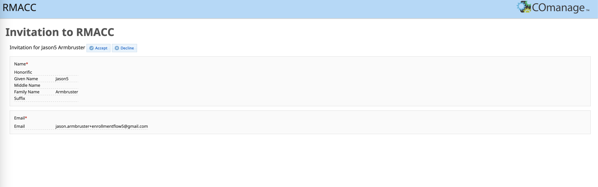
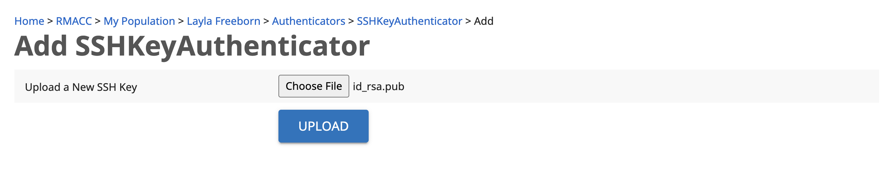

## Uploading an SSH Key to CILogon Registry  

CU Boulder Research Computing uses [CILogon](https://cilogon.org) to manage key-based login (CU Anschutz users, only) and passwordless data transfers with `scp` and `rsync` (CU Boulder and AMC, only). Access to the [RMACC CILogon Registry](https://registry.cilogon.org/registry/) is available by invitation only.

### *Step 1: Enroll in the RMACC CILogon Registry*

Request an invitation to the RMACC CILogon Registry by emailing <rc-help@colorado.edu> and explaining your intended use case (e.g., automated data transfers). After your case has been assigned, you will receive an email from <registry@cilogon.org> inviting you to enroll in the RMACC Registry. 
 

Follow the invitation URL and click 'Accept'. __The invitation link becomes invalid once you click 'Accept', so complete all of Step 1 before closing your browser tab.__ 

You will be automatically routed to the login page. If you access CURC resources with a CU Boulder account, select 'University of Colorado at Boulder' from the Identity Provider dropdown menu and click 'Log On'. 
If you access CURC resources with an ACCESS account, select 'ACCESS CI (XSEDE)' from the dropdown menu.
 

Enter your CU Boulder or ACCESS username and password and click 'Login'. Accept the Duo push from your device.

> **_IMPORTANT:_** You can move on to Step 2, but please make sure 10 minutes have elapsed between completing Step 1 and beginning Step 3.

### *Step 2: Generate an ssh key*

You are strongly encouraged to set a passphrase for your key pair. You will be prompted to enter the passphrase each time you log in. 

SSH Key Generation for Windows Users: 
- Using command prompt, PowerShell, or Windows Terminal: https://www.howtogeek.com/762863/how-to-generate-ssh-keys-in-windows-10-and-windows-11/
- Using PuTTY: https://devops.ionos.com/tutorials/use-ssh-keys-with-putty-on-windows/

SSH Key Generation for Mac Users: 
https://docs.tritondatacenter.com/public-cloud/getting-started/ssh-keys/generating-an-ssh-key-manually/manually-generating-your-ssh-key-in-mac-os-x

### *Step 3: Upload your ssh key to [registry.cilogon.org](https://registry.cilogon.org/registry/)*

After logging into [registry.cilogon.org](https://registry.cilogon.org/registry/) with your ACCESS 
credentials, click on the dropdown menu in the upper right hand corner by your name. 
Select 'MY PROFILE (RMACC)'.

Select 'Authenticators' from the menu on the right. 
 

 

Click 'Manage' in the SSHKeyAuthenticator row. 

Select 'Add SSH Key'.

Click 'Choose File'. If you store your SSH keys in a hidden directory (e.g. `~/.ssh`), it may be difficult to locate your public key using a Finder/File Explorer window. As a workaround, you can copy your public key to an easily discoverable location using the Terminal App/Windows Command Prompt:  `cp ~/.ssh/id_rsa.pub ~/Desktop`
 

Locate your __public__ key (`<keyname>.pub`) on your local drive, then click 'UPLOAD'.

 

A green message box will notify you that your SSH key was successfully added to your account.
 

### Deleting or Replacing SSH Keys in RMACC CILogon Registry

Log in at [registry.cilogon.org](https://registry.cilogon.org/registry/) and navigate to the 'Authenticators' section of your profile (see Step 3, above). Click 'Delete', then repeat the process for adding a new key. It will take a few minutes before you can log in with your new key.

### Troubleshooting

* If you receive an error message indicating that you are not in the COmanage registry (see screenshot below), please email <rc-help@colorado.edu>. Please include a screenshot of the error message and the date/time of your last login attempt.

 
