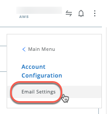
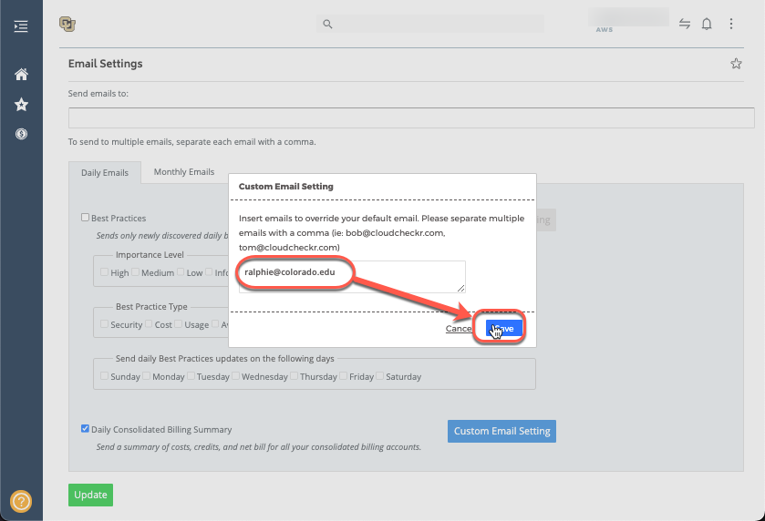

# AWS - Email Notifications

## Document Purpose

This document describes the steps to set Automated Email Notifications.

## Setting the Email Notifications 

1. Login to your CloudCheckr Accout using the [SSO Link](https://fedauth.colorado.edu/idp/profile/SAML2/Unsolicited/SSO?providerId=https://auth-us.cloudcheckr.com/auth)
2. Select the Account that you want to set up the email notifications. 
3. Select the 3 dots in the upper right corner of the page
4. Go to Account Configuration.

      
5. Go to Email Settings.

      
6. You will see a page for setting up email notifications.
7. Leave the email field blank for this step.
8. Uncheck the Best Practices in the Daily Emails.
9. Make sure you check the Daily Consolidated Billing Summary
10. Click on Custom Email Setting. 

       
11. A window pops up and enter the email addresses that you want the email notifications be sent to.
12. Click save.

       
13. Click on update at the end.

       

