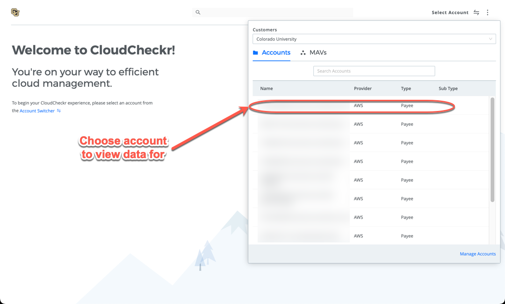
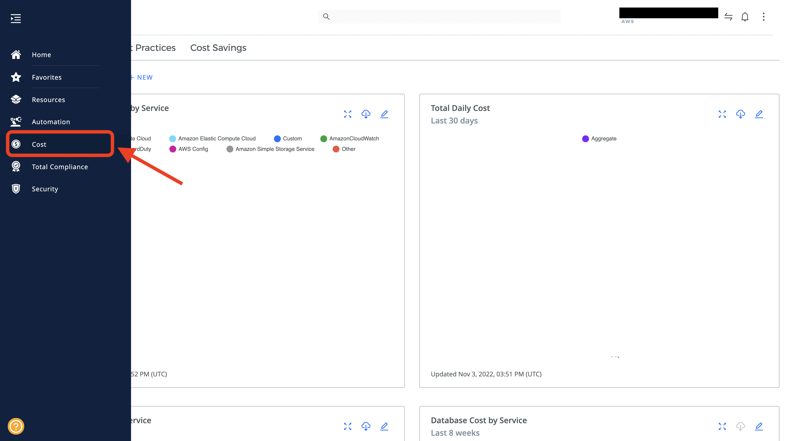
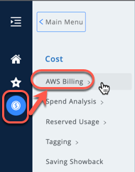
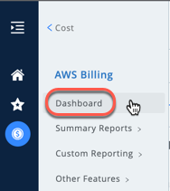
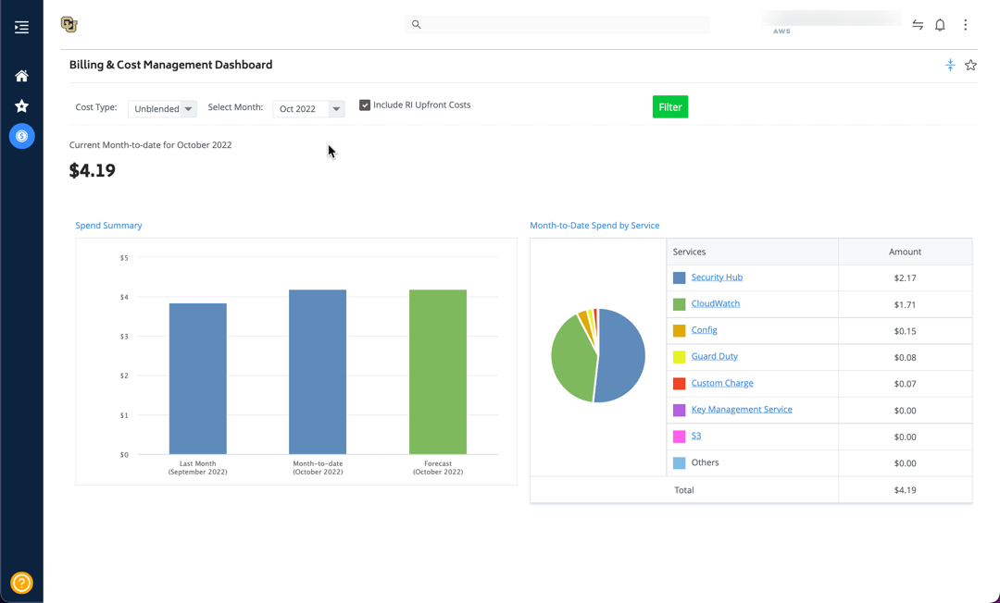
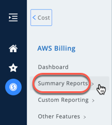
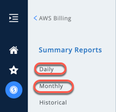
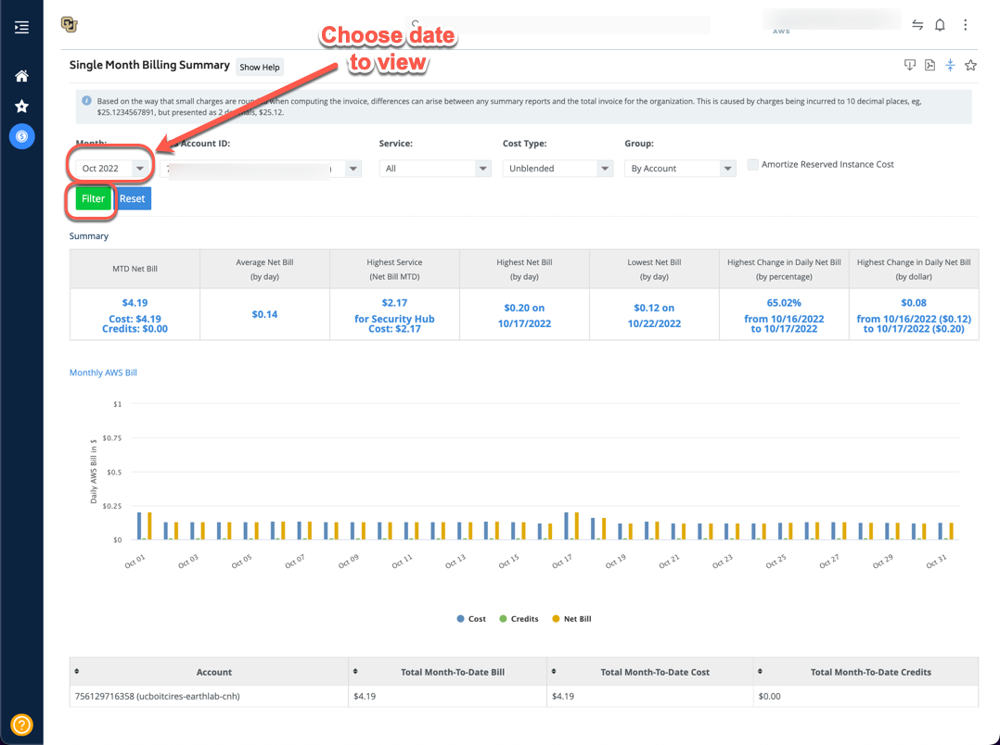

# AWS - Billing 

## Document Purpose

This document describes the steps to be followed when checking the AWS Account Billing. Each AWS account is associated with CloudCheckr Account where the Account holder can check their billing from CloudCheckr instead of the billing section in AWS Portal. This Document will guide you how to use CloudCheckr and how to look for your billing in the CloudCheckr. 

## How to Login to Cloudcheckr

### What do you need for the login

1. User's CU Credentials 
   1. CU Identity Key
   2. Identity key's Password 

2. SSO Link to Login
   1. SSO Link: [Click here](https://fedauth.colorado.edu/idp/profile/SAML2/Unsolicited/SSO?providerId=https://auth-us.cloudcheckr.com/auth)

### Steps to Login

1. Click the SSO Link given in the above section. 
2. Enter your CU Credentials
3. The page will navigate you to your CloudCheckr Portal

Note: For now the CloudCheckr has access to the technical contacts, responsible person and billing contacts associated to the AWS Account. If you need to add someone or modify the access then please contact us.

### After logging in for the first time
1. You can see a welcome page like in the image shown below. When you are logging in for the first time, you need to select the account to view the data for a account.

2. Click on the select account. You will see the list of accounts associated to the user. Select the one account that you want to see the data for. 

### Requesting to open a CloudCheckr Account

This section is only when you don't have a CloudCheckr Account. 

1. You will need to open a ticket with the rc-help 
2. Please do add your AWS account number and AWS account alias for which you want the CloudCheckr Access need to be created.
3. Email to rc-help@colorado.edu

## How to Check your Bill in CloudCheckr

1. When you log into the CloudCheckr as instructed in the above section. It will directly navigate to CloudCheckr Portal after you select your Account.
2. Towards your left, there is panel with Home, Favorites and cost.

3. Go to Cost.
4. Click on the AWS Billing

5. Click on Dashboard

6. You can see your billing details linked to the selected AWS Account.

## How to access the Summary Reports

1. Follow the steps from 1 to 4 from the above section. 

2. Click on the Summary Reports 

3. You can check the daily or monthly summary report.

4. For daily report, click on the Daily under the summary reports. It opens the Daily report and select a date to view the summary

5. For Monthly report, click on the Monthly under the summary reports. It opens the Daily report and select a month to view the summary

