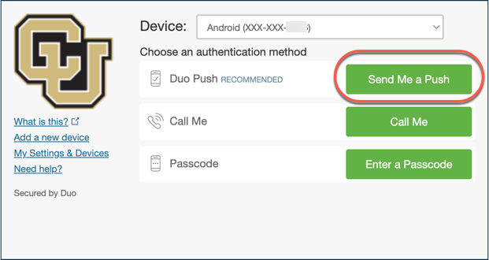

# Accessing the AWS Management Console

## Prerequisites
1. You are a member of CUBoulder. If you have access to CUBoulder AWS resources and are from another institution, please see [this guide](non-cu-boulder/aws-console-access-non-cu-boulder.html) on signing in using your institution's credentials.

2. The [DUO Multi-Factor Remote Access](https://oit.colorado.edu/services/identity-access-management/multi-factor-remote-access) (MFA) app is installed and enrolled.
Visit OIT's [DUO Multi-Factor Remote Access](https://oit.colorado.edu/services/identity-access-management/multi-factor-remote-access) documentation to install and enroll MFA.

## Single Sign-On

Users access the [AWS Management Console](http://bit.ly/OIT-AWS) using their [CU IdentiKey](https://oit.colorado.edu/services/identity-access-management/identikey).
The Single Sign-On (SSO) URL is [http://bit.ly/OIT-AWS](http://bit.ly/OIT-AWS).
You can access your AWS Account from anywhere with internet access.  You do not need to have a VPN connection to campus.

1. Launch the [AWS Management Console (SSO URL)](http://bit.ly/OIT-AWS).
2. Provide your [CU IdentiKey](https://oit.colorado.edu/services/identity-access-management/identikey) credentials.

3. Choose a method for authentication.  We recommend you select "Send Me a Push".  **NOTE:** You may not see the MFA step if you've recently authenticated and have an active session.

4. Accept the MFA request on your device.
5. If you only have access to a single AWS Account and a single Role, you will be logged straight in to the AWS Console.
If you have access to multiple AWS Accounts and/or Roles, you will be presented with a list of Accounts/Roles to select.  Select the Account and Role you wish to log in to.

6. You will be logged in to the AWS Management Console.  Always be sure to verify you have the AWS Region you are working with selected after logging in.

Once logged in, you have a 60 minute session.  You will be asked to log back in and re-authenticate using MFA when your session expires.

