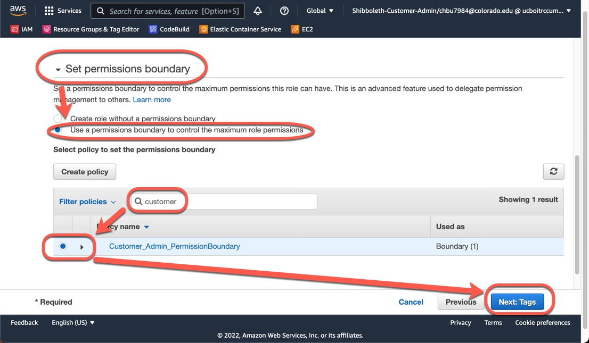

## Admin Account Permission Exclusions

Customers who wish to create new AWS Users or Roles are prevented from doing so unless they use the "Customer_Admin_PermissionBoundary" Permission Boundary.
See below for more information.  In addition, there are Explicit Denials that apply to all AWS Users and Roles.  This is also described below.

<!---
Info Table
-->
<table style="background-color: #dcdcdc; filter: alpha(opacity=40); opacity: 0.95;">
<tr>
<td>
<b>( ! ) - IMPORTANT</b>
</td>
</tr>
<tr>
<td>
Note that when using some AWS wizards to create services, the wizard will try to create a Role.
Due to the limitations discussed below, the wizard will fail.
When encountering this situation, you must manually create the Role with the proper permissions, and attach the permission boundary discussed below.
Then, in the wizard, you need to pick the Role you created.
</td>
</tr>
</table>

### Standard Customer Administrator Role

The standard CU Boulder AWS Account Baseline sets up a powerful AWS Role for use by the administrators in the customer department.
This Role will generally be used to set up new IAM Roles and to deploy basic infrastructure, but should be treated similarly to other administrative accounts (think root or Administrator accounts) and only used when it's privileges are needed.
Please consider the principal of least privilege when managing your accounts.

In order to ensure that this role is not breaking components deployed as part of the CU Boulder standard AWS Account Baseline there are certain restrictions on what this role can perform.
Outside of these restrictions, the Customer Admin role will have full administrative privileges.

All users, including Customer Administrators, automatically have Explicit Denial of the following actions:
* Changes to OIT Cloud Admin Roles, Users, Policies, and Groups
* Using AWS CloudTrail
* Using AWS GuardDuty
* Changes to AWS Config
* Changes to Default Account Password Policies
* Creating or Deleting Account Aliases
* Creating, Updating, or Deleting SAML Provider Settings

### Permission Boundary (limits permissions of new users or roles created by Customer Admin)

Creation of new Users and Roles by a Customer Admin Role is only allowed if the Permission Boundary is attached at the creation of the User or Role.
Permission Boundary is a policy created by Cloud Broker in your account named Customer_Admin_PermissionBoundary

New Users and Roles have the same restrictions as above, plus:
* New Users/Roles are Explicitly Denied the ability to Create/Update any additional AWS Roles/Users

### Attaching Permission Boundary

On Step 2 of the 'Create role' wizard, search for and add the "Customer_Admin_PermissionBoundary" Policy to the 'Set permissions boundary' section.

