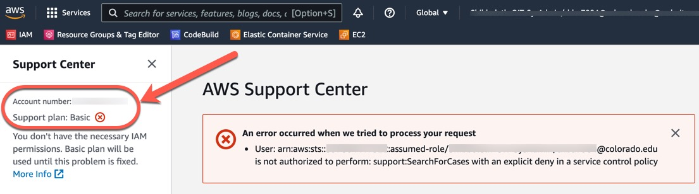

## AWS Support

AWS Customer Support is managed by <a href="https://www.dlt.com/" target="_blank">DLT</a>.
All AWS Support issues must be directed to <a href="https://www.dlt.com/" target="_blank">DLT</a>.
It is recommended that you send an email to **support@dlt.com**.
Alternatively, you can call <a href="https://www.dlt.com/" target="_blank">DLT</a>.
Calling is also the preferred escalation path: `800-262-4DLT (4358)`.
It is required that you provide the AWS Account Number when requesting support.
See below on how to obtain your AWS Account Number.

**How to Get your AWS Account Number and Current Support Plan**

1. The AWS Account Number and Support Plan can be found by logging in to the AWS Console using your <a href="https://oit.colorado.edu/services/identity-access-management/identikey" target="_blank">CU IdentiKey</a> here: <a href="http://bit.ly/OIT-AWS" target="_blank">http://bit.ly/OIT-AWS </a>.
2. Navigate to the AWS Support Center: https://console.aws.amazon.com/support/home?#/. In the upper left corner, the Account Number and Support Plan is shown.  **NOTE:** It is expected that you will see the error shown in the screen capture below.

**How to Upgrade your Support Plan**

To upgrade your support plan, send an email to rc-help@colorado.edu and request for a "AWS Support Change Request".
Please also provide the AWS Account Number in your request.
You can also call the OIT Support Center.
For more information about OIT Support, visit the website: [https://oit.colorado.edu/support](https://oit.colorado.edu/support)

**Support Levels and Costs**

For more information about AWS Support Plans and Pricing, please see the AWS documentation here: [https://aws.amazon.com/premiumsupport/pricing/?nc=sn&loc=3](https://aws.amazon.com/premiumsupport/pricing/?nc=sn&loc=3)

Couldn't find what you need? [Provide your feedback on these docs!](https://forms.gle/bSQEeFrdvyeQWPtW9)
