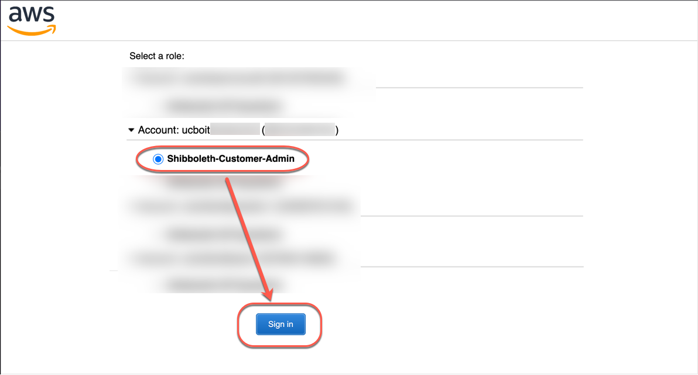

# Accessing the AWS CLI Using saml2aws (Non-CU Boulder)

The **saml2aws** CLI tool is used to login and retrieve AWS temporary credentials.

## Prerequisites

1. This guide is only relevant if you are not a member of CU Boulder and require access to manage AWS resources owned by CU Boulder. If you are a member of CU Boulder, please see [this guide](../aws-cli-saml2aws.html) on signing in using your IdentiKey.

2. You have a chromium based browser installed on your PC.

## Install saml2aws

To install **saml2aws** (MacOS, Windows, Linux), visit the online documentation: [saml2aws installation instructions](https://github.com/Versent/saml2aws#install)

Verify **saml2aws** is installed by running the following command (output should show the installed version):

`$ saml2aws --version`

## Configure saml2aws

Run the following command to begin the configuration process.
This only needs to be done one time:

`$ saml2aws configure`

Provide the following values for the configuration:

```
Provider:    Browser
AWS Profile: saml (default, just hit the enter key)
URL:         https://federation-proxy.rmacc.org/aws
Username:    leave blank (just hit the enter key)
Password:    leave blank (just hit the enter key)
```

Example configuration input:

```
? Please choose a provider: Browser
? AWS Profile: (default, hit enter key)
? URL: https://federation-proxy.rmacc.org/aws
? Username:
? Password:
```

Example configuration output:

```
account {
  URL: https://federation-proxy.rmacc.org/aws
  Username: 
  Provider: Browser
  MFA: Auto
  SkipVerify: false
  AmazonWebservicesURN: urn:amazon:webservices
  SessionDuration: 3600
  Profile: saml
  RoleARN: 
  Region: 
}
```
## Using saml2aws

Using **saml2aws** involves logging in first using the `saml2aws login` command. Once logged in, you can then execute AWS CLI commands using the `saml2aws exec` command. You can also establish an interactive shell to run your commands in. Both methods are described below.

### saml2aws login

Log in using the following command:

`$ saml2aws login`

**Note**: When logging in for the first time, you will need to add the `--download-browser-driver` flag which will download drivers for chromium based browsers, allowing the login page to pop-up in browser. The full command is as follows:
`$ saml2aws login --download-browser-driver`

When prompted for the Username and Password, just hit the ENTER key to accept the defaults you configured earlier. A browser window like the one shown below should pop up.


Select your institution from the drop down menu and click "Log On".


Log in using your regular institution credentials. You may be asked to authenticate with MFA.


If you only have access to a single AWS Account and a single Role, you will be immediatly authenticated with SAML.

If you have access to multiple AWS Accounts and/or Roles, you will be presented with a list of Accounts/Roles to select.  Select the Account and Role you wish to log in to.


Your browser window should then close and your terminal should have a similar output to the following

```
Selected role: arn:aws:iam::XXXXXXXXXXXX:role/Shibboleth-Customer-Admin
Requesting AWS credentials using SAML assertion
Logged in as: arn:aws:sts::XXXXXXXXXXXX:assumed-role/Shibboleth-Customer-Admin/ralphie@colorado.edu

Your new access key pair has been stored in the AWS configuration
Note that it will expire at 2022-04-21 23:10:34 -0600 MDT
To use this credential, call the AWS CLI with the --profile option (e.g. aws --profile saml ec2 describe-instances).
```

AWS CLI commands can be executed by using the format:

`aws --profile saml <aws subcommands here>`

Let's test your login from above by running your first AWS CLI command.

`$ aws --profile saml sts get-caller-identity`

You should see output similar to the following:

```
$ aws --profile saml sts get-caller-identity
{
    "UserId": "XXXXXXXXXXXXXXXXXXXXX:ralphie@colorado.edu",
    "Account": "XXXXXXXXXXXX",
    "Arn": "arn:aws:sts::XXXXXXXXXXXX:assumed-role/Shibboleth-Customer-Admin/ralphie@colorado.edu"
}
```

### saml2aws exec

You can use `saml2aws exec` to run a command using the login credentials from the `saml2aws login` command from above.
AWS CLI commands can be executed by using the format:

`saml2aws exec aws <aws subcommands here>`

Run the following command, which is equivalent to the command you ran above.
You should get the same output:

`$ saml2aws exec aws sts get-caller-identity`

### saml2aws shell

Most times, users will want to establish a shell to type AWS CLI commands in to without the extra hassle of providing a profile or prepending with the saml2aws exec command.
Here's how it's done:

`$ saml2aws exec -- $SHELL`

Now try the following AWS CLI command:

`$ aws sts get-caller-identity`

You should see the same output from earlier.
Now you can run all the AWS CLI commands you want, or run a shell script.
All AWS CLI commands will run under the saml2aws login credentials from earlier.

## saml2aws Advanced Configuration

You can manually add profiles for each AWS Account/Role.
This is particularly helpful for automating **saml2aws** commands non-interactively.
Profiles are added by editing the %HOME_DIR%/.saml2aws file (ie. ~/.saml2aws).
Profiles can be added using the following template:
* substitute <account_alias> for the AWS Alias
* substitute XXXXXXXXXXXX for the AWS Account Number

```
[admin-<account_alias>]
url                  = https://federation-proxy.rmacc.org/aws
provider             = Browser
mfa                  = auto
skip_verify          = false
timeout              = 0
aws_urn              = urn:amazon:webservices
aws_session_duration = 3600
aws_profile          = <account_alias>
```

Example command for establishing an interactive shell in a single command.
Note that you will have to manually accept the MFA request.

```shell
$ saml2aws -a admin-<account_alias> login --skip-prompt --duo-mfa-option="Duo Push" --session-duration=3600 && saml2aws -a admin-<account_alias> exec -- $SHELL
```

You can run the `saml2aws exec` portion of the above command however you need.
For example, you can execute a shell script.
Again, MFA will need to be performed manually.

