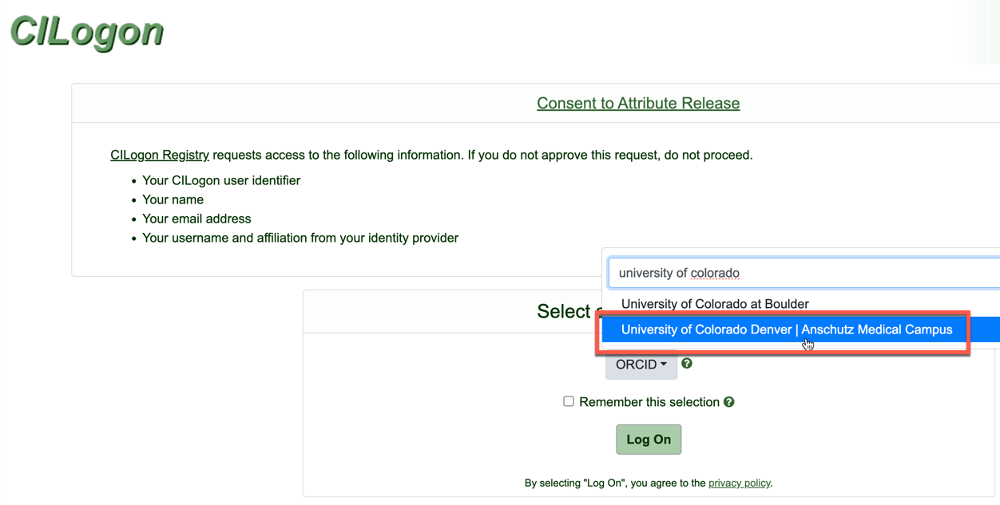
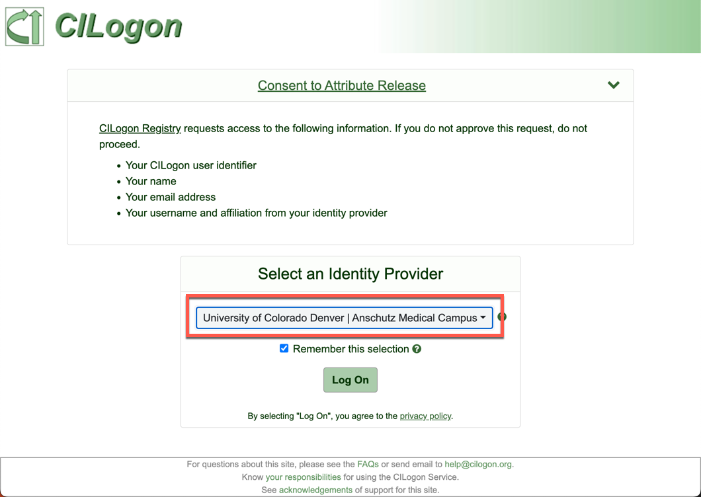
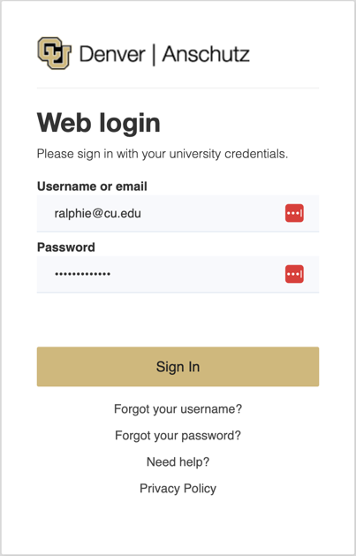
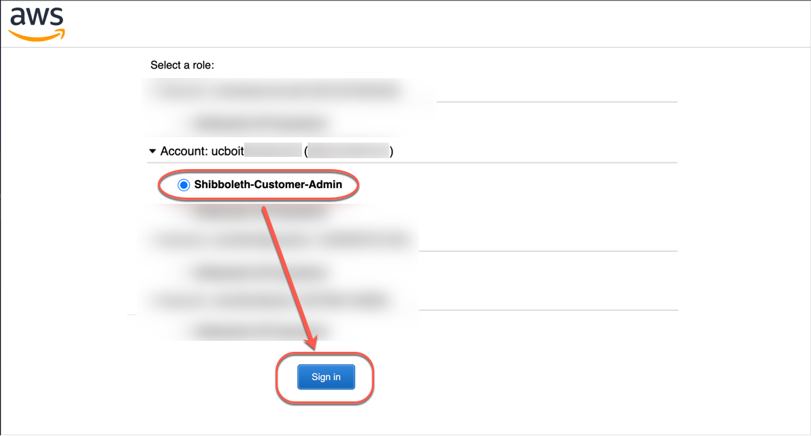
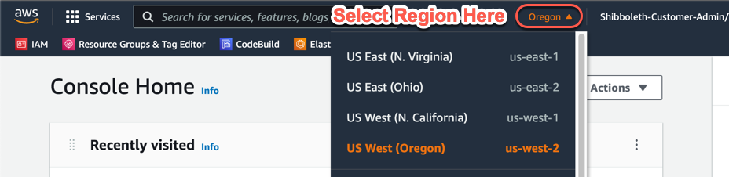

# Accessing the AWS Management Console with CILogon (Non-CU Boulder)

## Prerequisites
This guide is only relevant if you are not a member of CU Boulder and require access to manage AWS resources owned by CU Boulder. If you are a member of CU Boulder, please see <a href="../aws-console-access.html" target="_blank">this guide</a> on signing in using your IdentiKey.

## CILogon

Users access the <a href="https://federation-proxy.rmacc.org/aws" target="_blank">CILogon page</a> and log in using their campus credentials. They will then need to select the account with which they wish to log in if they have access to more than one account, otherwise they will be redirected to the AWS management console 

1. Launch <a href="https://federation-proxy.rmacc.org/aws" target="_blank">CILogon</a>.
2. Select your institution from the drop-down list

3. Tick "Remember this selection" and click Log On.

4. You will be redirected to your institution's sign in page. Log in using your credentials - you may also be asked to authenticate using MFA.

5. If you only have access to a single AWS Account and a single Role, you will be logged straight in to the AWS Console.
If you have access to multiple AWS Accounts and/or Roles, you will be presented with a list of Accounts/Roles to select.  Select the Account and Role you wish to log in to.

6. You will be logged in to the AWS Management Console.  Always be sure to verify you have the AWS Region you are working with selected after logging in.

Once logged in, you have a 60 minute session.  You will be asked to log back in and re-authenticate when your session expires.