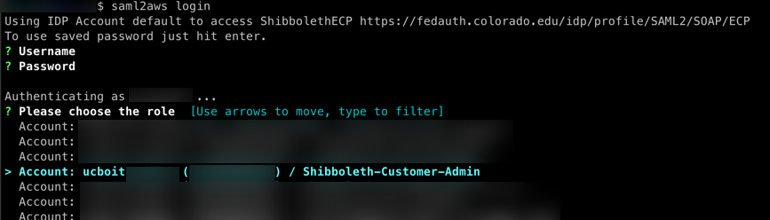

# Accessing the AWS CLI Using saml2aws

The **saml2aws** CLI tool is used to login and retrieve AWS temporary credentials.

## Prerequisite

The [DUO Multi-Factor Remote Access](https://oit.colorado.edu/services/identity-access-management/multi-factor-remote-access) (MFA) app is installed and enrolled.
Visit OIT's [DUO Multi-Factor Remote Access](https://oit.colorado.edu/services/identity-access-management/multi-factor-remote-access) documentation to install and enroll MFA.

## Install saml2aws

You use your [CU IdentiKey](https://oit.colorado.edu/services/identity-access-management/identikey) to authenticate from CU's Shibboleth Identity Provider.
To install **saml2aws** (MacOS, Windows, Linux), visit the online documentation: [saml2aws installation instructions](https://github.com/Versent/saml2aws#install)

Verify **saml2aws** is installed by running the following command (output should show the installed version):

`$ saml2aws --version`

## Configure saml2aws

Run the following command to begin the configuration process.
This only needs to be done one time:

`$ saml2aws configure`

Provide the following values for the configuration:

```
Provider:    ShibbolethECP
MFA:         push (preferred, though you can choose other options)
AWS Profile: default (just hit the enter key)
URL:         https://fedauth.colorado.edu/idp/profile/SAML2/SOAP/ECP
Username:    <identikey>
Password:    <identikey password>
Confirm:     <identikey password>
```

Example configuration input:

```
? Please choose a provider: ShibbolethECP
? Please choose an MFA: push
? AWS Profile: (default, hit enter key)
? URL https://fedauth.colorado.edu/idp/profile/SAML2/SOAP/ECP
? Username ralphie
? Password ********
? Confirm ********
```

Example configuration output:

```
account {
  URL: https://fedauth.colorado.edu/idp/profile/SAML2/SOAP/ECP
  Username: ralphie
  Provider: ShibbolethECP
  MFA: push
  SkipVerify: false
  AmazonWebservicesURN: urn:amazon:webservices
  SessionDuration: 14400
  Profile: saml
  RoleARN:
  Region: us-west-2
}
```

### Updating Configuration

When your [CU IdentiKey](https://oit.colorado.edu/services/identity-access-management/identikey) **password changes**, you must reconfigure.

`$ saml2aws configure`

Accept all the defaults (hit the enter key), but use the new password.

## Using saml2aws

Using **saml2aws** involves logging in first using the `saml2aws login` command.
Once logged in, you can then execute AWS CLI commands using the `saml2aws exec` command.
You can also establish an interactive shell to run your commands in.
Both methods are described below.

### saml2aws login

Log in using the following command:

`$ saml2aws login`

When prompted for the Username and Password, just hit the ENTER key to accept the defaults you configured earlier.
Alternatively, you could log in with a different [CU IdentiKey](https://oit.colorado.edu/services/identity-access-management/identikey) if needed.

Next, choose the AWS Account and Role to log in to.



You should see output similar to the following

```
Selected role: arn:aws:iam::XXXXXXXXXXXX:role/Shibboleth-Customer-Admin
Requesting AWS credentials using SAML assertion
Logged in as: arn:aws:sts::XXXXXXXXXXXX:assumed-role/Shibboleth-Customer-Admin/ralphie@colorado.edu

Your new access key pair has been stored in the AWS configuration
Note that it will expire at 2022-04-21 23:10:34 -0600 MDT
To use this credential, call the AWS CLI with the --profile option (e.g. aws --profile saml ec2 describe-instances).
```

AWS CLI commands can be executed by using the format:

`aws --profile saml <aws subcommands here>`

Let's test your login from above by running your first AWS CLI command.

`$ aws --profile saml sts get-caller-identity`

You should see output similar to the following:

```
$ aws --profile saml sts get-caller-identity
{
    "UserId": "XXXXXXXXXXXXXXXXXXXXX:ralphie@colorado.edu",
    "Account": "XXXXXXXXXXXX",
    "Arn": "arn:aws:sts::XXXXXXXXXXXX:assumed-role/Shibboleth-Customer-Admin/ralphie@colorado.edu"
}
```

### saml2aws exec

You can use `saml2aws exec` to run a command using the login credentials from the `saml2aws login` command from above.
AWS CLI commands can be executed by using the format:

`saml2aws exec aws <aws subcommands here>`

Run the following command, which is equivalent to the command you ran above.
You should get the same output:

`$ saml2aws exec aws sts get-caller-identity`

### saml2aws shell

Most times, users will want to establish a shell to type AWS CLI commands in to without the extra hassle of providing a profile or prepending with the saml2aws exec command.
Here's how it's done:

`$ saml2aws exec -- $SHELL`

Now try the following AWS CLI command:

`$ aws sts get-caller-identity`

You should see the same output from earlier.
Now you can run all the AWS CLI commands you want, or run a shell script.
All AWS CLI commands will run under the saml2aws login credentials from earlier.

## saml2aws Advanced Configuration

You can manually add profiles for each AWS Account/Role.
This is particularly helpful for automating **saml2aws** commands non-interactively.
Profiles are added by editing the %HOME_DIR%/.saml2aws file (ie. ~/.saml2aws).
Profiles can be added using the following template:
* substitute <account_alias> for the AWS Alias
* substitute XXXXXXXXXXXX for the AWS Account Number

```
[admin-<account_alias>]
url                  = https://fedauth.colorado.edu/idp/profile/SAML2/SOAP/ECP
username             = ralphie
provider             = ShibbolethECP
mfa                  = auto
skip_verify          = false
timeout              = 0
aws_urn              = urn:amazon:webservices
aws_session_duration = 14400
aws_profile          = <account_alias>
role_arn             = arn:aws:iam::XXXXXXXXXXXX:role/Shibboleth-Customer-Admin
```

Example command for establishing an interactive shell in a single command.
Note that you will have to manually accept the MFA request.

```shell
$ saml2aws -a admin-<account_alias> login --skip-prompt --duo-mfa-option="Duo Push" --session-duration=14400 && saml2aws -a admin-<account_alias> exec -- $SHELL
```

You can run the `saml2aws exec` portion of the above command however you need.
For example, you can execute a shell script.
Again, MFA will need to be performed manually.

