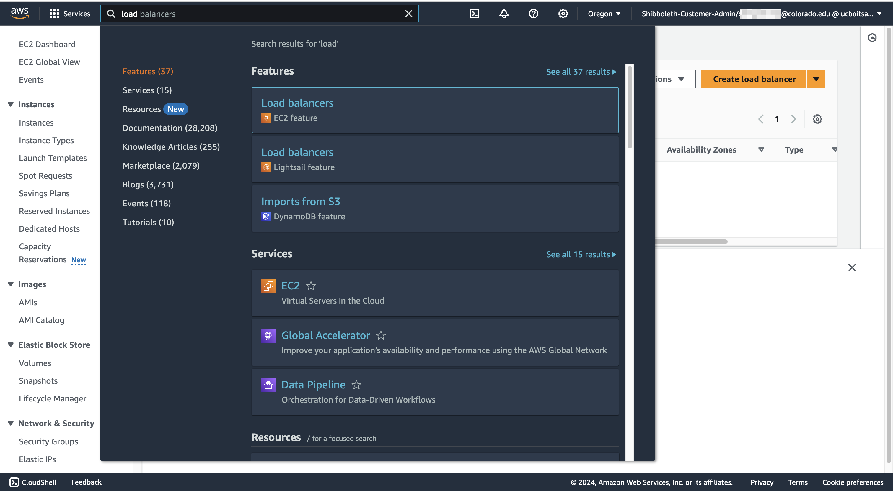
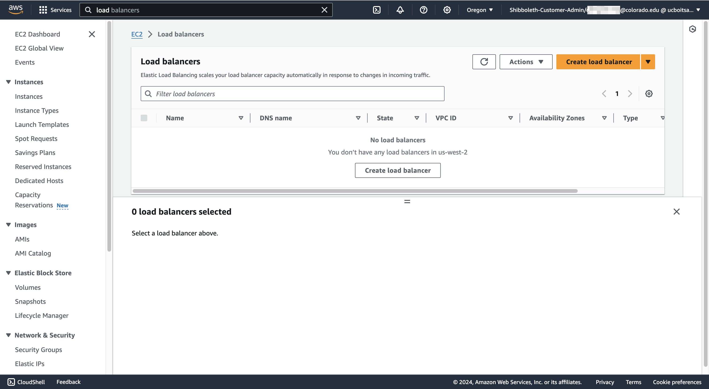
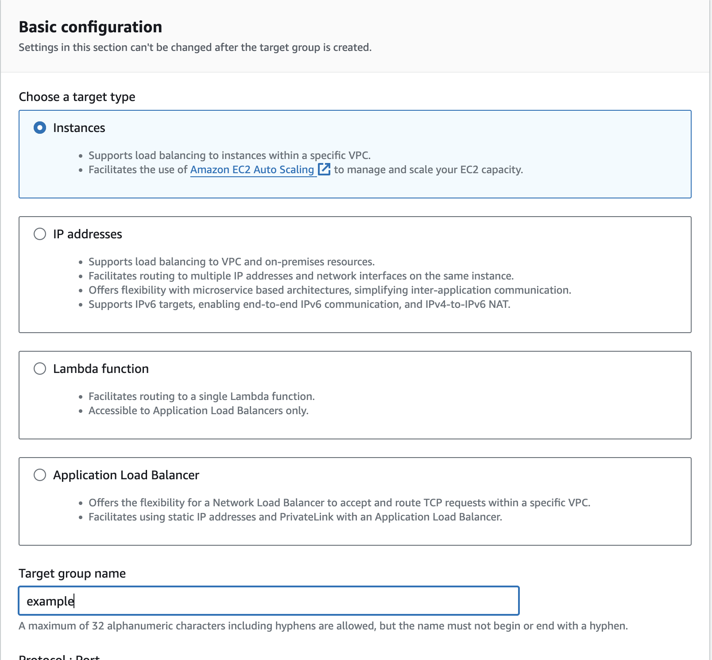

# Setting up a Load Balancer

Setup a load balancer to publicly expose services running on the internal VPC. This is to be used when you have a service running on the internal campus network (CFS VPC private subnets) and want to expose it to the outside internet. To accomplish this we must put a load balancer in front of the VPC.

## Network Load Balancer Example

In this example we assume the prerequisite of an EC2 instance using the CFS VPC on the private subnet. The EC2 instance is running nginx on port 443 and has a inbound security group rule allowing access to port 443 on the EC2 instance. We are going to expose it to the outside internet on port 443 using a network load balancer.

1. Navigate to Load Balancers by searching for "Load Balancers" in the main search box.

2. Select "Create load balancer"

3. Select "Network Load Balancer"

4. Under the Basic configuration section, name the load balancer and leave the rest of the settings as defaults

5. Under the Network mapping section, select "cfs-vpc". Then check the availability zones you would like to use. Make sure to select the public subnet.

6. Scroll down to the "Security groups" section. Click the link to "create a new security group". This will open a new a tab with the security group wizard.

7. For this example we will allow inbound traffic on port 443 from anywhere. Then click "Create security group". Now go back to the Load balancer wizard tab.

8. Under the Security group section, select the security group that was just created.

9. Under the Listeners and routing section, select the "Create target group" link. This will open a new tab with the target group wizard.

10. In this example we will select "Instances" target type. Give your target group a name.

11. In this example we will use port 443. Make sure to select the "cfs-vpc"

12. Select your EC2 target(s) and then select "Include as pending below". Then select "Create target group" to complete the target group creation.

13. The target group is now created and the tab can be closed. Now go back to the Load balancer wizard.

14. The target group is now created and the tab can be closed. Now go back to the Load balancer wizard, click the little refresh icon and then select the target group that was just created. Enter the load balancer listening port. Then scroll down and "Create load balancer" to complete the setup.

15. You can now access your service via the load balancer DNS name.

## Notes

