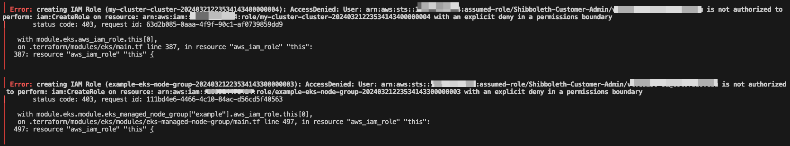

## AWS - Troubleshooting

Troubleshooting AWS Errors

---

### Failed to create role: not authorized to perform: iam:CreateRole

**Error:**


**Solution:**

When creating AWS Roles, you must attach the "Customer_Admin_PermissionBoundary" Permission Boundary.
See [Admin Account Permission Exclusions](../getting-started/customer-permission-boundary.md)

---

### Unable to create user: not authorized to perform: iam:CreateUser

**Error:**


**Solution:**

When creating AWS Users, you must attach the "Customer_Admin_PermissionBoundary" Permission Boundary.
See [Admin Account Permission Exclusions](../getting-started/customer-permission-boundary.md)

---

### AccessDenied: not authorized to perform: iam:CreateRole | Module Block

Below error occurs when creating **EKS Cluster** using <a href="https://registry.terraform.io/modules/terraform-aws-modules/eks/aws/latest" target="_blank">Terraform module</a> from the Terraform registry. 

This error is not an AWS nor Terraform bug. This error is seen when AWS Customers at CU Boulder uses their customer admin IAM role to create an EKS cluster.

**Error:**



**Solution:**

When creating EKS cluster using terraform module from terraform registry, you must attach the "Customer_Admin_PermissionBoundary" Permission Boundary as an argument twice. First in the EKS module and second in the EKS Managed node groups submodule.

```
module "eks" {
  iam_role_permissions_boundary = "arn:aws:iam:<AWS account number>:policy/Customer_Admin_PermissionBoundary"

eks_managed_node_groups = {
    example = {
      iam_role_permissions_boundary = "arn:aws:iam::<AWS Account Number>:policy/Customer_Admin_PermissionBoundary"

    }
}
}
```
---


### AccessDenied: not authorized to perform: iam:CreateRole | Resource Block


Below error occurs when creating **EKS Cluster** using <a href="https://registry.terraform.io/providers/hashicorp/aws/latest/docs/resources/eks_cluster" target="_blank">Terraform resource block</a> from the Terraform registry documentation. 

This error is not an AWS nor Terraform bug. This error is seen when AWS Customers at CU Boulder uses their customer admin IAM role to create an EKS cluster.


**Error:**


**Solution:**

When creating EKS cluster using terraform resource from terraform registry, you must attach the "Customer_Admin_PermissionBoundary" Permission Boundary as an argument in AWS IAM role

```
resource "aws_iam_role" "example" {

  permissions_boundary = "arn:aws:iam::<AWS account number>:policy/Customer_Admin_PermissionBoundary"
}
```