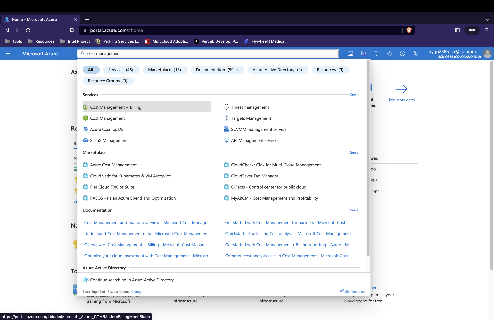
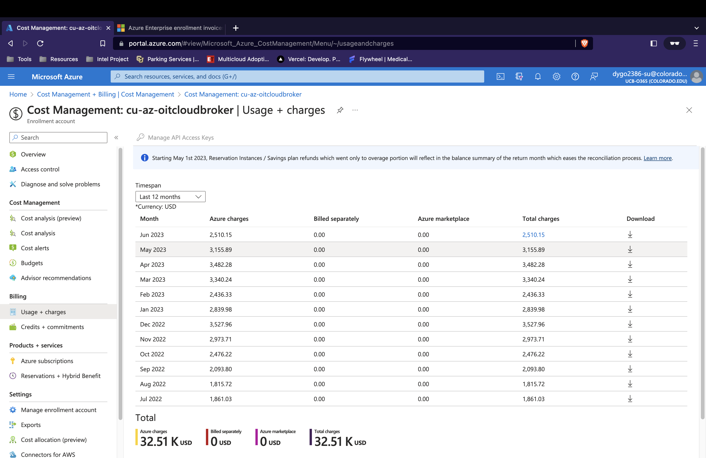
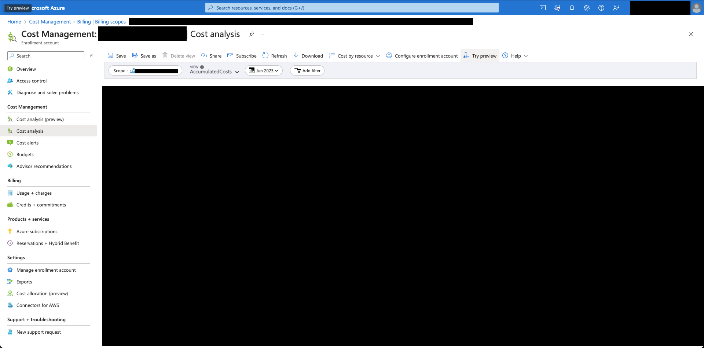

# Azure Billing

## Billing Process
Azure billing is handled using SpeedType numbers. We support the following payment splitting methods:
* One speedtype pays everything
* Two or more speedtypes split the bill along percentages
* Two or more speedtypes pay sequentially, with each paying up to a maximum amount before moving on to the next
* Any mixed combination of the above

Speedtypes will be charged during the next bill processing cycle. Please email [rc-help@colorado.edu](mailto:rc-help@colorado.edu) with any billing questions or concerns. 
Billing details can be viewed in the emailed invoices sent to the designated billing contact or in the Azure billing portal.

### How to Check your Bill in Azure

1. Navigate to the [Azure Login Portal](https://portal.azure.com/)
2. Enter your CU Credentials 
3. Once you log in, it will take you to your dashboard
4. In the top search bar, search for **Cost Management + Billing**. From the **Services** results, select **Cost Management + Billing**.
   <br> <br><br>
5. In the left navigation, under **Billing**, select **Usage + charges**. This page lists monthly Azure charges, marketplace charges, and total charges. You can change the timespan filter and download charges for an individual month.<br>
   <br> <br><br>
6. For a more detailed breakdown, select **Cost analysis** in the left navigation under **Cost Management**. Use **Scope**, **View**, and the date range to filter costs, then download or share the view if needed.
   <br> <br><br>

## Network Cost Guide

There are thre network acess methods available:

1) Internet Gateway - used with public IP
2) NAT Gateway - used with private or public IP
3) CFS Transit Gateway (VPN) - used with private IP address, VPN connects back to CU Boulder

### 1. Internet Gateway

```{Important}
Always check [Microsoft documentation](https://azure.microsoft.com/en-us/pricing/details/bandwidth/) for current pricing.
```
 
**Network costs**

1) Downloads - no cost

2) Uploads - first 100GB/month is free, tiered cost per 1GB transferred after

**Sample Network Cost**

2 Servers will download 100GB and upload 500GB in a month.

	1) Download cost = $0
	2) Upload cost = (100GB = $0) + ($0.087 x 400GB) = $34.80

	Total Network Cost = $34.80/month

### 2. NAT Gateway
```{Important}
Always check [Microsoft documentation](https://azure.microsoft.com/en-us/pricing/details/virtual-network/) for current pricing.
```

```{Important}
The CFS NAT Gateway will be deployed into subscriptions unless we are told otherwise. If you do not want to be charged for this and you do not require public internet access from your Azure environment, please contact [rc-help@colorado.edu](mailto:rc-help@colorado.edu).
```

**Network Costs**
1) Downloads - $0.045/GB
2) Uploads - $0.045/GB
3) NAT Gatway Resource - $0.045/hr
4) Public IP Resource - $0.0036/hr

**Sample Network Cost**

2 Servers on the same subnet will download 100GB and upload 500GB in a month.  The NAT gateway will be on the entire month.

	1) Download cost = $0.045 x 100 = $4.50
	2) Upload cost = $0.045 x 500 = $22.50
	3) NAT Gateway Instance = $0.045 x (24hr x 30day = 720hr) = $32.40
	4) Public IP = $0.0036 x (24hr x 30day = 720hr) = $2.60

	Total Network Cost = $62.00/month

Creating another NAT Gateway without public internet access would incur the same costs with the exception of the Public IP for:

	Total Network Cost = $59.40/month

### 3. CFS VNET Peering (VPN)

```{Important}
Always check [Microsoft documentation](https://azure.microsoft.com/en-us/pricing/details/virtual-network/) for current pricing.
```

**Network Costs**
1) Downloads - $0.01/GB
2) Uploads - $0.01/GB

**Sample Network Cost**

2 Servers will download 100GB and upload 500GB in a month.  The VPC attachment will be on the entire month.

	1) Download cost = $0.01 x 100 = $1
	2) Upload cost = $0.01 x 500 = $5

	Total Network Cost = $6/month

