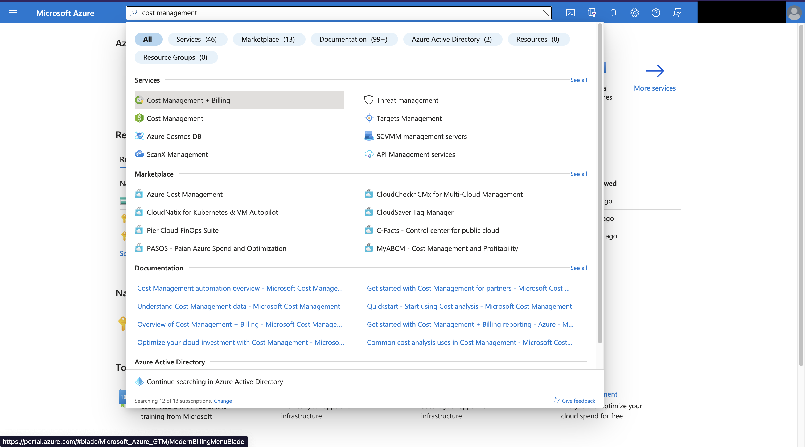
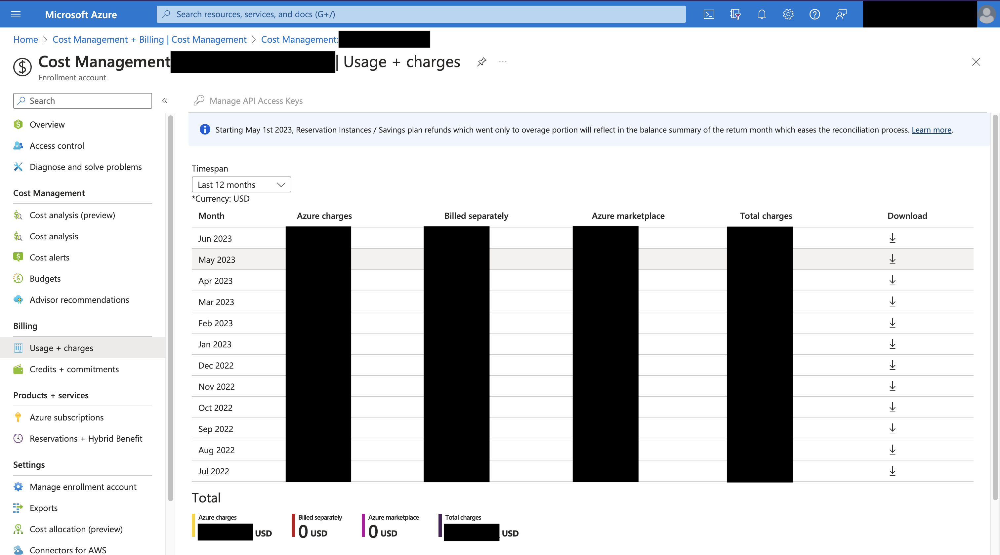

# Azure - Billing

## Document Purpose

This document describes the billing process for Azure subscriptions and  the steps to be followed when checking the Azure subscription billing.

## Billing Process
Azure billing is handled using SpeedType numbers. We support the following payment splitting methods:
* One speedtype pays everything
* Two or more speedtypes split the bill along percentages
* Two or more speedtypes pay sequentially, with each paying up to a maximum amount before moving on to the next
* Any mixed combination of the above (see complex example below)

Speedtypes will be charged during the next FBO bill processing cycle. Please email [rc-help@colorado.edu](mailto:rc-help@colorado.edu) with any billing disputes. 
Billing details can be viewed in the emailed invoice and Azure billing portal.

## How to Login to Azure

### Steps to Login

1. Navigate to the [Azure Login Portal](https://portal.azure.com/)
2. Enter your CU Credentials

## How to Check your Bill in Azure

1. When you log into the Azure Portal as instructed in the above section. It will directly navigate to 
2. In the top search bar, search for "Cost Management + Billing"  
       
3. Click on the Usage + Credits 
       
