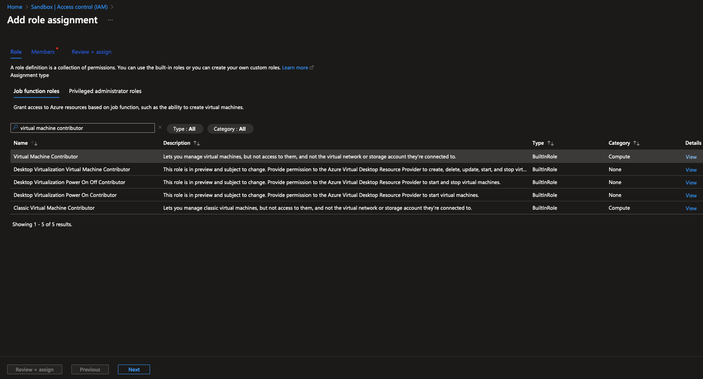
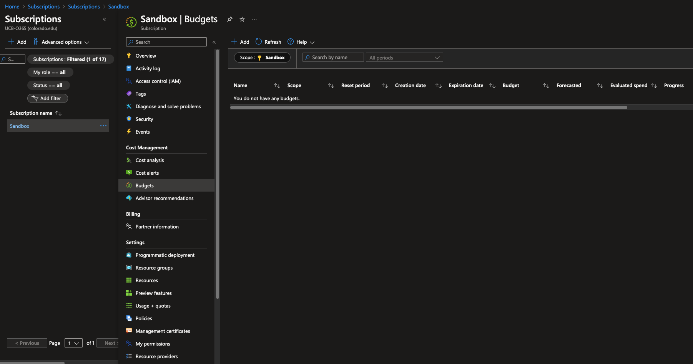
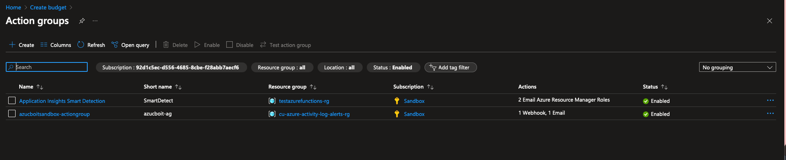
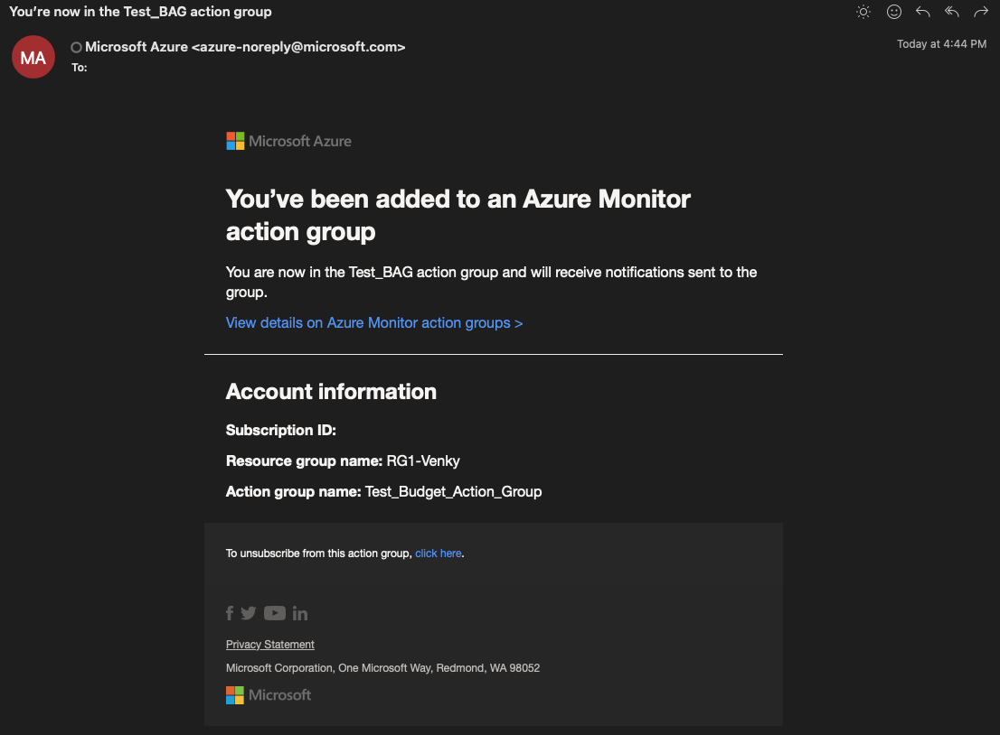
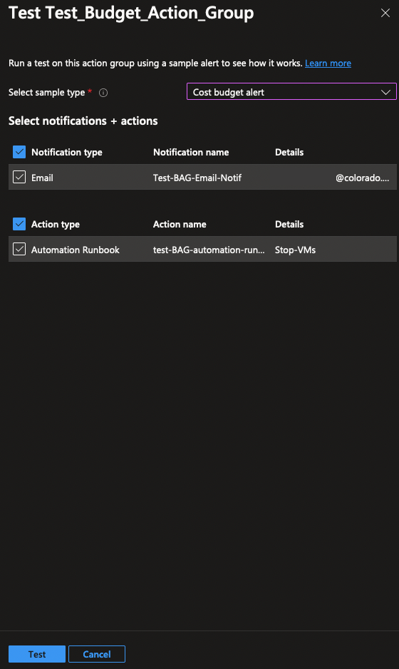
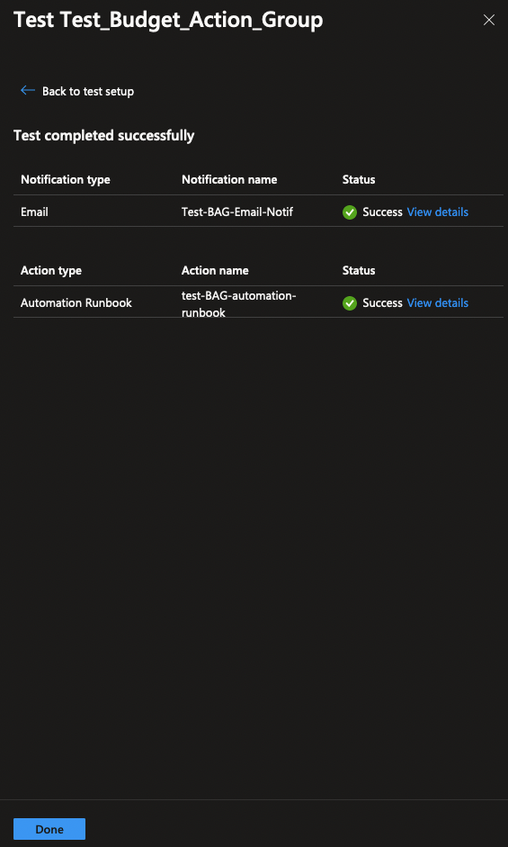

# Configuring Azure budget action

Cost control is a critical component to maximizing the value of your investment in the cloud. To configure a Budget and Budget actions in Azure, you'll complete the following actions by using the steps provided in each section. This document specifically outlines an example of how to setup a budget action to shutdown virtual machine when it meets the configured alert condition.

These actions included in this tutorial allow you to:

    1. Create an Azure Automation Account, Import relevant Runbook, which will use webhooks to stop VMs.
    2. If needed, Add role assignment to provide relevant access to the Automation account to perform operations on virtual machines.
    3. If haven't already,Create the budget with the wanted thresholds and wire it to the action group.
    4. Azure Monitor Action Group will be configured to trigger the Webhook when the budget threshold is met. This behaviour can be tested using 'Test action group'.

## Creating Azure Automation Account

1.	Sign in to the [Azure Management Console](https://portal.azure.com/#home) and search for **Automation accounts** on the top search bar. Click **Create** and choose the subscription that you intent to manage, A Resource Group to place the Automation account, Name and Region to host Automation account.

2.	Leave all other parameters to default. You may optionally choose to configure **Tags** as per your compliance standards. Click **Review+Create** and then click on **Create**.

3.	Once you are in your Automation Account, Click on **Runbooks** and click on **Browse Gallery** from the top pane.

4.	Search for **Stop Azure V2 VMs** from the search bar. Make sure to choose **source** as **Github**. Click on Stop Azure V2 VMs graphical runbook.

5.	Review the graphical flow to understand how this runbook will excute to stop all VMs at subscription or resource group level and then click on **Select** at the bottom.

6. **Name** the Runbook and click **Import**. In **Edit graphical runbook** pane, Click on **Publish** and choose **Yes**

## Add VM Contributor Role Assignment

1.	To check access level of the Automation account that you created, go to **Subscription** using top search bar and click on your subscription name. Then click on **Access control (IAM)** >> choose **check access** from top pane >> click on **check access**

2.	Choose **Managed Identity** and choose your **subscription**. Under 'Managed Indentity' choose **Automation Accounts** and select your automation account. This will show you manually or auto assigned Role assignments for this automation account (if any). 

3.	In case you don't see any Role assignments, Click on **Add** in **Access Control (IAM)** blade of your subscription and choose **Add role assignment**.
In **Role** >> **Job function roles** >> search for **virtual machine contributor** and click on it. Then click **Next** to assign this role to our automation account.

4.	Choose **Managed Identity** radio button, click on **select members** to select your automation account. Once your clicked on **select**, click on **Review+Assign**.

## Create Budget and Action Group

1. To create budgets, choose **Budgets** in your subscription

2. Name, choose **reset period** (I chose monthly). You may consider to leave **creation and expiration dates** as is and finally enter Total Budget **amount** and click **next**.

3. In **Set alerts** tab, click on **Manage action group**. Click **Create** to create a new action group.

4. Enter necessary details in **Basics** tab as per below screenshot and click **Next:Notifications**. Choose **Email/SMS/Push/Voice** and choose the option convenient for you (I choose email in this example) and click **OK**. Finally Name the Notification and click on **Next:Actions**.

5. Under **Actions** choose **Automation Runbook** as **Action type**. Choose relevant options as per screenshot below and finally click on **Configure Parameters**. You may choose to **Resourcegroupname** if you want to enforce budget actions at RG level. **Subscription** is the only mandatory parameter, hence in this example I am enforcing budget actions at Subscription level. Click **OK** multiple times and finally name the Action. Click on **Review+create** and then **Create**

6. Once you are back on **Action Groups** page, give it 10-20 seconds for the new Action group to show up. Click on **Refresh** if needed. Once you see your Action group, carefully click on Red **X** at the top right corner, only Once, to come back to **Create Budget** pane.

7. When action group is created you'll receive an email notification like below

8. On **Create Budget** pane, configure **alert conditions** as needed, I chose to not perform any action for 80% and enforce budget action when my budget hits 100% utilization, in this example. Make sure to select the action group which you have created in previous step. Click **Create** in the bottom, once you have filled all relevant fields as per below screenshot. In the next section, we will test this action group if it really works.

## Test Azure Monitor Action Group

Don't test this if you have any production VMs running which you do not intend to stop. Create a new Resource Group with a couple of test VMs to test this. Make sure your webhook in Automation Runbook is set to take action at Resoruce Group level.

1. The Action Group that we created be found under **Monitor** >> **Alerts** >> **Action Groups** on the top pane. Use the top search bar to find Azure Monitor service.

2. In the **Actions Groups** Pane select the checkbox right next to the action group you've created and click on **Test action group** from the top.

3. Leave the default selection of notification and action test. Choose **Cost Budget alert** from the drop down for **sample type**. This will send a test email to ensure email notification is working and will test if the webhook fires up to stop VMs from the Subscription/Resource group (based on your webhook configuration) 

4. Once the test completes, you will either see a success or a failure error status on the screen. You may navigate to VM service to view if you notice your virtual machines are in disallocated state.

5. You would receive an email like this if your email notification test succeeds. 

