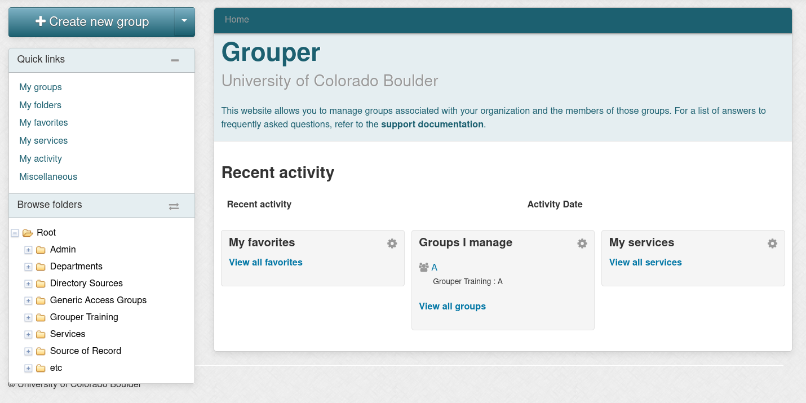

## Project Management

### CUmulus Web Portal (Horizon)

Once your application has been accepted you will be notified that a project has be created and cloud access is ready. Projects are managed through CUmulus's graphical management interface (Horizon) at: [cumulus.rc.colorado.edu/](https://cumulus.rc.colorado.edu/auth/login/?next=/). Project owners can access the CUmulus management interface with InCommon Federation (select the "InCommon Federation" from the authentication pull-down).

> __Note to XSEDE users__: The first attempt to login will automatically fail because you have not been assigned to any groups or roles. Once you have attempted to login please respond to your acceptance email that you have attempted to login and your username will be processed. 

Once your username is processed you will be able to login. The landing page for CUmulus is the "Overview page" which provides you basic information about your project (compute, volume, and network usage). You can select a period of time to query usage below the main overview graphics as well as view all current vm instances.

To use your CUmulus resources, you must create an instances (or a virtual machine) which will each utilize portions of your main project's allocated reources. Visit our docs on [instance creation](./instance-creation.html)

### Adding Users to your Project

Project access is managed through the Grouper application. Grouper is an enterprise access management system that empowers users to manage access, without the need for central IT. Group creation will be handled during project creation (if you don't see your group in "My Groups" in the Grouper application please email [rc-help@colorado.edu](rc-help@colorado.edu)).

To view your groups in Grouper navigate to [mygroups.colorado.edu](https://mygroups.colorado.edu/grouper/) and sign in using InCommon Federated Authentication (identikey & password). Find your group under the "Groups I Manage" section on the landing page (or click on the "My groups" button on the side bar).
>_Note:_ If you do not see your group, please contact [rc-help@colorado.edu](rc-help@colorado.edu) to create a group with the correct permissions and connections to CUmulus (_do not create your own group_).

Detailed instructions to add and remove members from your group can be found here: [Add/Remove Members](https://oit.colorado.edu/tutorial/grouper-manage-members-email-enabled-groups).

 

The CU Research Computing group would like to acknowledge support of this project from the National Science Foundation (OAC-1925766).

