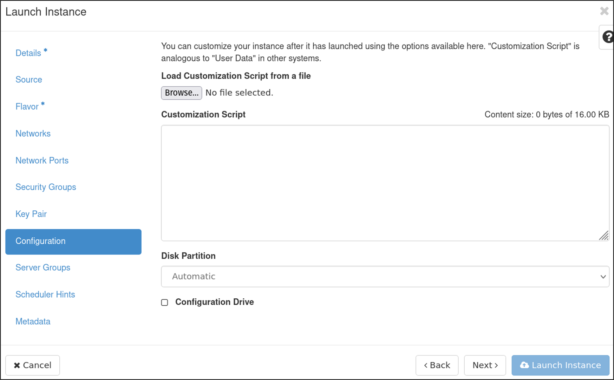
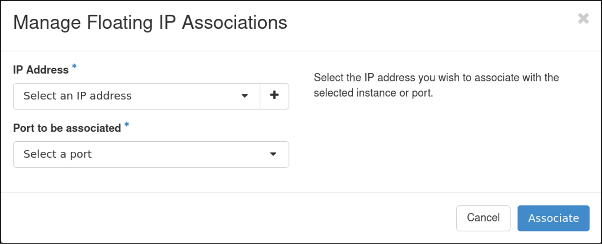
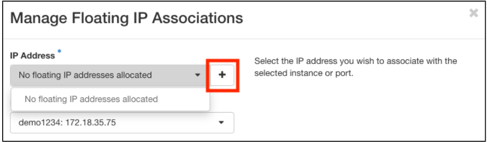

## Creating an Instance

### Instances

Instances are virtual machines that run inside the cloud, more simply: an instance is just a digital version of a physical computer. Instances are the basic "unit" of compute you will use within CUmulus. Once you have requested a CUmulus allocation you will be provided with a "project" which contains the total resources you requested. Within your project you can spin up a finite number of instances (determined by your allocation) each of which can be thought of as it's own computer. 

### Navigating to your Instances

Projects are managed through the CUmulus Web Portal (Horizon) which is hosted at https://cumulus.rc.colorado.edu. First, navigate to the web portal and autenticate using your institution's credentials (e.g, University of Colorado Boulder).

1) Select a project
2) Navigate to "Compute"
3) Select "Instances"
4) Select "Launch Instance" (to create new instance)


To create an instance you must first specify the resources you wish to allocate from your project.

### Create New Instance

#### Launch Instance  
Click on `Launch Instance` button on the top bar from the "Instances" page (step 4 above). This will bring up the instance launcher which will guide you in creating your new instance by selecting your operating system, allocating resources, choosing security groups, and adding security keys. We'll go through each step one at a time:

##### Step 1: Details 
* Fill out the instance _name_ and _description_
	> _Availability zone_ and _count_ can be left as default. This value is set to the availability zone given by the cloud provider (for example, us-west or apac-south).


> _**Note:**_ if launching Windows Server, the hostname will be truncated if greater than 15 characters in the OS
* click `Next` when done to go to the ___Source___ screen.

##### Step 2: Source
Select boot source. 
* Choose an operating system from the list of images CURC provides.
* Choose a storage volume size 
  * _Choosing an image will auto-populate the size, warning you if it is too small_
* Choose to have your storage volume deleted on Instance Deletion
  * If you select _No_ be aware “zombie” volumes will remain when the instance is deleted (you will need to remove them manually later!)


* click `Next` when done to go to the ___Flavor___ screen.


##### Step 3: Flavor 
A flavor defines the compute, memory, and storage capacity of our instance.

* Choose the most appropriate sizing for your use case from a list of pre-selected resources
> Note: if your instance does not boot up, you may need to increase your flavor's resources.

> Note: If you don't see a list of flavors contact rc-help@colorado.edu; instances are added based on your project needs.


* click `Next` when done to go to the ___Networks___ screen.

##### Step 4: Network & Network Ports
* Select a project network, which determines routability of either a public/internet or campus/internal floating IP.
* click `Next` when done to go to the ___Ports___ screen.
  * Ports provide extra communication channels to your instances. 
  * You can select ports instead of networks or a mix of both.


* click `Next` when done to go to the ___Security Groups___ screen.


##### Step 5: Security Groups
Security Groups act as a virtual firewall for your instance to control inbound and outbound traffic. Select the secrity groups to launch the instance in (e.g. ssh-restricted in order to ssh into your vm, icmp to ping your instance).

* Security groups act at the instance level and can be changed after instance creation.


* click `Next` when done to go to the ___Key Pair___ screen.

##### Step 6: Key Pairs
* A key pair allows you to SSH into your new instance.
* You may select an existing key pair, import a key pair, or generate a new key pair.
  * _Tip: it is often easiest to create a keypair in a terminal on your local machine and import it: https://www.ssh.com/academy/ssh/public-key-authentication_ 

> _**An aside on SSH keypairs:**_ SSH keys are an access credential that is used in the SSH protocol and they are foundational to modern Infrastructure-as-a-Service platforms. Public key authentication provides cryptographic strength that even extremely long passwords can not offer. With [SSH](https://www.ssh.com/ssh/), public key authentication improves security considerably as it frees the users from remembering complicated passwords (or worse yet, writing them down).
>
> They can be tricky to set up for new users however, so we'll go over a simple example here. From your terminal in a local machine use the `ssh-keygen` command to create a new ssh keypair (you can specify cryptographic algorithm, in this case we'll use the Ed25519 algorithm):
>
>	```shell
> $ ssh-keygen -t ed25519
> Generating public/private ed25519 key pair.
> Enter file in which to save the key (/home/username/.ssh/id_ed25519):
>	```
>
> Here you can specify the full path/name of the keypair files and even set a extra passwords. We'll press enter twice for the `no passphrase` option. Our new keypairs have been created at `/home/username/.ssh/` and are called `id_ed25519`  and `id_ed25519.pub.` The public key (.pub) can be transferred to other remote servers (this is the key we will import to our CUmulus instance) but the private key (no suffix) should never leave the host machine. 


* click `Next` when done to go to the ___Configuration___ screen.

##### Step 7: Configuration, Server Group, Scheduler Hints, and Metadata
* For the remaining screens -- _Configuration_, _Server Group_, _Scheduler Hints_, and _Metadata_ -- leave these as defaults, as they are extra, optional configuration for the instances.



##### Step 9: Launch the instance
Your instance will take a few minutes to finish provisioning. Once it's finished yourinstance will be available from the "Instance" sub-tab.


##### Step 10: (Optional) Associate Floating IP to instance
* You can now associate a Floating IP to enable access to the instance from outside of the CU network.
  * On the right hand side of the newly created instance choose `Associate Floating IP` under the `Actions` dropdown
  


* Now select from available IP addresses if needed (e.g., if you'll be adding a web portal to your instance)
* The _Select port to be associated_ option should already be pre-populated with the internal IP of your new instance. Click associate.



Associate the IP Address to your instance


> Note: If an instance is terminated, the floating IP will be disassociated but remain with the project as an available address. If the floating IP is  it is returned to the SN IP pool and can be difficult to re-allocate if the same address is desired.

##### Step 11: Logging into your Instance

At a minimum, you'll need to login to your instance via `ssh` to install the software you'll be using. Other reasons to login to the instance may be to stop or start services, associate a domain name with your IP, run your software, troubleshoot problems, etc. You are essentially the "system administrator" of your own instance.

* To login to an instance via `ssh`, you _must_ be on CU VPN to connect (this is CURC restriction)
* Open up an ssh connection providing the identity (key) file that you associated with the instance in the _Key Pair_ step covered earlier:

```bash
$ ssh -i ~/.ssh/<private key> <hostname>@<external floating IP>
```

* Note that `hostname` will be "ubuntu" for Ubuntu instances, "centos" for Centos instances, etc. 
  * For example, for an ubuntu instance your `ssh` command may look something like this:

```bash
$ ssh -i ~/.ssh/testkey ubuntu@123.456.789.123
```


If desired, set a password on the root account to make troubleshooting easier via the recovery console if the instance loses network connectivity.

```bash
$ sudo su - 
$ passwd root
```

#### Get the default DNS name (optional)

1. All Floating IP's have a default A record, this can optionally be used in place of an IP address.
2. Perform a reverse lookup:

	

3. If a specific record is desired, contact NEO via [oithelp@colorado.edu](oithelp@colorado.edu).


#### Troubleshooting
* If no available addresses are allocated to the project, you can allocate one by clicking the "+" button:



* Depending on which network was selected in Step 4, allocate either an public/internet floating IP, (scinet-external) or a campus internal floating IP. (scinet-internal)


