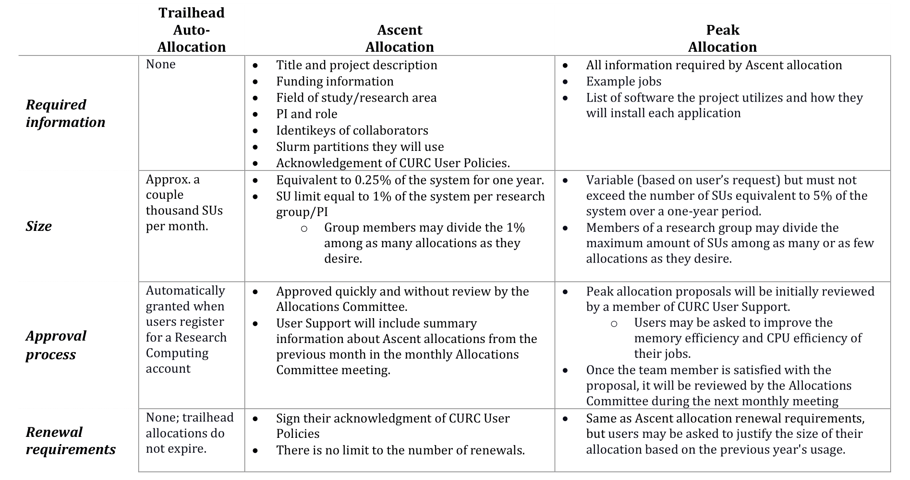

## Alpine Allocations

### What are allocations and why do I need one?

In the simplest terms, an allocation is a way for us to specify your cut 
of Alpine's computational resources. Allocations are referred to as 
accounts in Slurm's documentation and are indicated by the `--account` 
directive:

```
#SBATCH --account=______
```

Allocations are required to run on CURC clusters. They help us keep track 
of system usage for reporting purposes and to ensure we have enough 
resources to accommodate all of our users.  

### FairShare, Priority, and Allocations

#### Fairshare Scheduling
The idea behind fairshare scheduling is simple, even though its
implementation is complex: jobs submitted by people who have underutilized
their allocated resources get higher priority, while jobs submitted by
people who have overutilized their allocated resources get lower priority.

#### Level Fairshare
A Level Fairshare (`LevelFS`) is a value calculated by [Slurm's Fairshare 
Algorithm](https://slurm.schedmd.com/fair_tree.html#algorithm). A user's 
assigned shares (determined by their allocation) and usage (based on their 
job history) contribute to their `LevelFS` value. Information on how to 
check your `LevelFS` score can be found 
[here](../../faq.html#how-can-i-see-my-current-fairshare-priority).

Note that if there are no other pending jobs and enough resources are 
available then your job will run regardless of your previous usage.

#### Priority Score
When you request resources on Alpine, your job's priority determines its 
position in the queue relative to other jobs. A job’s priority is based on 
multiple factors, including (but not limited to) FairShare score, job age, 
resources requested, job size, and QOS. 

#### Allocations
When you receive a Research Computing account you are automatically 
assigned a **Trailhead Auto-Allocation**, which grants you a fixed share 
of `ucb-general`. The Trailhead is a great allocation for smaller jobs or 
testing and benchmarking your code. However, if you consume more than your 
fixed share of `ucb-general`,  your `LevelFS` will decrease, causing your 
priority score to decrease. The end result is that your jobs will sit 
lower (read: longer) in the queue relative to other jobs. One way to 
combat this is to apply for an allocation.

### Alpine Allocation Tiers

In addition to the Trailhead auto-allocation (`ucb-general`) that all users are awarded automatically, CURC offers two 
additional tiers to accommodate larger computing needs on Alpine. The **Ascent Allocation** tier provides users 
with 350,000 SUs over a 12 month period. The **Peak Allocation** tier is 
aimed at projects that will consume between 350,000 and 6,000,000 SUs in a 
12 month period. Users may apply for these tiers as described below.

CURC's tiered allocations are structured in a way such that your jobs are 
likely to have a higher priority if they are running in Ascent or Peak 
Allocations than if they are running in a Trailhead 
Auto-Allocation.

#### Comparing Trailhead Auto-Allocation, Ascent Allocation, and Peak Allocation Tiers

The following table summarizes the required information, size, approval 
process, and renewal requirements for each tier.



Individual and group size limits for new and renewed allocations will be 
reviewed on an annual basis.

#### Get an Ascent Allocation 

Step 1: Fill out the [Ascent Allocation 
Request](https://forms.office.com/r/eAA15b8Gsg) form. You need to be 
logged in to Office365 with your CU Boulder account.

Step 2: Look out for an email message from the CURC ticketing system (<rc-help@colorado.edu>) indicating when your allocation is ready to 
use.

#### Get a Peak Allocation 

Step 1: Download and complete the [Peak Allocation Request Supplementary 
Information](https://o365coloradoedu.sharepoint.com/:x:/s/RC-Team/EajdPBAejjpDru7kvEEA29QBI8CoO8lj7-kUjotBIIusEg?e=geLBBP) 
document. You need to be logged into Office365 with your CU Boulder 
account.

Step 2: Fill out the [Peak Allocation 
Request](https://forms.office.com/r/5VtLpiCh01) form. You need to be 
logged into Office365 with your CU Boulder account.
The last question will ask you to upload your completed Peak Allocation 
Request Supplementary Information document from step 1. 

Step 3: Look out for email messages from the CURC ticketing system (<rc-help@colorado.edu>). User Support will contact you when the proposal 
is received, during the initial 
review stages, and when the allocation is ready to use.

#### Renewing Your Allocation

Step 1: Keep an eye on your email inbox for a notification that your allocation is about to expire. Allocations will automatically expire one year after they are provisioned. 

Step 2: Fill out the [Alpine Allocation Renewal](https://forms.office.com/r/wimT1SCsWz) form. You need to be logged into Office365 with your CU Boulder account.

Step 3: Look out for email messages from the CURC ticketing system (<rc-help@colorado.edu>). User Support will contact you when the renewal request is received and when the renewed allocation is ready to use.

Alpine is jointly funded by the University of Colorado Boulder, the University of Colorado Anschutz, Colorado State University, and the 
National Science Foundation (award 2201538).


