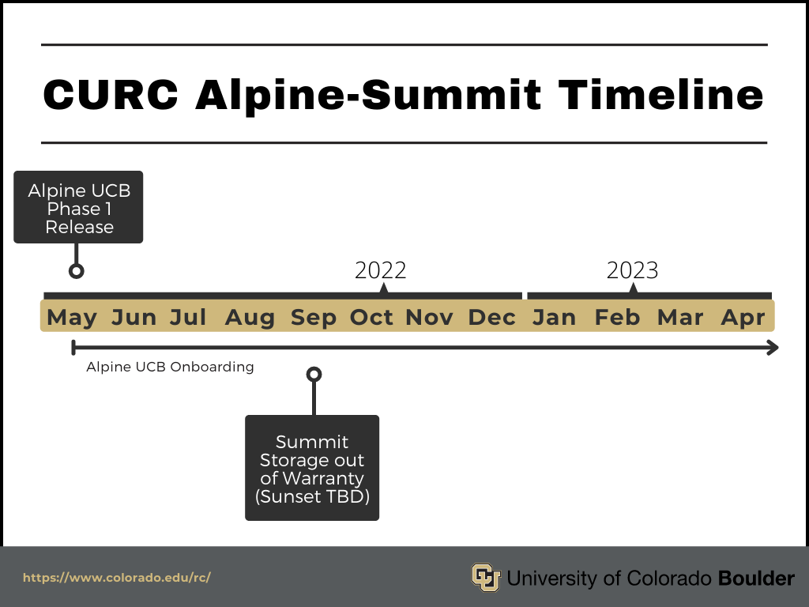

## Summit

<!--  -->

  <!--  -->
  
  <!--  --> 

Summit is the second-generation HPC cluster at University of Colorado Research Computing, following Janus. Summit is an NSF-Funded cluster shared between th University of Colorado, Colorado State University, and institutions in the Rocky Mountain Advanced Computing Consortuium (RMACC).

### Summit Quick-Start

1. From a login node, run "module load slurm/summit" to access the Slurm job scheduler instance for Summit.
2. Consult the Table and the Examples section below to learn how to direct your jobs to the appropriate compute nodes.
3. If needed, compile your application on a compile node ([Compiling and Linking](../compute/compiling.html)).

### Job Scheduling

All jobs are run through a batch/queue system.  Interactive jobs on compute nodes are allowed but these must be initiated through the scheduler.  High-priority jobs move to the top of the queue and are thus guaranteed to start running within a few minutes, unless other high-priority jobs are already queued or running ahead of them.  High-priority jobs can run for a maximum wall time of 7 days.  Low-priority jobs have a maximum wall time of 24 hours.

More details about how to use Slurm can be found [here](../running-jobs/running-apps-with-jobs.html).

### Summit Resources

Job resources are specified via slurm job scripts, more information and script examples can be found at our [batch job page](../running-jobs/batch-jobs.md). Summit resources are described in detail at our [slurm flags, partitions, and qos page](../running-jobs/job-resources.md) 

Couldn't find what you need? [Provide feedback on these docs!](https://forms.gle/bSQEeFrdvyeQWPtW9)
