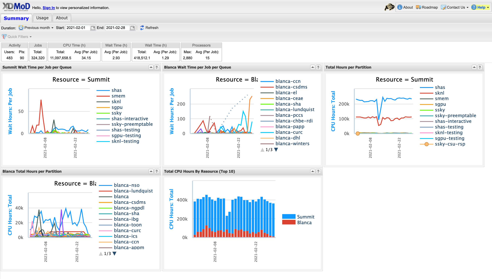
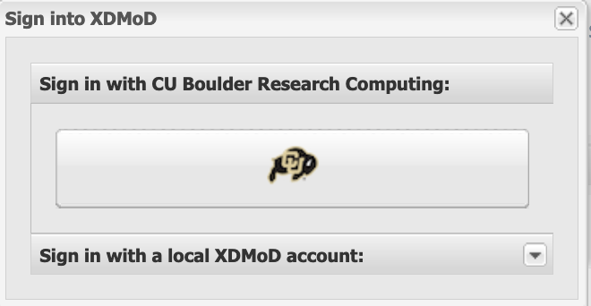
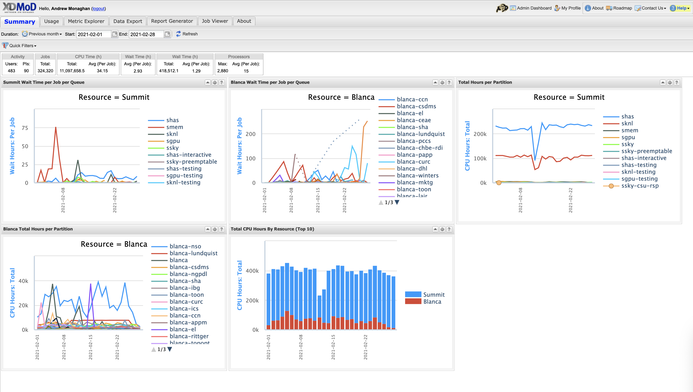

# Monitoring Resources

CU Research Computing has two main tools which can help users monitor their HPC resources:
* [Slurmtools](#slurmtools): A [module](./modules.md) that loads a collection of functions to assess recent usage statistics
* [XDMoD](#xdmod): A web portal for viewing metrics at the system, partition, and user-levels.

## Slurmtools
Slurmtools is a collection of helper scripts for everyday use of the [SLURM](https://slurm.schedmd.com/overview.html) job scheduler. Slurmtools can be loaded in as a module from any node (including login nodes). Slurmtools can help us understand the following questions:
* How many core hours (SUs) have I used recently?
* Who is using all of the SUs on my group's account?
* What jobs have I run over the past few days?
* What is my priority?
* How efficient are my jobs?

### __Step 1__: Log in
If you have a CURC account, login as you [normally would](../access/logging-in.md) using your identikey and Duo from a terminal: 

```bash
$ ssh ralphie@login.rc.colorado.edu
```

### __Step 2__: Load the slurm module for the HPC resource you want to query metrics about (Blanca, Alpine):
```bash
$ module load slurm/alpine # substitute alpine for blanca
```

### __Step 3__: Load the `slurmtools` module
```bash
$ module load slurmtools
```

You will see the following informational message:

```
You have sucessfully loaded slurmtools, a collection of functions
 to assess recent usage statistics. Available commands include:

 'suacct' (SU usage for each user of a specified account over N days)

 'suuser' (SU usage for a specfied user over N days)

 'seff' (CPU and RAM efficiency for a specified job)

 'seff-array' (CPU, RAM, and time efficiency for a specified array job)

 'jobstats' (job statistics for all jobs run by a specified user over N days)

 'levelfs' (current fair share priority for a specified user)


 Type any command without arguments for usage instructions
 ```

### __Step 4__: Get some metrics!

___How many Service Units (core hours) have I used?___

Type the command name for usage hint:
```bash
$ suuser
```
```
Purpose: This function computes the number of Service Units (SUs)
consumed by a specified user over N days.

Usage: suuser [userid] [days, default 30]
Hint: suuser ralphie 15
```

Check usage for the last 365 days:
```bash
$ suuser ralphie 365
```
```
SU used by user ralphie in the last 365 days:
Cluster|Account|Login|Proper Name|Used|Energy|
alpine|admin|ralphie|Ralphie|15987|0|
alpine|ucb-testing|ralphie|Ralphie|3812|0|
alpine|tutorial1|ralphie|Ralphie|3812|0|
alpine|ucb-general|ralphie|Ralphie|5403|0|
```

This output tells us that:
* Ralphie has used "SUs" across four different accounts over the past year
* Ralphie's usage by account varied from 3,812 SUs to 15,987 SUs


___Who is using all of the SUs on my groups' account?___

Type the command name for usage hint:
```bash
$ suacct
```
```
Purpose: This function computes the number of Service Units (SUs)
consumed by each user of a specified account over N days.

Usage: suacct [account_name] [days, default 30]
Hint: suacct ucb-general 15
```

Check `admin` account usage over past 180 days:
> Note: Most user accounts follow the naming convention `ucbXXX_ascX`, in this example we show the `admin` account.
```bash
$ suacct admin 180
```
```
SU used by account (allocation) admin in the last 180 days:
Cluster|Account|Login|Proper Name|Used|Energy
alpine|admin|||763240|0
alpine| admin|coke4948|Corey Keasling|84216|0
alpine| admin|frahm|Joel Frahm|24|0
alpine| admin|holtat|Aaron Holt|9832|0
alpine| admin|joan5896|Jonathon Anderson|9357|0
alpine| admin|ralphie|Ralphie|9357|0
```

This output tells us that:
* Five users used the account in the past 180 days.
* Their usage ranged from 24 SUs to 84,216 SUs

___What jobs have I run over the past few days?___

Type the command name for usage hint:
```bash
$ jobstats
```
```
Purpose: This function shows statistics for each job
run by a specified user over N days.

Usage: jobstats [userid] [days, default 5]
Hint: jobstats ralphie 15
```

Check ralphie's jobstats for the past 35 days:
```bash
$ jobstats ralphie 35
```
```
job stats for user ralphie over past 35 days
jobid        jobname  partition    qos          account      cpus state    start-date-time     elapsed    wait
-------------------------------------------------------------------------------------------------------------------
8483382      sys/dash amilan       normal       ucb-gener+   1    TIMEOUT  2021-09-14T09:32:09 01:00:16   0 hrs
8487254      test.sh  amilan       normal       ucb-gener+   1    COMPLETE 2021-09-14T13:21:12 00:00:02   0 hrs
8487256      interact ahub         interacti+   ucb-gener+   1    TIMEOUT  2021-09-14T13:22:11 12:00:22   0 hrs
8508557      acompile acompile     compile      ucb-gener+   2    COMPLETE 2021-09-16T10:41:45 00:00:00   0 hrs
8508561      test.sh  amilan       normal       ucb-gener+   24   CANCELLE 2021-09-22T10:07:03 00:00:00   143 hrs
8508569      test     amilan       normal       ucb-gener+   4096 FAILED   2021-09-16T10:42:46 00:00:00   0 hrs
8508575      test     amilan       normal       ucb-gener+   8192 FAILED   2021-09-16T10:43:17 00:00:00   0 hrs
8508593      test     amilan       normal       ucb-gener+   4096 CANCELLE 2021-09-16T10:44:47 00:00:00   0 hrs
8508604      test     amilan       normal       ucb-gener+   2048 CANCELLE 2021-09-16T10:45:40 00:00:00   0 hrs
8512083      spawner- ahub         interacti+   ucb-gener+   1    TIMEOUT  2021-09-16T16:55:37 04:00:23   0 hrs
8579077      acompile acompile     compile      ucb-gener+   1    COMPLETE 2021-09-24T15:26:32 00:00:47   0 hrs
8627076      acompile acompile     compile      ucb-gener+   24   CANCELLE 2021-10-04T12:17:30 00:10:03   0 hrs
8672525      interact ahub         interacti+   ucb-gener+   1    CANCELLE 2021-10-08T13:29:13 00:07:25   0 hrs
8800741      interact ahub         interacti+   ucb-gener+   1    CANCELLE 2021-10-19T08:11:44 01:48:38   0 hrs
```

This output tells me that:
* Ralphie has run 14 jobs in the past 35 days
* Most jobs had queue waits of < 1 hour
* The number of cores requested ranged from 1-->8192
* The elapsed times ranged from 0 hours to 1 hour and 48 minutes


___What is my priority?___

Type the command name for usage hint:
```bash
$ levelfs
```
```
Purpose: This function shows the current fair share priority of a specified user.
A value of 1 indicates average priority compared to other users in an account.
A value of < 1 indicates lower than average priority
	(longer than average queue waits)
A value of > 1 indicates higher than average priority
	(shorter than average queue waits)

Usage: levelfs [userid]
Hint: levelfs ralphie
```

Check Ralphie's fair share priority:
```bash
$ levelfs ralphie
```
```
ralphie
admin LevelFS: inf
ucb-general LevelFS: 44.796111
tutorial1 LevelFS: inf
ucb-testing LevelFS: inf
```

This output tells me:
* Ralphie hasn't used `admin`, `tutorial1`, or `ucb-testing` for more than a month, and therefore Ralphie has very high ("infinite") priority. 
* Ralphie has used `ucb-general` but not much. Priority is >> 1 , therefore Ralphie can expect lower-than-average queue waits compared to average ucb-general waits.


___NOTE___

What is "Priority"?  

* Your priority is a number between 0.0 --> 1.0 that defines your relative placement in the queue of scheduled jobs
* Your priority is computed each time a job is scheduled and reflects the following factors:
	* Your "Fair Share priority" (the ratio of resources you are allocated versus those you have consumed for a given account)
	* Your job size (slightly larger jobs have higher priority)
	* Your time spent in the queue (jobs gain priority the longer they wait)
	* The partition and qos you choose (this is a minor consideration on CURC systems)
* Your "Fair Share" priority has a half life of 14 days (i.e., it recovers fully in ~1 month with zero usage)

___How efficient are my jobs?___

Type the command name for usage hint:
```bash
$ seff
```
```
Usage: seff [Options] <Jobid>
       Options:
       -h    Help menu
       -v    Version
       -d    Debug mode: display raw Slurm data
```

Now check the efficiency of job 8636572:
```bash
$ seff 8636572
```
```
Job ID: 8636572
Cluster: alpine
User/Group: ralphie/ralphiegrp
State: COMPLETED (exit code 0)
Nodes: 1
Cores per node: 24
CPU Utilized: 04:04:05
CPU Efficiency: 92.18% of 04:24:48 core-walltime
Job Wall-clock time: 00:11:02
Memory Utilized: 163.49 MB
Memory Efficiency: 0.14% of 113.62 GB
```

This output tells us that:
* the 24 cores reserved for this job were 92% utilized (anything > 80% is pretty good)
* 163.49 MB RAM was used of 113.62 GB RAM reserved (0.14%). This job is "cpu bound" so the memory inefficiency is not a major issue.

This information is also sent to users who include the `--mail` directive in jobs.

___How can I check the efficiency of array jobs?___

Use the `seff-array` command with the help flag for a usage hint: 
```
$ seff-array -h
```
```
usage: seff-array.py [-h] [-c CLUSTER] [--version] jobid

positional arguments:
  jobid

options:
  -h, --help            show this help message and exit
  -c CLUSTER, --cluster CLUSTER
  --version             show program's version number and exit
```
In order to check the efficiency of all jobs in job array 8636572, run the command: 
```
$ seff-array 8636572
```
This will display the status of all jobs in the array:
```
--------------------------------------------------------
Job Status
COMPLETED: 249
FAILED: 4
PENDING: 1
RUNNING: 22
TIMEOUT: 4
--------------------------------------------------------
```
 Additionally, `seff-array` will display a histogram of the efficiency statistics all of the jobs in the array, separated into 10% increments. For example: 
```
CPU Efficiency (%)
---------------------
+0.00e+00 - +1.00e+01  [  3]  ▌
+1.00e+01 - +2.00e+01  [244]  ████████████████████████████████████████
+2.00e+01 - +3.00e+01  [  8]  █▎
+3.00e+01 - +4.00e+01  [  2]  ▍
+4.00e+01 - +5.00e+01  [  0]
+5.00e+01 - +6.00e+01  [  0]
+6.00e+01 - +7.00e+01  [  0]
+7.00e+01 - +8.00e+01  [  0]
+8.00e+01 - +9.00e+01  [  0]
+9.00e+01 - +1.00e+02  [  0]
```
The above indicates that all of the jobs displayed less than 40% CPU efficiency, with the majority (244/256) demonstrating between 10% and 20% efficiency. This information will also be displayed for memory and time efficiency. 

## XDMoD 
 
XDMoD is a web portal for viewing metrics at the system-, partition- and user-levels.

Would you like to know average queue wait times?  Do you need to better understand your historical resource utilization or utilization of your project account by user? The XDMoD ([XD Metrics on Demand](https://open.xdmod.org/9.0/index.html)) web-based tool provides users with the ability to easily obtain detailed metrics for high performance computing resources. This open-source tool was developed by the University at Buffalo [Center for Computational Research (CCR)](http://www.buffalo.edu/ccr.html). CU Boulder Research Computing runs its own instance, [CURC XDMoD](https://xdmod.rc.colorado.edu) that enables users to query metrics for the _RMACC_, _Alpine_ and _Blanca_ computing resources. 

__Getting started with XDMoD__

All CURC users have access to XDMoD (CU Boulder, CSU and RMACC). At this time, login is only supported for CU Boulder users.  Non-CU Boulder users may still query all of the statistics available to CU Boulder users, they just won't have the ability to personalize metrics. 

### Step 1: Navigate to the CURC XDMoD instance

In your browser navigate to [https://xdmod.rc.colorado.edu](https://xdmod.rc.colorado.edu). Upon reaching there you will see a summary screen similar to the following image.



This screen provides some "quick stats" and summary plots that address some of the most common user questions, such as average wait times and recent resource usage by system (Alpine or Blanca) and partition.  These metrics may be all you need. If you want to personalize metrics you can login with your CURC username and password (*currently only supported for CU Boulder users*).

### Step 2: Login (CU Boulder users only)

Choose the __Sign In__ option near the upper left of the screen.  This will initiate a pop-up window that gives you the option to _"Sign in with CU Boulder Research Computing"_ or _"Sign in with a local XDMoD account"_. 



Choose the option for _"Sign in with CU Boulder Research Computing"_ and enter your CURC username and password. The portal uses 2-factor authentication, so you will need to accept the Duo push to your phone to complete login.

### Step 3: Familiarize yourself with XDMoD

Whether or not you login, you'll start on the _"Summary"_ screen.  



The following tabs will be available, depending on whether you are logged in
* __Summary__ (the screen you are on when you login)
* __Usage__ (provides access to an expansive set of resource-wide metrics)
* __Metrics Explorer**__ (similar to the _Usage_ tab, but with additional functionality)
* __Data Export**__ (enables raw data to be output in _csv_ or _json_ format for use in other apps)
* __Report Generator**__ (facilitates the creation of reports that can be saved and shared)
* __Job Viewer**__ (enables users to search for and view jobs that meet specified criteria)
* __About__ (provide general information on the XDMoD software)

_** - only available to users who are logged in._

> _Notes on XDMoD Syntax_
>	* a "CPU Hour" is a "core hour" (e.g., for a single job, this would be the number of `ntasks` a user specifies in their job script multipled by how long the job runs)
>	* a "PI" is a project account (e.g., `ucb-general` or `ucb124_asc1`)

### Step 4: Become a pro!

XDMoD can query a seemingly endless number of metrics, more than could ever be described in this documentation.  To learn how to query specific metrics, customize your views, etc., please refer to the [XDMoD documentation](https://xdmod.rc.colorado.edu/user_manual/index.php).

### Example use case

Let's say you want to see how many core hours you project account has used over time, including the usage by user.  

* Go to the _Usage_ tab.
* In the "Metrics and Options" menu, choose _CPU Hours: Total_ to create a graph of total CPU hours consumed over a default period. In XDMoD syntax a "CPU Hour" refers to a "core hour" (for a single job, this would be the number of `ntasks` a user chooses in their job script multipled by how long the job runs).  
* Click anywhere on the blue line in the graph to expose the "Drill Down" menu:


* Choose the "PI" option.  In XDMoD syntax a "PI" is a project account (e.g., `ucb-general` or `ucb124_asc1`).  
* This will revise the graph to show CPU usage for different "PIs" (accounts), showing only the accounts with the greatest usage. Your account may not be shown. To find it click the _Filter_ tab at the top and search for your project (e.g., `ucb-general`). 
* You will now see a graph showing only core hours used by your account. To see core hours used for each user of the account, click anywhere on the line to expose the "Drill Down" menu and choose the _User_ option.
* This will revise the graph to show CPU usage by user.  If you don't see your user of interest, you can use the _Filter_ tab at the top to find them.
* You can change the time range of the x-axis by specifying the dates in the "Start" and "End" boxes near the top of the screen.


