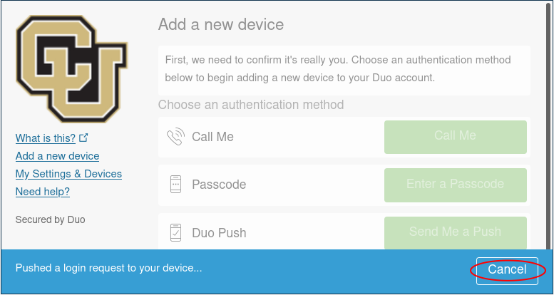

## Frequently Asked Questions

See our documentation [homepage](index.html) for information about our most common topics.

1. [I have a new phone. How do I move my Duo onto it?](#i-have-a-new-phone-how-do-i-move-my-duo-onto-it) 
2. [How do I acknowledge use of CURC Resources?](https://curc.readthedocs.io/en/latest/index.html#acknowledging-rc)
3. [How do I check how full my Summit directories are?](#how-do-i-check-how-full-my-summit-directories-are)  
4. [When will my job start?](#when-will-my-job-start) 
5. [How can I get system metrics?](#how-can-i-get-metics-about-curc-systems-such-as-how-busy-they-are-wait-times-and-account-usage) 
6. [How much memory did my job use?](#how-much-memory-did-my-job-use)  
7. [Where is my current fair share priority level at?](#how-can-i-see-my-current-fairshare-priority)  
8. [Why is my job pending with reason 'ReqNodeNotAvail'?](#why-is-my-job-pending-with-reason-reqnodenotavail)  
9. [Why do I get the following 'Invalid Partition' error when I run my job?](#why-do-i-get-an-invalid-partition-error-when-i-try-to-run-a-job):   
    `sbatch: error: Batch job submission failed: Invalid partition name specified.`
10. [Why do I get the following 'Invalid Partition' error when I run a Blanca job?](#why-do-i-get-an-invalid-partition-error-when-i-try-to-run-a-Blanca-job) 
11. [How can I check what allocations I belong to?](#how-can-i-check-what-allocations-i-belong-to)
[Why do I get the following 'LMOD' error when I try to load slurm/summit?](#why-do-i-get-an-lmod-error-when-i-try-to-load-slurm):  
    `Lmod has detected the following error:  The following module(s) are unknown: "slurm/summit"`
12. [How do I install my own python library?](#how-do-i-install-my-own-python-library)  

### I have a new phone. How do I move my Duo onto it?

You can add a new device to your duo account by visiting <a href="https://duo.colorado.edu">https://duo.colorado.edu</a>.
After a CU authorization page you will be directed to a Duo authentication page. **Ignore the Duo Push prompt and instead click "Add a new device":** 

<!--  -->


<!--  -->

Duo will then try to authenticate your account by push notification to verify your identity. Cancel this push notifcation...  



...and click on "Enter a Passcode", or "Call Me". 
- If you select "Call Me" the simply recieve the call and press 1. 
- If you select "Enter a passcode" then click "Text me new codes" and you will be sent a list of one time passwords. Type in any one of the codes and you will be authenticated. 

Once you have verified your identity, follow the instructions provided by Duo to add your device.

If you cannot authenticate your account (e.g. do not have your old device), contact rc-help@colorado.edu for further assistance.

### How do I check how full my Summit directories are?

You have three directories allocated to your username (`$USER`). These include `/home/$USER` (2 G), `/projects/$USER` (250 G) and `/scratch/summit/$USER` (10 T).  To see how much space you've used in each, from a Summit 'scompile' node, type `curc-quota` as follows:

```
[user@shas0100 ~]$ curc-quota
------------------------------------------------------------------------
                                       Used         Avail    Quota Limit
------------------------------------------------------------------------
/home/janedoe                          1.7G          339M           2.0G
/projects/janedoe                       67G          184G           250G
/scratch/summit                         29G        10211G         10240G
```

You can also check the amount of space being used by any directory with the `du -sh` command or the directory's contents with the `du -h` command: 

```
[janedoe@shas0136 ~]$ du -h /scratch/summit/janedoe/WRF
698M	WRF/run
698M	WRF
```

### When will my job start?

You can pull up information on your job's start time using the `squeue` command: 
```
squeue --user=your_rc-username --start
```
Note that Slurm's estimated start time can be a bit inaccurate. This is because Slurm calculates this estimation off the jobs that are currently running or queued in the system. Any job that is added in later with a higher priority may delay your job.

For more information on the `squeue` command, [take a look at our Useful Slurm Commands tutorial.](running-jobs/slurm-commands.html) Or visit the Slurm page on [squeue](https://slurm.schedmd.com/squeue.html)

Note that you can also see system level wait times and how they change through time by visiting the [CURC metrics portal](https://curc.readthedocs.io/en/latest/gateways/xdmod.html) at [https://xdmod.rc.colorado.edu](https://xdmod.rc.colorado.edu)

### How can I get metics about CURC systems such as how busy they are, wait times, and account usage?

Visit the [CURC metrics portal](https://curc.readthedocs.io/en/latest/gateways/xdmod.html) at [https://xdmod.rc.colorado.edu](https://xdmod.rc.colorado.edu)

### How much memory did my job use?

You can check how much memory your job used by using the `sacct` command. Simply replace `YYYY-MM-DD` with the date you ran the job:

```
sacct --starttime=YYYY-MM-DD --jobs=your_job-id --format=User,JobName,JobId,MaxRSS
```

If you'd like to monitor memory usage on jobs that are currently running, use the `sstat` command:

```
sstat --jobs=your_job-id --format=User,JobName,JobId,MaxRSS
```

For more information on `sstat` or `sacct` commands, [take a look at our Useful Slurm Commands tutorial.](running-jobs/slurm-commands.html) Or visit the Slurm reference pages on [sstat](https://slurm.schedmd.com/sstat.html) and [sacct](https://slurm.schedmd.com/sacct.html).

### How can I see my current FairShare priority?

There are a couple ways you can check your FairShare priority:

1. Using the `levelfs` tool in the `slurmtools` module. `levelfs` shows the current fair share priority of a specified user.
	
	You can use this tool by first loading in the `slurmtools` module (available from login nodes):
	```
	$ module load slurmtools
	```
	> _Tip: slurmtools is packed with lots of great features and tools like suacct, suuser, jobstats, seff, etc._
	
	Then using `levelfs` on your username:
	```
	$ levelfs $USER
	```
	* A value of 1 indicates average priority compared to other users in an account.
	* A value of < 1 indicates lower than average priority (longer than average queue waits) 
	* A value of > 1 indicates higher than average priority (shorter than average queue waits)
<br/><br/>
2. Using the `sshare` command:
	```
	sshare -U -l
	```
	The `sshare` command will print out a table of information regarding your usage and priority on all allocations. The -U flag will specify the current user and the -l flag will print out more details in the table. The field we are looking for is the _LevelFS_. The LevelFS holds a number from 0 to infinity that describes the fair share of an association in relation to its other siblings in an account. Over serviced accounts will have a LevelFS that's between 0 and 1. Under serviced accounts will have a LevelFS that's greater than 1. Accounts that haven't run any jobs will have a LevelFS of infinity (inf).

	For more information on fair share the `sshare` command, [take a look at Slurm's documentation on fair share](https://slurm.schedmd.com/fair_tree.html) Or [check out the Slurm reference page on sshare](https://slurm.schedmd.com/sshare.html)

### Why is my job pending with reason 'ReqNodeNotAvail'?

The 'ReqNodeNotAvail' message usually means that your node has been reserved for maintenance during the period you have requested within your job script. This message often occurs in the days leading up to our regularly scheduled maintenance, which is performed the first Wednesday of every month. So, for example, if you run a job with a 72 hour wall clock request on the first Monday of the month, you will receive the 'ReqNodeNotAvail' error because the node is reserved for maintenance within that 72-hour window. You can confirm whether the requested node has a reservation by typing `scontrol show reservation` to list all active reservations. 

If you receive this message, the following solutions are available: 1) run a shorter job that does not intersect the maintenance window; or 2) wait until after maintenance. 

### Why do I get an 'Invalid Partition' error when I try to run a job?

This error usually means users do not have an allocation that would provide the service units (SUs) required to run a job.  This can occur if a user has no valid allocation, specifies an invalid allocation, or specifies an invalid partition.  Think of SUs as "HPC currency": you need an allocation of SUs to use the system. Allocations are free. New CU users should automatically get added to a 'ucb-general' allocation upon account creation which will provide a modest allocation of SUs for running small jobs and testing/benchmarking codes. However, if this allocation expires and you do not have a new one you will see this error.  'ucb-general' allocations are intended for benchmarking and testing, and it is expected that users will move to a project allocation.  To request a Project and apply for a Project Allocation visit our [allocation site](https://www.colorado.edu/rc/userservices/allocations).

### Why do I get an 'Invalid Partition' error when I try to run a Blanca job?
If you are getting an 'invalid patition' error on a Blanca job which you know you have access to or have had access to before, you may be in the slurm/summit or slurm/alpine scheduler instance. From a login node, run “module load slurm/blanca” to access the Slurm job scheduler instance for Blanca then try to resubmit your job.

### How can I check what allocations I belong to?

You can check the allocations you belong to with the `sacctmgr` command. Simply type:
```bash
sacctmgr -p show associations user=$USER
```
...from a login or compile node. This will print out an assortment of information including allocations and QoS available to you. For more information on sacctmgr, [check out the Slurm's documentation](https://slurm.schedmd.com/sacctmgr.html)

### Why do I get an 'LMOD' error when I try to load Slurm?

The slurm/summit module environment can not be loaded from compile or compute nodes. It should only be loaded from login nodes when attempting to switch between Blanca and Summit enviornments. This error can be disregarded, as no harm is done.

### How do I install my own python library?

Although Research Computing provides commonly used Python libraries as module, you may need to install individual python libraries for your research. This is best handled by utilizing Research Computing's Anaconda installation to set up a local Conda enviornment.

[Find out more about using Python with Anaconda here.](software/python.html)


<!-- 
This guide covers installing a local Python library (pyDOE) which is not included in the Research Computing modules. One prerequisite assumption is that you are using the [new module system](compute/modules.html). That being said, this guide can be tweaked to be used on the older modules as well.

First login to a login node and then ssh to a compile node.

```
[user@login01 ~]$ ssh scompile
```

Next load the version of Python you'd like to add a library too. For this guide we'll be using Intel and Python 2.7.11.

```
[user@shas0100 ~]$ ml intel/17.4
[user@shas0100 ~]$ ml python/2.7.11
```

Before installing, create a directory in which to keep your local Python libraries. It is recommended that the /projects directory be used as it has more space.

```
[user@shas0100 ~]$ mkdir /projects/$USER/python_libs
```

You can now install your local python library.

```
[user@shas0100 ~]$ pip install --prefix="/projects/$USER/python_libs" pyDOE
```

In order to use your newly installed library it needs to be added to your PYTHONPATH. Use the following export command:

```
[user@shas0100 ~]$ export PYTHONPATH=$PYTHONPATH:/projects/$USER/python_libs/lib/python2.7/site-packages/
```

You can quickly check if your install worked with the following:

```
[user@shas0100 ~]$ python -c "import pyDOE"
```

Every time you log out you will need to rerun the above export to use your Python library (don't forget to load Python as well). Two ways of avoiding this are to add the export command to your bashrc. `vim ~/.bashrc`. An alternative is to make your own modulefile.

One final item of note is a Python virtualenv. Virtualenvs allow you to keep multiple Python environments with separate versions of packages. There are plenty of guides available online such as this one: [http://docs.python-guide.org/en/latest/dev/virtualenvs/](http://docs.python-guide.org/en/latest/dev/virtualenvs/). These are especially handy if you have several projects which require different versions of the same Python library.

-->
