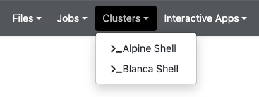
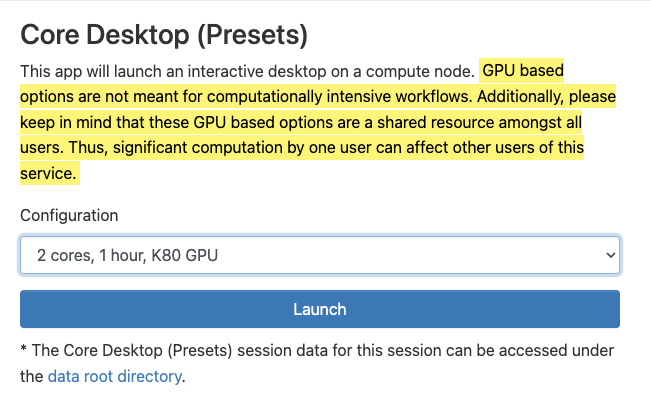
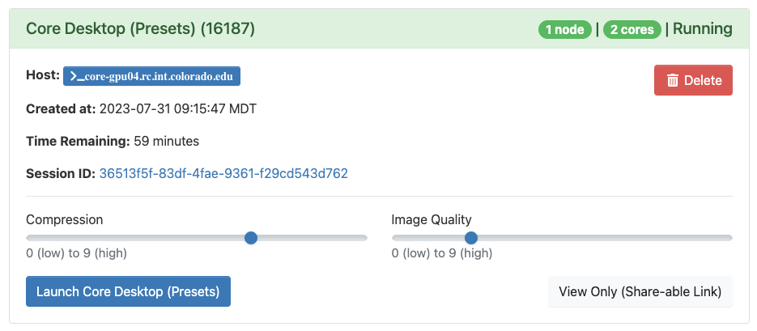
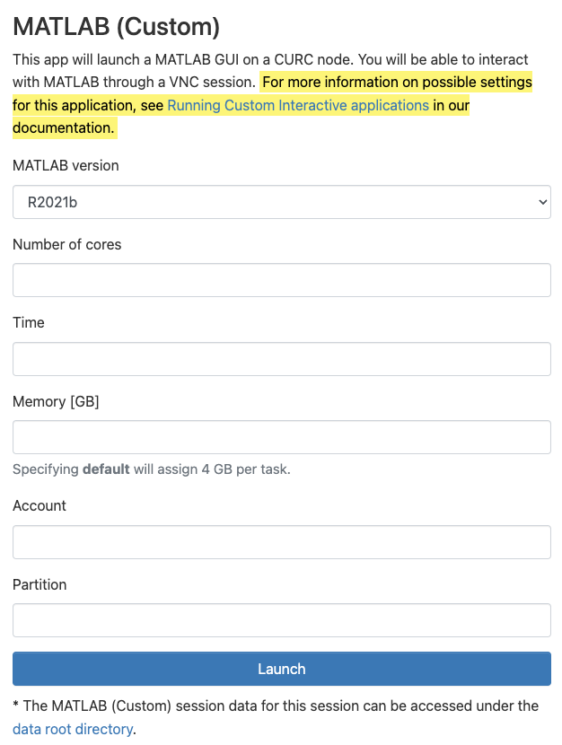
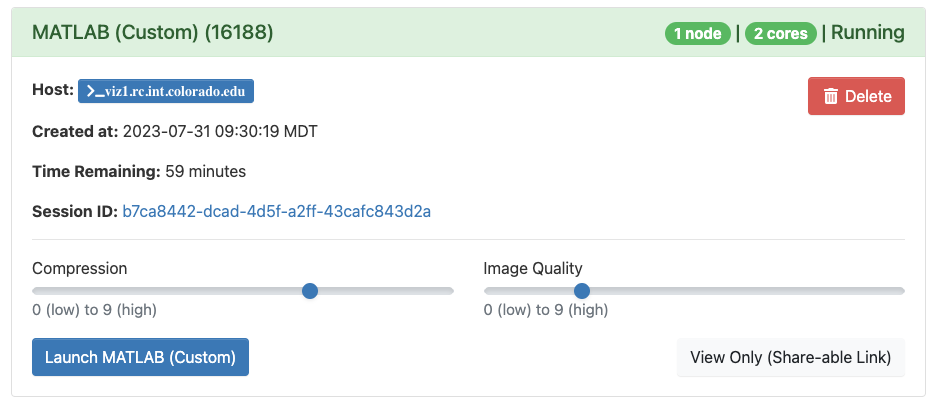
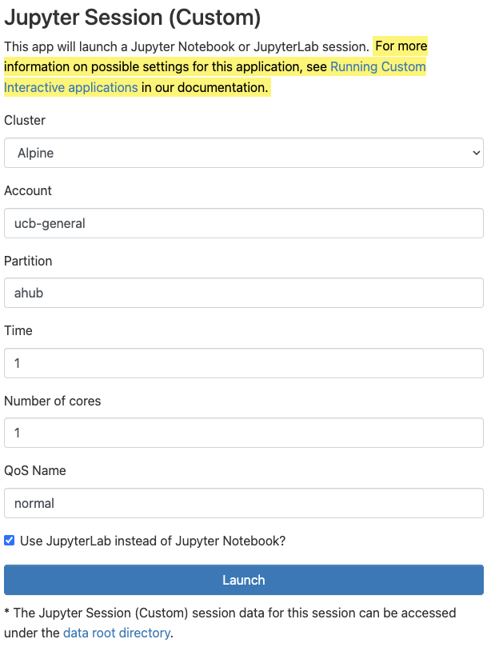
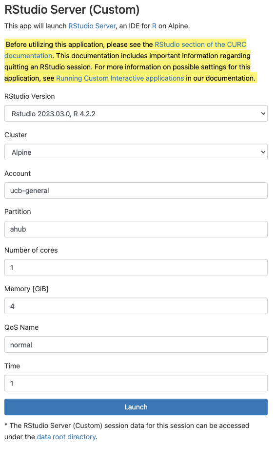
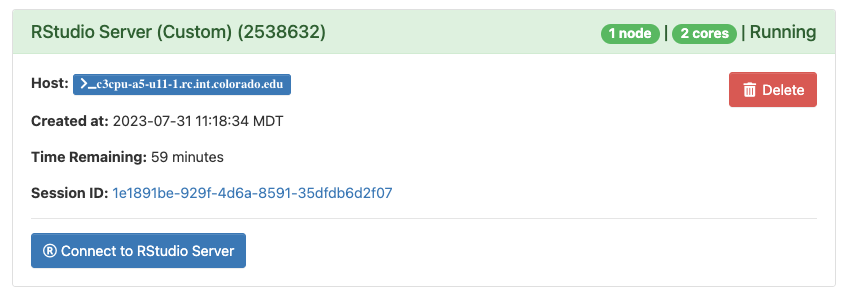

## Open OnDemand _(Browser Based HPC Portal)_

CURC Open OnDemand is a browser based, integrated, single access point for all of your high performance computing (HPC) resources at CU Research Computing. CURC Open OnDemand provides a graphical interface to view, edit, download, and upload files; manage and create job templates for CURC's clusters; and access CURC interactive applications (Virtual Desktops, Matlab, Jupyter Notebooks, and RStudio). All of these actions are completed via a web browser and require only minimal knowledge of Linux and scheduler commands.

<iframe width="560" height="315" src="https://www.youtube.com/embed/cP6lfRWywk0" frameborder="0" allow="autoplay; encrypted-media" allowfullscreen></iframe>

### Getting started with CURC Open OnDemand
 
To connect to CURC Open OnDemand, visit [https://ondemand.rc.colorado.edu](https://ondemand.rc.colorado.edu/). The first page of CURC Open OnDemand will bring you to a login prompt. Use your CU Research Computing credentials and Duo 2-factor authentication to login. If you need a CU Research Computing account please visit [our account request page](https://curc.readthedocs.io/en/latest/access/logging-in.html) to get started. If you are an RMACC member, please follow our provided instructions on accessing [Alpine resources for RMACC members](../access/rmacc.html).

_**Notes on logging out:**_ 
* You must **completely quit your browser in order for "logout" to occur**. If after reopening your browser you are still logged in, please clear your cookies. If you are on a Chromebook or Chromebox, you will need to reboot your device in order to "quit the browser" and thus "logout".  
* **Tip: Using a "private browsing mode"** window while using OnDemand is a great way to handle "auto-logout", as closing your browser window will remove all associated cookies and session information. 

### Features

When you have successfully logged into CU Open OnDemand, you will see the landing page with the following features broken into tabs along the top of the page: __Files__, __Jobs__, __Clusters__ (shell access), __Interactive Apps__, and __My Interactive Sessions__.

We'll step through these features one at a time.

#### Files

The _File_ menu allows you to view and operate on files in different file spaces: your _home_ directory, _projects_ directory, scratch spaces, and (if you own one or are part of a group with one) access to _PetaLibary_ allocations.

Selecting one of the file spaces will open a separate browser window which will allow you to navigate the space in a graphical setting similar to a file browser on a personal computer. From here you can download, upload, create, delete, and open files.

> **_NOTE:_** _Please use 
[Globus](https://curc.readthedocs.io/en/latest/compute/data-transfer.html#globus-transfers) 
to transfer files to and from `/scratch/alpine` or `/rc_scratch`. Additionally, Globus should be used if you have more than 1 GB of data to transfer. Open OnDemand is not designed to handle large file transfers._

> For additional documentation visit [OSC's File Transfer and Management help page](https://www.osc.edu/resources/online_portals/ondemand/file_transfer_and_management).

#### Jobs 

Jobs can be monitored, created, edited and scheduled with the job management tools under the _Jobs_ menu.

* __Active Jobs:__ Under the “Active Jobs” tab you can view active jobs. You can choose to view your jobs (or all jobs) as well as choose from specific clusters (Alpine, Core, or All Clusters). From this menu you can also cancel your own jobs.

* __Job Composer:__ Create and edit job scripts and schedule jobs under this menu.

> See [OSC's Job Management help page](https://www.osc.edu/resources/online_portals/ondemand/job_management) for detailed use of the job composer feature.

#### Clusters (Shell Access)

The _Clusters_ menu provides shell access to login nodes on CURC clusters. The shell terminal is similar to many other tools that provide terminal access.

 

> Currently, Alpine shells log you into a basic login node. You can 
load in either Alpine or Blanca slurm instances from here: `module load 
slurm/<cluster>` with either Alpine or Blanca.

* __Alpine:__ The Alpine tab will launch a terminal that RC users can use to manually access an RC Login node. After the tab opens, type your CURC password and accept the Duo push to your phone, which will complete the login to the terminal.

<!-- * __Blanca:__ The Blanca tab will launch a terminal that RC users can use to manually access an RC Login node. After the tab opens, type your CURC password and accept the Duo push to your phone to complete login to the terminal. To load the Blanca Slurm environment, make sure to type “module load slurm/blanca upon login. More information on using the Blanca cluster can be found [in the Blanca documentation](https://curc.readthedocs.io/en/latest/access/blanca.html). -->

#### Interactive Applications Menu

The _Interactive Applications_ menu contains options to launch certain applications that have graphical user interfaces (GUIs) for interactive use on CURC clusters. Currently supported applications include a __remote desktop__, __MATLAB__, __Jupyter session__, and __RStudio session__.

##### Core Desktop (remote desktop)

1. To start a remote desktop session, you can select either `Core Desktop` or `Core Desktop (Presets)` from the interactive applications menu. When starting a `Core Desktop` session, you may customize the runtime and number of cores for the session. If you select `Core Desktop (Presets)`, you may select from standard configurations we provide.

2. Once either option is selected, click “Launch” to submit the remote desktop job to the queue. The wait time depends on the number of other users presently on the resource. Requesting smaller and shorter jobs may facilitate shorter wait times. 
3. When your remote desktop is ready, you can click the "Launch Core Desktop" or "Launch Core Desktop (Presets)" button to bring up a web page with the remote desktop. In most cases, the default compression and image quality will suffice. If you do have problems with image quality you can adjust these settings as necessary. 

4. With the remote desktop session running and open, you should be able to run standard Linux desktop applications that have a graphical user interface (GUI). 

**Notes**:
* <mark style="background-color: #FFF36D">
  GPU based options are not meant for computationally intensive workflows. Additionally,
  please keep in mind that these GPU based options are a shared
  resource amongst all users. Thus, significant computation by one
  user can affect other users of this service.
  </mark>
* You can copy/paste into/out of the VNC desktop using the clipboard in the "hidden" tab on the left-hand-side of the virtual desktop.

* Closing the window will not terminate the job. You can use the “My Interactive Sessions” tab to view all open interactive sessions and terminate them.

##### MATLAB

1. To start an interactive MATLAB session, select either `MATLAB (Custom)` or `MATLAB (Presets)` from the interactive applications menu. When starting a `MATLAB (Custom)` session, you may customize resources allocated to the session and other characteristics of the dispatched Slurm job. For more information on these options, please see the [Running Custom Interactive applications](#running-custom-interactive-applications) section below. If you select `MATLAB (Presets)`, you may select from standard configurations we provide.

2. Once either option is selected, click “Launch” to submit the MATLAB job to the queue. The wait time depends on user provided options, such as the number of cores and time requested.
3. When your Matlab session is ready, you can click the “Launch MATLAB (Custom)” or "Launch MATLAB (Presets)" button to bring up a web page with the MATLAB session. In most cases, the default compression and image quality will suffice. If you do have problems with image quality of the MATLAB session, you can adjust as necessary.

4. Once launched, it may take a few minutes for MATLAB to begin. However, once started, you should be able to interact with MATLAB as you would on your own computer.  

**_Notes:_** 
* <mark style="background-color: #FFF36D">
  GPU based options are not meant for computationally intensive workflows. Additionally,
  please keep in mind that these GPU based options are a shared
  resource amongst all users. Thus, significant computation by one
  user can affect other users of this service.
  </mark>
* Closing the window will not terminate the job, you can use the “My Interactive Sessions” tab to view all open interactive sessions and terminate them.

##### Jupyter Session

1. When starting an interactive Jupyter session job, you may select `Jupyter Session (Custom)` or `Jupyter Session (Presets)` from the menu. The `Jupyter Session (Custom)` option allows you to modify the resources and Slurm configurations for the job. For more information on these options, please see the [Running Custom Interactive applications](#running-custom-interactive-applications) section below. If you select `Jupyter Session (Presets)`, you may select from standard configurations we provide.  Most use cases can be accommodated by one of the presets. The `Jupyter Session (Presets)` option submits jobs to Alpine's `ahub` partition. This partition provides users with rapid start times, but __limits users to one Jupyter session__ (or any one job using the partition).

2. Click “Launch” to submit the Jupyter session job to the queue. The wait time depends on the number of cores and time requested. The preset options generally start within a few moments. 
3. Once your Jupyter Notebook session is ready, you can click “Connect to Jupyter”. An interactive Jupyter session will be started in a new window.

**_Notes:_** 
* When the session starts, the file navigator panel displays CURC root. You can navigate to one of your CURC spaces by selecting `home` or `projects` from the file panel on the left. Alternatively, you can go to "File" then "Open Path" and enter your path in the field (e.g. `/projects/<your username>`).
* For more information on running Jupyter sessions, [check out RC’s page on Jupyter](./jupyterhub.html).
* Closing the window will not terminate the job, you can use the “My Interactive Sessions” tab to view all open interactive sessions and terminate them.

##### RStudio

1. To start an interactive RStudio job, select `RStudio Server (Custom)` or `RStudio Server (Presets)` from the menu. The `RStudio Server (Custom)` option allows you to modify the resources and Slurm configurations for the job. For more information on these options, please see the [Running Custom Interactive applications](#running-custom-interactive-applications) section below. The `RStudio Server (Presets)` application provides configurations for your convenience. Most use cases can be accommodated by one of the presets. The `RStudio Server (Presets)` option submits jobs to Alpine's `ahub` partition. This partition provides users with rapid start times, but __limits users to one RStudio Server session__ (or any one job using the partition; for example if you have a Jupyter session that is also using the `ahub` partition, you will not be able to start an RStudio Server session using the preset options).

2. Click “Launch” to submit the RStudio job to the queue. The wait time depends on the number of cores and time requested.  The preset options provided generally start within a few moments. 
3. Once your RStudio session is ready, you can click “Connect to RStudio Server”. An interactive RStudio session will be started in a new window.

4. To shut down an RStudio server, go to the "File" menu at the top and choose "Quit session...". If you have made changes to the workspace, then you will be asked if you would like to save them to `~/.RData`, this is not necessary, but can be helpful. Once completed, a prompt will notify you that your R session has ended and will give you the option to restart a server, if desired. However, it is important to note that quitting the session will not cancel the job you are running. Additionally, closing the window will not terminate the job. To terminate the job, you can use the “My Interactive Sessions” tab in Open OnDemand to terminate running sessions.

**_Notes:_** 
* We have designed the RStudio app in Open OnDemand such that it employs versions of R that match the versions of R that are also available in the CURC module stack. This is done to facilitate moving between using RStudio for interactive work, and running larger R workflows as batch jobs on Alpine or Blanca. Due to system constraints, packages you install in a given version of R in RStudio will not be available if you load the equivalent version of the R module, and vice versa.  You will need to (re-)install the packages you need when using the equivalent module.

##### Running _Custom_ Interactive applications

The Matlab, Jupyter, and RStudio interactive applications each have `Custom` menus available for starting sessions (jobs) in addition to `Preset` menus. The `Custom` menus are intended to provide the ability to start jobs that require unconventional resources that aren't available through the `Preset` menu, for example: 

* access to GPU nodes;
* access to high-memory nodes;
* large numbers of cores;
* longer job durations.

To help you use the `Custom` menu for interactive applications, below is a table describing each field and possible options. 

| Input | Description |
| --- | ----------- |
| Cluster | Possible options are [Alpine](https://curc.readthedocs.io/en/latest/clusters/alpine/index.html) and [Blanca](https://curc.readthedocs.io/en/latest/clusters/blanca/blanca.html).  |
| Account | The account you would like to use. If you do not have a project allocation, then CU Boulder users specify `ucb-general`; CSU users specify `csu-general`; RMACC users specify `rmacc-general`; and AMC users provide `amc-general`. If you have a project allocation you can use this allocation e.g. `ucbXXX_asc1`. |
| Partition | Specifies a particular node type to use. For example, you can provide `ahub` for quicker access or utilize another [partition on Alpine](https://curc.readthedocs.io/en/latest/clusters/alpine/alpine-hardware.html#partitions).  Blanca users may use their `blanca-<groupname>` partition.  |
| Number of cores1 | The number of physical CPU cores for the job. Jobs started on the OnDemand interactive apps may use up to 32 cores.  All jobs are limited to a single compute node. |
| Memory [GB]1 | The total amount of memory allocated for the Job. Memory in GB should be roughly the number of cores multiplied by 3.8 for standard Alpine `amilan` nodes. For specifications on memory for each Alpine partition, see [Alpine hardware](https://curc.readthedocs.io/en/latest/clusters/alpine/alpine-hardware.html). |
| QoS Name | Quality of Service (QoS) constrains or modifies certain job characteristics. On most Alpine partitions you can specify `normal` for jobs of up to 24 hours and `long` for jobs of up to 7 days in duration. For more information see [Alpine QoS](https://curc.readthedocs.io/en/latest/clusters/alpine/alpine-hardware.html#quality-of-service-qos). Blanca users should specify their `blanca-<groupname>` for QoS. |
| Time1 | The duration of the job, in hours. This is dependent on both the partition and the QoS on Alpine (see above).  On Blanca, users may specify jobs of up to 7 days (168 hours) in duration. |

1Please note that jobs scheduled on partitions other than `ahub` may take up to several hours to start depending on the number of cores, memory and duration.

###### GPU access for Jupyter Sessions

When launching custom Jupyter sessions, one can access a single GPU on Alpine by specifying the correct partition and QoS name. However, only the testing partitions are valid on Jupyter sessions and they are limited to a run time of one hour. For GPU jobs that require more resources or more time, please submit a [batch job](../running-jobs/batch-jobs.html) using the standard `ami100` or `aa100` partitions. The table below provides the inputs needed to start a Jupyter session with a GPU:

| Partition | QoS Name | Type of GPU |
| --- | ----------- | --------------
| atesting_a100 | testing |   NVIDIA A100 |
| atesting_mi100 | testing |   AMD MI100 |

#### My Interactive Sessions

The _My Interactive Sessions_ menu will let you view and manage all of your current open Interactive applications. From this window, you can view the node/core count, status, as well as time remaining for current sessions. 

Closing the window an interactive application is opened in will not terminate the session. You will need to click the “Delete” button for the individual session.

