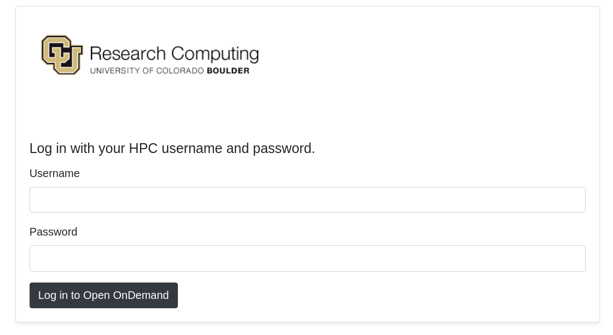

## CU Open OnDemand _(Browser based access for all of your HPC resources)_

CU OnDemand is a browser based, integrated, single access point for all of your HPC resources. CU OnDemand provides a graphical interface to view, edit, download, and upload files, manage and create job templates, and access CURC interactive applications (Viz cluster, Matlab, and JupyterNotebooks), all via a web browser and with minimal knowledge of Linux and scheduler commands.

### Getting started with CU Open OnDemand

> **_NOTE:_** _This is a beta release of Open OnDemand currenly only available to CU users_
 
To connect to CU OnDemand, visit [https://ondemand.rc.colorado.edu](https://ondemand.rc.colorado.edu/). The first page of CU OnDemand will bring you to a login prompt. Use your CU Research Computing credentials to login and 2-factor authenticate using Duo. If you need a CU Research Computing account please visit [our acccount request page](https://curc.readthedocs.io/en/latest/access/logging-in.html) to get started.

### Features

When you have successfully logged into Cu OnDemand you will see the landing page with the following features broken into tabs along the top of the page: Files, Jobs, Clusters (shell access), Interactive Apps, and My Interactive Sessions.

#### File Menu

The File menu allows users to view and operate on files in three different file spaces: the user’s home directory, project directory, and if applicable shared PetaLibary directories.

Selecting one of the file spaces will open a separate browser window which will allow you to navigate the space in a graphical setting similar to a file browser on personal computers. From here users can download, upload, create, delete, and open files.

> **_NOTE 1:_** _Use [Globus](https://curc.readthedocs.io/en/latest/compute/data-transfer.html#globus-transfers) to transfer files to /scratch/summit or /rc_scratch._

> **_NOTE 2:_** _If you have more than 1 GB of data to transfer, please use [Globus](https://curc.readthedocs.io/en/latest/compute/data-transfer.html#globus-transfers)._

For additional detail: [OSC's File Transfer and Management help page](https://www.osc.edu/resources/online_portals/ondemand/file_transfer_and_management).

#### Jobs Menu

Jobs can be monitored, created, edited and scheduled with the job management tools under the “Jobs” menu.

* __Active Jobs:__ Under the “Active Jobs” tab you can view active jobs. You can choose to view your jobs (or all jobs) as well as choose from specific clusters (Blanca, Summit, Viz-Core, or all Custers). From this menu you can cancel your own jobs.

* __Job Composer:__ Create and edit job scripts and schedule jobs under this menu. [OSC's File Transfer and Management help page](https://www.osc.edu/resources/online_portals/ondemand/file_transfer_and_management) provides details on its use.

#### Clusters (i.e. Shell Access)

The Clusters tab provides shell access to login nodes on CURC clusters. The shell terminal is similar to many other tools that provide terminal access.

* __Summit:__ The Summit tab will launch a terminal that RC users can use to manually access an RC Login node. After the tab opens, type your CURC password and accept the Duo push to your phone to complete login to the terminal.

* __Blanca:__ The Blanca tab will launch a terminal that RC users can use to manually access an RC Login node. After the tab opens, type your CURC password and accept the Duo push to your phone to complete login to the terminal. To load the Blanca Slurm environment, make sure to type “module load slurm/blanca upon login. More information on using the [Blanca cluster can be found here](https://curc.readthedocs.io/en/latest/access/blanca.html).

#### Interactive Applications

The Interactive Applications menu contains options to launch certain applications that have graphical user interfaces (GUIs), for interactive use on CURC clusters. Current supported applications include a __remote desktop from the visual cluster (viz), MATLAB, and Jupyter Notebook__.

##### Remote Desktop (Viz-Core VNC)

1. When starting a Remote Desktop session on the Viz cluster you may customize the resources allocated to the session and other characteristics of the dispatched Slurm job. The default will open a Remote Desktop with 1 node (2 cores) for 1 hour (no need to specify account).
2. Click “launch” to submit the Remote Destop job to the queue. The wait time depends on the number of cores as well as time requested. 
3. When your Remote Desktop is ready you can click the “Launch VIZ CORE VNC.” In most cases the default compression and image quality will suffice but if you do have problems with image quality of the Remote Desktop you can adjust these settings as necessary. 
4. With the Remote Desktop session running and open, you should be able to run standard Linux desktop applications that have a graphical user interface (GUI). Instructions to use graphical software can be found at the [RC EnginFrame page](https://curc.readthedocs.io/en/latest/gateways/enginframe.html#step-3-use-graphical-software).

> **_NOTE:_** _Closing the window will not terminate the job, you can use the “My Interactive Sessions” tab to view all open interactive sessions and terminate them._

##### MATLAB

1. When starting an interactive MatLab job you may customize the resources allocated to the session and other characteristics of the dispatched Slurm job including the Matlab version. In most cases the defaults will be adequate (i.e, no need to specify an account).
2. Click “launch” to submit the MATLAB job to the queue. The wait time depends on the number of cores, nodes, and time requested.
3. When your Matlab session is ready you can click the “Launch MATLAB on Core- CURC” In most cases the default compression and image quality will suffice but if you do have problems with image quality of the Remote Desktop you can adjust as necessary. An interactive Matlab session will be started in a new window.

> **_NOTE:_** _Matlab can also be opened in the Remote Desktop (VIZ CORE VNC), once you’ve opened a Remote Desktop session instructions can be found at the [RC EnginFrame page](https://curc.readthedocs.io/en/latest/gateways/enginframe.html#step-3-use-graphical-software)._

> **_NOTE:_** _Closing the window will not terminate the job, you can use the “My Interactive Sessions” tab to view all open interactive sessions and terminate them._

##### Jupyter Notebook

1. When starting an interactive JupyterHub job you may customize the resources allocated to the session and other characteristics of the dispatched Slurm job. In most cases the defaults will be adequate (i.e, no need to specify an account or partition).

> **_NOTE:_** _Jobs are currently limited to 1 core per node requested._

2. Click “launch” to submit the JupyterNotebook job to the queue. The wait time depends on the number of nodes and cores as well as time requested.
3. Once your Jupyter Notebook session is ready you can click the “Launch Jupyter Notebook” In most cases the default compression and image quality will suffice but if you do have problems with image quality of the Remote Desktop you can adjust as necessary. An interactive Jupyter Notebook session will be started in a new window.
4. For more information on running Jupyter Notebooks [check out RC’s page on Jupyter](https://curc.readthedocs.io/en/latest/gateways/jupyterhub.html).

> **_NOTE:_** _Closing the window will not terminate the job, you can use the “My Interactive Sessions” tab to view all open interactive sessions and terminate them._ 

#### My Interactive Sessions

The “My Interactive Sessions” tab will let you view and manage all of your current open Interactive applications. From this window you can view the node/core count, status, as well as time remaining for current sessions. 

Closing the window an interactive application is opened in will not terminate the session, you will need to click the “Delete” button for the individual session.
