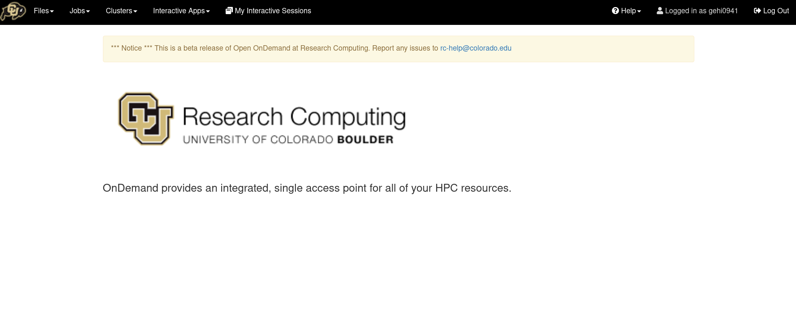
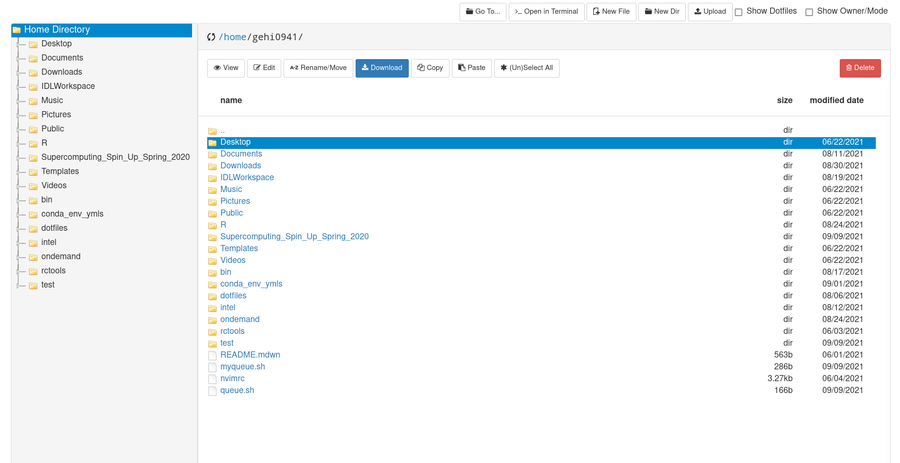
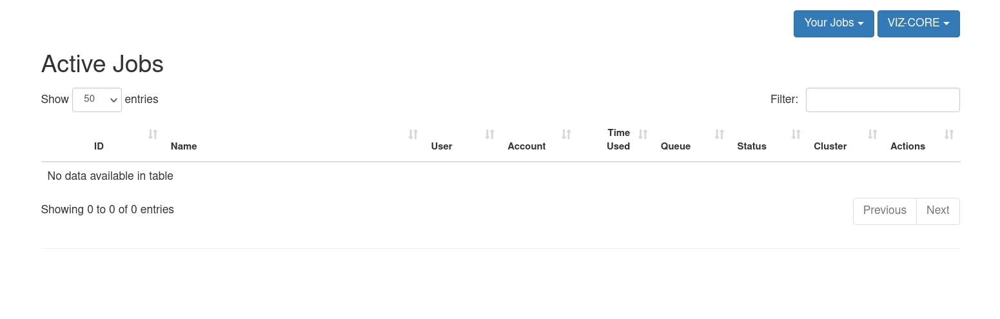
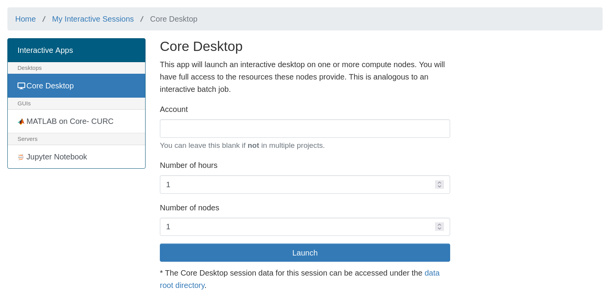
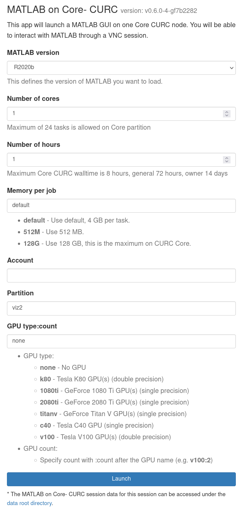
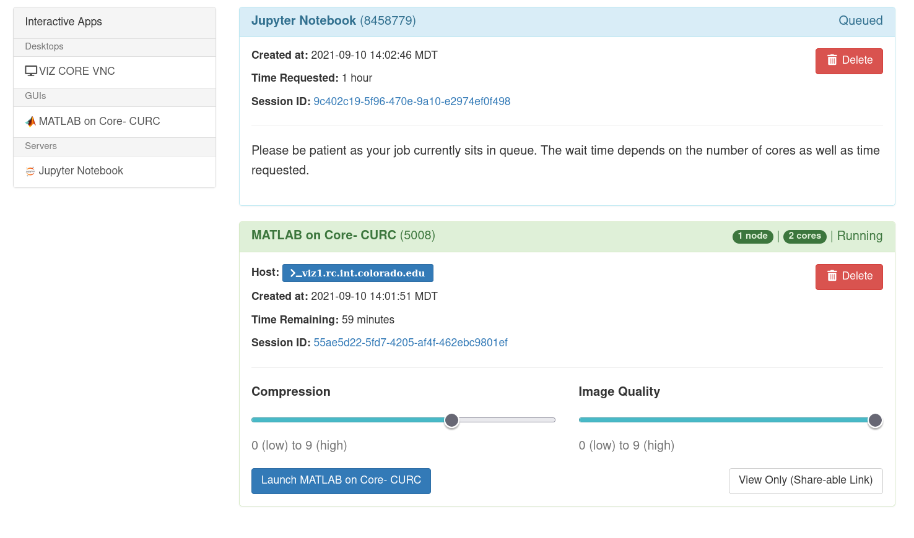

## Open OnDemand _(Browser Based HPC Portal)_

CURC Open OnDemand is a browser based, integrated, single access point for all of your high performance computing (HPC) resources at CU Research Computing. CURC Open OnDemand provides a graphical interface to view, edit, download, and upload files; manage and create job templates for CURC's clusters; and access CURC interactive applications (Virtual Desktops, Matlab, Jupyter Notebooks, and RStudio). All of these actions are completed via a web browser and require only minimal knowledge of Linux and scheduler commands.

<iframe width="560" height="315" src="https://www.youtube.com/embed/cP6lfRWywk0" frameborder="0" allow="autoplay; encrypted-media" allowfullscreen></iframe>

### Getting started with CURC Open OnDemand
 
To connect to CURC Open OnDemand, visit [https://ondemand.rc.colorado.edu](https://ondemand.rc.colorado.edu/). The first page of CURC Open OnDemand will bring you to a login prompt. Use your CU Research Computing credentials and Duo 2-factor authentication to login. If you need a CU Research Computing account please visit [our account request page](https://curc.readthedocs.io/en/latest/access/logging-in.html) to get started.


_**Notes on logging out:**_ 
* You must **completely quit your browser in order for "logout" to occur**. If after reopening your browser you are still logged in, please clear your cookies. If you are on a Chromebook or Chromebox, you will need to reboot your device in order to "quit the browser" and thus "logout".  
* **Tip: Using a "private browsing mode"** window while using OnDemand is a great way to handle "auto-logout", as closing your browser window will remove all associated cookies and session information. 

### Features

When you have successfully logged into CU Open OnDemand, you will see the landing page with the following features broken into tabs along the top of the page: __Files__, __Jobs__, __Clusters__ (shell access), __Interactive Apps__, and __My Interactive Sessions__.



We'll step through these features one at a time.

#### Files

The _File_ menu allows you to view and operate on files in different file spaces: your _home_ directory, _projects_ directory, scratch spaces, and (if you own one or are part of a group with one) access to _PetaLibary_ allocations.

Selecting one of the file spaces will open a separate browser window which will allow you to navigate the space in a graphical setting similar to a file browser on a personal computer. From here you can download, upload, create, delete, and open files.

> **_NOTE:_** _Please use 
[Globus](https://curc.readthedocs.io/en/latest/compute/data-transfer.html#globus-transfers) 
to transfer files to and from `/scratch/alpine` or `/rc_scratch`. Additionally, Globus should be used if you have more than 1 GB of data to transfer. OnDemand is not designed to handle large file transfers._



> For additional documentation visit [OSC's File Transfer and Management help page](https://www.osc.edu/resources/online_portals/ondemand/file_transfer_and_management).

#### Jobs 

Jobs can be monitored, created, edited and scheduled with the job management tools under the _Jobs_ menu.

* __Active Jobs:__ Under the “Active Jobs” tab you can view active jobs. You can choose to view your jobs (or all jobs) as well as choose from specific clusters (Alpine, Core, or All Clusters). From this menu you can also cancel your own jobs.



* __Job Composer:__ Create and edit job scripts and schedule jobs under this menu.

> See [OSC's Job Management help page](https://www.osc.edu/resources/online_portals/ondemand/job_management) for detailed use of the job composer feature.


#### Clusters (Shell Access)

The _Clusters_ menu provides shell access to login nodes on CURC clusters. The shell terminal is similar to many other tools that provide terminal access.

> Currently, Alpine shells log you into a basic login node. You can 
load in either Alpine or Blanca slurm instances from here: `module load 
slurm/<cluster>` with either Alpine or Blanca.

* __Alpine:__ The Alpine tab will launch a terminal that RC users can use to manually access an RC Login node. After the tab opens, type your CURC password and accept the Duo push to your phone, which will complete the login to the terminal.

<!-- * __Blanca:__ The Blanca tab will launch a terminal that RC users can use to manually access an RC Login node. After the tab opens, type your CURC password and accept the Duo push to your phone to complete login to the terminal. To load the Blanca Slurm environment, make sure to type “module load slurm/blanca upon login. More information on using the Blanca cluster can be found [in the Blanca documentation](https://curc.readthedocs.io/en/latest/access/blanca.html). -->

#### Interactive Applications Menu

The _Interactive Applications_ menu contains options to launch certain applications that have graphical user interfaces (GUIs) for interactive use on CURC clusters. Current supported applications include a __remote desktop atop the core cluster__, __MATLAB__, and __JupyterHub__ .

##### Core Desktop (Remote Desktop)

1. When starting a Remote Desktop session, you may customize the resources allocated to the session and other characteristics of the dispatched Slurm job. The default will open a Remote Desktop with 1 node (2 cores) for 1 hour (no need to specify "Account").

2. Click “Launch” to submit the Remote Destop job to the queue. The wait time depends on the number of other users presently on the resource. Requesting smaller, shorter jobs may faciliate shorter wait times. 
3. When your Remote Desktop is ready, you can click the "Launch Core Desktop" button. In most cases, the default compression and image quality will suffice. If you do have problems with image quality you can adjust these settings as necessary. 
4. With the Remote Desktop session running and open, you should be able to run standard Linux desktop applications that have a graphical user interface (GUI). 

**Notes**:
* You can copy/paste into/out of the VNC desktop using the clipboard in the "hidden" tab on the left-hand-side of the virtual desktop.

* Closing the window will not terminate the job. You can use the “My Interactive Sessions” tab to view all open interactive sessions and terminate them.

##### MATLAB

1. When starting an interactive MatLab job, you may customize the resources allocated to the session and other characteristics of the dispatched Slurm job, including the Matlab version. In most cases, the defaults will be adequate (i.e, no need to specify an account).

2. Click “Launch” to submit the MATLAB job to the queue. The wait time depends on the number of cores, nodes, and time requested.
3. When your Matlab session is ready, you can click the “Launch MATLAB on Core- CURC”. In most cases, the default compression and image quality will suffice. If you do have problems with image quality of the Remote Desktop, you can adjust as necessary. An interactive Matlab session will be started in a new window.

**_Notes:_** 
* Some users find running Matlab in the Core Remote Desktop option provides an enhanced experience. To do this, start a Remote Desktop session, open a terminal by clicking "Applications" -> "System Tools" --> "MATE Terminal", then load the MATLAB module. Finally, start MATLAB by typing

```bash
module load matlab/2019b
matlab
```

* Closing the window will not terminate the job, you can use the “My Interactive Sessions” tab to view all open interactive sessions and terminate them.

##### JupyterHub

1. When starting an interactive JupyterHub job, you may select `JupyterHub 1 (Presets)` or `JupyterHub 2 (Custom)` from the menu. The first server option offers preset configurations for convenience; you may select 1 core for 12 hours or 4 cores for 4 hours. Most use cases can be accommodated by one of the presets. The `JupyterHub 1 (Presets)` server submits jobs to Alpine's `ahub` partition. This partition provides users with rapid start times, but __limits users to one Jupyter session__ (or any one job using the partition). `JupyterHub 2 (Custom)` allows you to specify the cluster, account, partition, number of hours and cores, and QoS. 

2. Click “Launch” to submit the JupyterNotebook job to the queue. The wait time depends on the number of cores and time requested. The preset options generally start within a few moments. 

3. Once your Jupyter Notebook session is ready, you can click “Connect to Jupyter”. An interactive Jupyter Notebook session will be started in a new window.

4. To shut down a Notebook server, go to the "File" menu at the top and choose "Shut Down". This will shut down the Jupyter notebook server and cancels the job you are running on Alpine or Blanca. You also have the option to restart a server if desired. Closing the window will not terminate the job. You can use the “My Interactive Sessions” tab in Open OnDemand to terminate running sessions.

**_Notes:_** 
* In most cases, the default compression and image quality will suffice. If you do have problems with image quality of the Remote Desktop, you can adjust as necessary. 
* When the server starts, the file navigator panel displays CURC root. You can navigate to one of your CURC spaces by selecting `home` or `projects` from the file panel on the left. Alternatively, you can go to "File" then "Open Path" and enter your path in the field (e.g. `/projects/<your username>`).

For more information on running Jupyter Notebooks, [check out RC’s page on Jupyter](https://curc.readthedocs.io/en/latest/gateways/jupyterhub.html).

##### RStudio

1. To start an interactive RStudio job, select `RStudio Server (Presets)` from the menu. This provides preset configurations for your convenience; you may select 1 core for 1 hour, 1 core for 12 hours, or 4 cores for 4 hours. Most use cases can be accommodated by one of the presets. The `RStudio Server (Presets)` option submits jobs to Alpine's `ahub` partition. This partition provides users with rapid start times, but __limits users to one RStudio session__ (or any one job using the partition; for example if you have a Jupyter session that is also using the `ahub` partition, you will not be able to start an RStudio session using the preset options).

2. Click “Launch” to submit the RStudio job to the queue. The wait time depends on the number of cores and time requested.  The preset options provided generally start within a few moments. 

3. Once your RStudio session is ready, you can click “Connect to RStudio Server”. An interactive RStudio session will be started in a new window.

4. To shut down an RStudio server, go to the "File" menu at the top and choose "Quit session...". If you have made changes to the workspace, then you will be asked if you would like to save them to `~/.RData`, this is not necessary, but can be helpful. Once completed, a prompt will notify you that your R session has ended and will give you the option to restart a server, if desired. However, it is important to note that quitting the session will not cancel the job you are running. Additionally, closing the window will not terminate the job. To terminate the job, you can use the “My Interactive Sessions” tab in Open OnDemand to terminate running sessions.

**_Notes:_** 
* We have designed the RStudio app in Open OnDemand such that it employs versions of R that match the versions of R that are also available in the CURC module stack. This is done to facilitate moving between using RStudio for interactive work, and running larger R workflows as batch jobs on Alpine or Blanca. Due to system constraints, packages you install in a given version of R in RStudio will not be available if you load the equivalent version of the R module, and vice versa.  You will need to (re-)install the packages you need when using the equivalent module. 

#### My Interactive Sessions

The _My Interactive Sessions_ menu will let you view and manage all of your current open Interactive applications. From this window, you can view the node/core count, status, as well as time remaining for current sessions. 

Closing the window an interactive application is opened in will not terminate the session. You will need to click the “Delete” button for the individual session.


Couldn't find what you need? [Provide feedback on these docs!](https://forms.gle/bSQEeFrdvyeQWPtW9)
