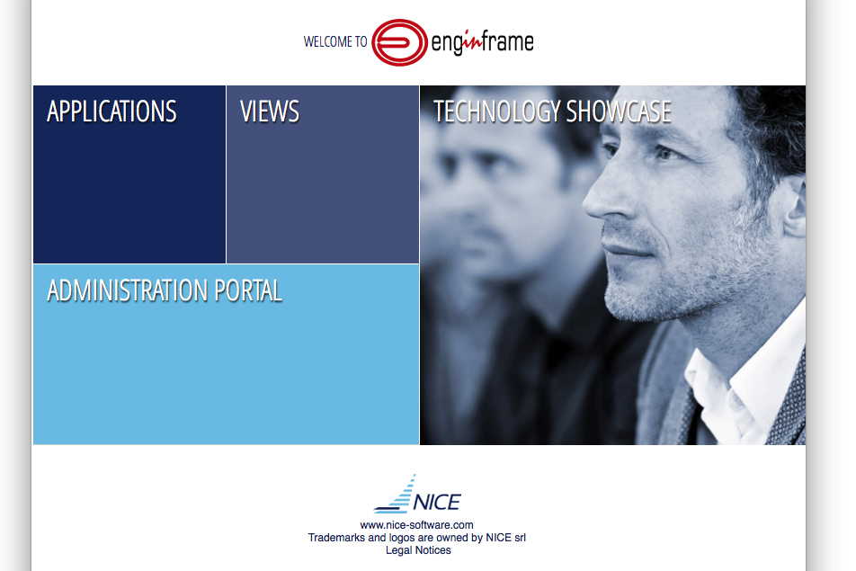
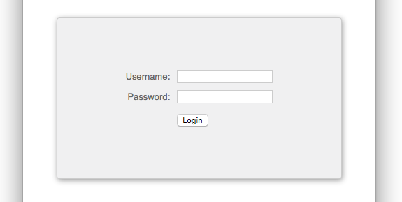
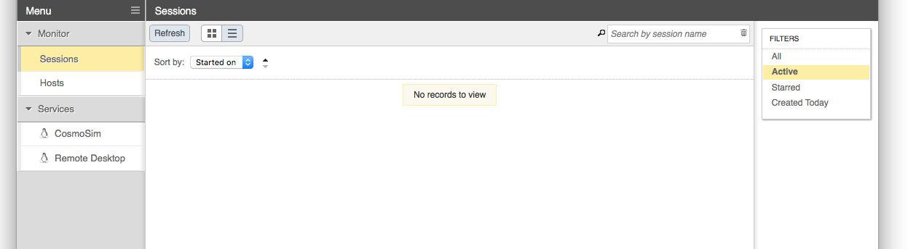
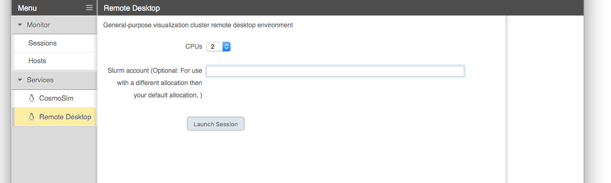
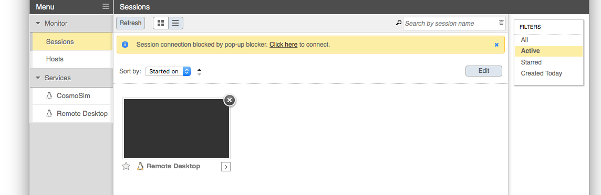
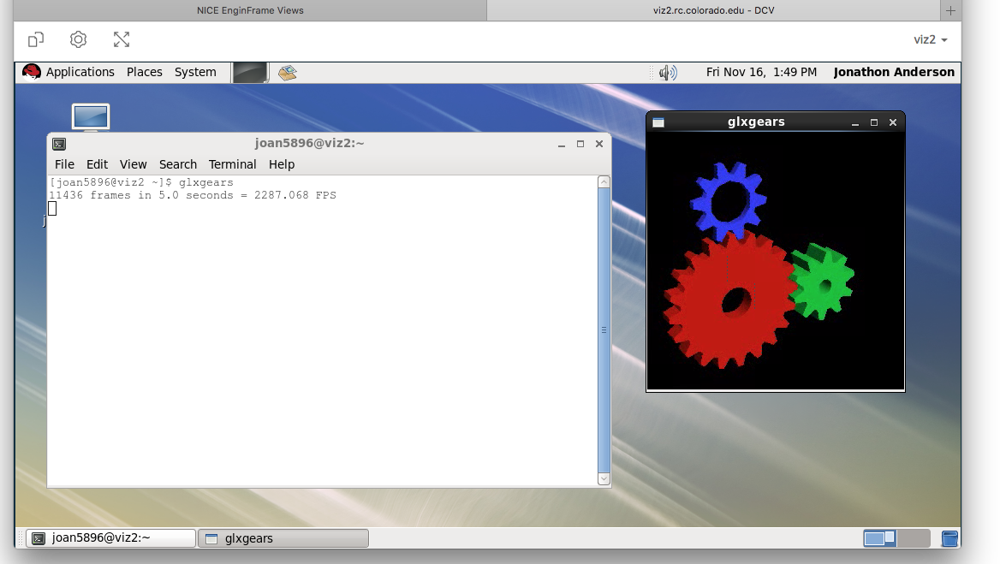

## EnginFrame

NICE EnginFrame provides a 3d-accelerated remote desktop environment
on an Nvidia GPU-equipped compute node. Coupled with the proprietary
Desktop Cloud Visualization (DCV) VNC server, the EnginFrame service
supports the use of common visualization applications in a typical
desktop environment using only a modern web browser.

### Accessing EnginFrame

Access to EnginFrame is granted on request. Request access by sending
email to rc-help@colorado.edu.

Once access has been granted, EnginFrame is available at
https://viz.rc.colorado.edu/.

From the welcome page, select "Views" from the available interfaces
(or use [this direct link][vdi]).

[vdi]: https://viz.rc.colorado.edu/enginframe/vdi/vdi.xml

Provide your RC login credentials at the login prompt. You will be
promted to use a second authentication factor (e.g., the Duo mobile
app) to log in.

### Remote desktop

After logging in, select "Remote Desktop" from the list of services in
the left sidebar. (Other custom services may be configured for you as
well.)

When starting a Remote Desktop session you may customize the resources
allocated to the session and other characteristics of the dispatched
Slurm job. In most cases the defaults should be sufficient; however,
you may need to supply a Slurm account if you are associated with more
than one and you do not want to use your default account.

Once the session has started, a thumbnail of the running session
appears in the Sessions list. EnginFrame will attempt to open the
session automatically, but may be blocked by the browser. In that
case, simply select the session thumbnail from the list, or use the
"click here" link in the notification text.

With the Remote Desktop session running and open, you should be able
to run standard Linux desktop applications, including 3d-acellerated
OpenGL applications.

### Additional Resources

- [https://www.nice-software.com/products/enginframe](https://www.nice-software.com/products/enginframe)
- [https://www.nice-software.com/products/dcv](https://www.nice-software.com/products/dcv)
