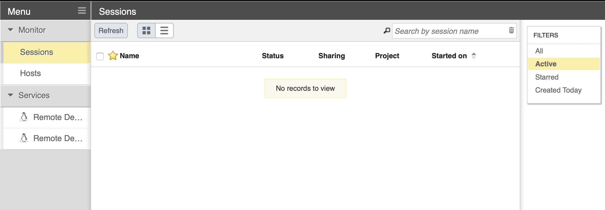
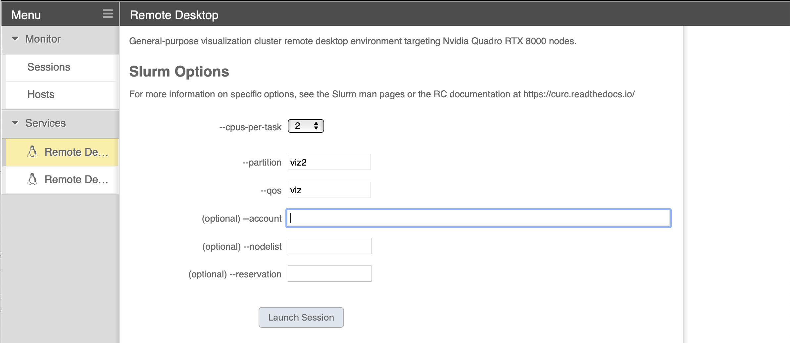
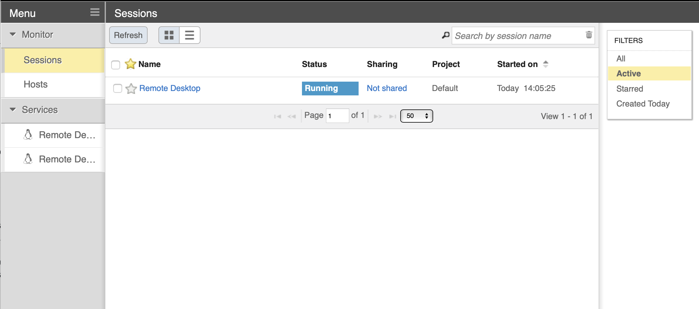
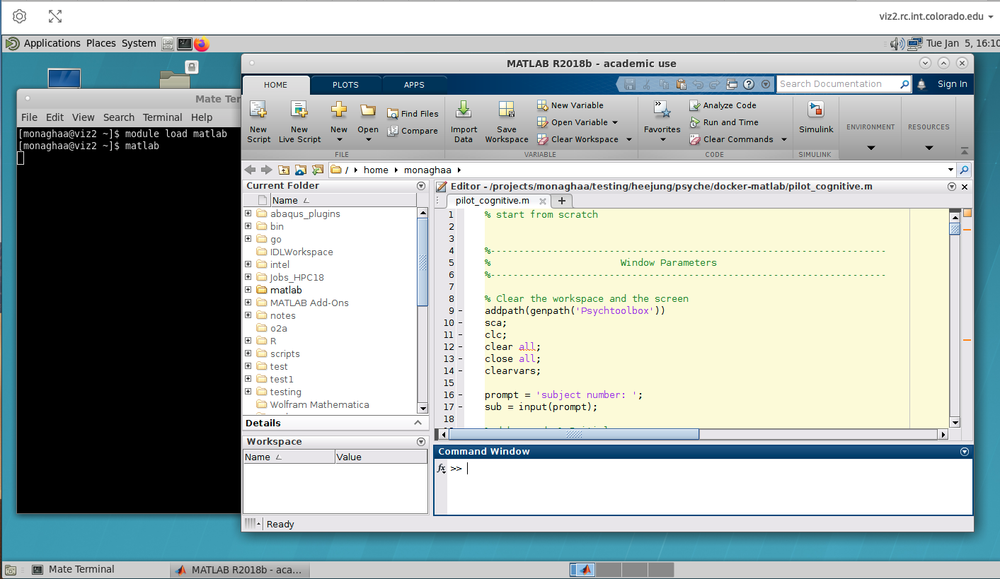

## EnginFrame _(visualization, GUIs on CURC)_

NICE EnginFrame provides a 3d-accelerated remote desktop environment on an Nvidia GPU-equipped compute node. Coupled with the proprietary Desktop Cloud Visualization (DCV) VNC server, the EnginFrame service supports the use of common visualization applications in a typical desktop environment via your web browser.


### Step 1: Login to EnginFrame

> **_NOTE 1:_** _To use EnginFrame you'll need to be on the CU Virtual Private Network (VPN), even if you are already on the CU network. If you already have a VPN client on your machine you can connect to `vpn.colorado.edu` through that (login credentials are your CU IdentiKey and password). If you don't have a VPN client on your machine, you can <a href="https://oit.colorado.edu/services/network-internet-services/vpn/help" target="_blank">download one from the CU Office of Information Technology</a>._

> **_NOTE 2:_** _If you registered for a CURC account in 2021 or later you should have automatically received access to EnginFrame at the time the account was provisioned. However, if you find you cannot login per the documentation below, or if you registered for a CURC account prior to 2021, please email [rc-help@colorado.edu](mailto:rc-help@colorado.edu) to request access._

In your web browser, navigate to the CURC EnginFrame instance at
<a href="https://viz.rc.colorado.edu" target="_blank">https://viz.rc.colorado.edu</a>.

From the welcome page, select "Views" from the available interfaces (or use <a href="https://viz.rc.colorado.edu/enginframe/vdi/vdi.xml" target="_blank">this direct link</a>).


Provide your RC login credentials at the login prompt. You will be
prompted to use a second authentication factor (e.g., the Duo mobile
app) to log in.


### Step 2: Starting a remote desktop

After logging in, you'll see some "Remote Desktop" options in the list of services in
the left sidebar. Choose the opton for the "Nvidia Quadro RTX 8000" (there may be two NVIDIA options; either will work fine). 



When starting a Remote Desktop session you may customize the resources allocated to the session and other characteristics of the dispatched Slurm job. In most cases the defaults will be adequate (i.e, no need to specify an account, nodelist or reservation).



Once the session has started, an indicator of the running session appears in the Sessions list. EnginFrame will attempt to open the session automatically, but may be blocked by the browser. In that case, simply select the session from the list, or use the "click here" link in the notification text.



> Note: If you are getting an error associated with `dbus`: 
> ```
> Could not connect to session bus: Failed to connect to socket /tmp/dbus-oBg2HbRfLi: Connection refused.
> ``` 
> visit [our anaconda documents](../software/python.html#dbus-error).


### Step 3: Use graphical software

With the Remote Desktop session running and open, you should be able to run standard Linux desktop applications that have a graphical user interface (GUI). A commonly-used example would be Matlab. To start the Matlab GUI, do the following:

1. Open a terminal by clicking `Applications`-->`System Tools`-->`MATE Terminal`
2. Load the Matlab software and start Matlab by typing:

```bash
module load matlab/2019b
matlab
```



### Tips and Tricks

* Desktop sessions in EnginFrame have default screensaver and screen locking functions that activate after a short period of inactivity.  When this happens, the user will need to login again with their CURC credentials and accept a Duo push. To lengthen the period of inactivity that will cause the screen to lock, in the desktop session navigate to `System`-->`Control Center`-->`Screensaver Preferences` and increase the time for the "Regard the computer as idle after" category. _To ensure unauthorized users cannot access the CURC system, please use this feature with caution and lock your screen manually if you will be leaving the session unattended._

### Additional Resources

- <a href="https://www.nice-software.com/products/enginframe" target="_blank">https://www.nice-software.com/products/enginframe</a>
- <a href="https://www.nice-software.com/products/dcv" target="_blank">https://www.nice-software.com/products/dcv</a>
