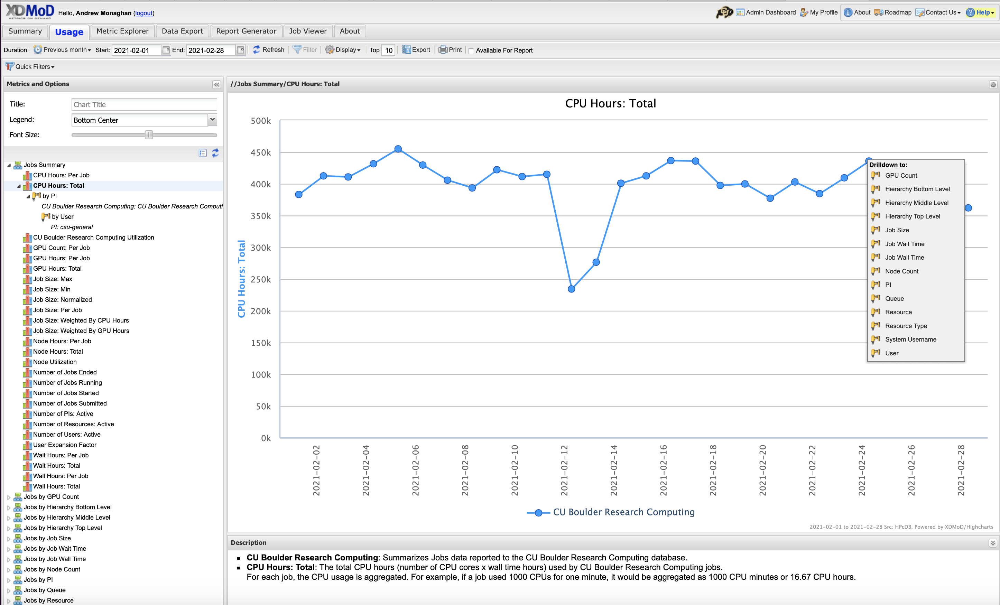

 ## XDMoD _(CURC system metrics)_
 
__A portal for viewing metrics at the system-, partition- and user-levels.__

_Overview:_ Would you like to know average queue wait times?  Do you need to better understand your and historical resource utilization, or utilization of your project account by user? The XDMoD ([XD Metrics on Demand](https://open.xdmod.org/9.0/index.html)) web-based tool provides users with the ability to easily obtain detailed metrics for high performance computing resources. This open-source tool was developed by the University at Buffalo [Center for Computational Research (CCR)](http://www.buffalo.edu/ccr.html). CU Boulder Research Computing runs its own instance, [CURC XDMoD](https://xdmod.rc.colorado.edu) that enables users to query metrics for the _RMACC Summit_ and _Blanca_ computing resources. 

### Getting started with XDMoD

All CURC users have access to XDMoD (CU Boulder, CSU and RMACC). At this time, login is only supported for CU Boulder users.  Non-CU Boulder users may still query all of the statistics available to CU Boulder users, they just won't have the ability to personalize metrics. 

#### Step 1: Navigate to the CURC XDMoD instance

In your browser navigate to [https://xdmod.rc.colorado.edu](https://xdmod.rc.colorado.edu). Upon reaching there you will see a summary screen similar to the following image.

This screen provides some "quick stats" and summary plots that address some of the most common user questions, such as average wait times and recent resource usage by system (Summit or Blanca) and partition.  These metrics may be all you need. If you want to personalize metrics you can login with your CURC username and password (*currently only supported for CU Boulder users*).

#### Step 2: Login (CU Boulder users only)

Choose the __Sign In__ option near the upper left of the screen.  This will initiate a pop-up window that gives you the option to _"Sign in with CU Boulder Research Computing"_ or _"Sign in with a local XDMoD account"_. 

Choose the option for _"Sign in with CU Boulder Research Computing"_ and enter your CURC username and password. The portal uses 2-factor authentication, so you will need to accept the Duo push to your phone to complete login.

#### Step 3: Familiarize yourself with XDMoD

Whether or not you login, you'll start on the _"Summary"_ screen.  

The following tabs will be available, depending on whether you are logged in
* __Summary__ (the screen you are on when you login)
* __Usage__ (provides access to an expansive set of resource-wide metrics)
* __Metrics Explorer**__ (similar to the _Usage_ tab, but with additional functionality)
* __Data Export**__ (enables raw data to be output in _csv_ or _json_ format for use in other apps)
* __Report Generator**__ (facilitates the creation of reports that can be saved and shared)
* __Job Viewer**__ (enables users to search for and view jobs that meet specified criteria)
* __About__ (provide general information on the XDMoD software)

_** - only available to users who are logged in._

> _Notes on XDMoD Syntax_
>	* a "CPU Hour" is a "core hour" (e.g., for a single job, this would be the number of `ntasks` a user specifies in their job script multipled by how long the job runs)
>	* a "PI" is a project account (e.g., `ucb-general` or `ucb124_summit1`)

#### Step 4: Become a pro!

XDMoD can query a seemingly endless number of metrics, more than could ever be described in this documentation.  To learn how to query specific metrics, customize your views, etc., please refer to the XDMoD documentation:

https://xdmod.rc.colorado.edu/user_manual/index.php

### Example use case

Let's say you want to see how many core hours you project account has used over time, including the usage by user.  

* Go to the _Usage_ tab.
* In the "Metrics and Options" menu, choose _CPU Hours: Total_ to create a graph of total CPU hours consumed over a default period. In XDMoD syntax a "CPU Hour" refers to a "core hour" (for a single job, this would be the number of `ntasks` a user chooses in their job script multipled by how long the job runs).  
* Click anywhere on the blue line in the graph to expose the "Drill Down" menu:

* Choose the "PI" option.  In XDMoD syntax a "PI" is a project account (e.g., `ucb-general` or `ucb124_summit1`).  
* This will revise the graph to show CPU usage for different "PIs" (accounts), showing only the accounts with the greatest usage. Your account may not be shown. To find it click the _Filter_ tab at the top and search for your project (e.g., `ucb-general`). 
* You will now see a graph showing only core hours used by your account. To see core hours used for each user of the account, click anywhere on the line to expose the "Drill Down" menu and choose the _User_ option.
* This will revise the graph to show CPU usage by user.  If you don't see your user of interest, you can use the _Filter_ tab at the top to find them.
* You can change the time range of the x-axis by specifying the dates in the "Start" and "End" boxes near the top of the screen.

