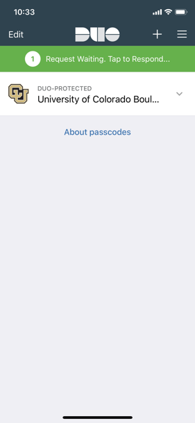
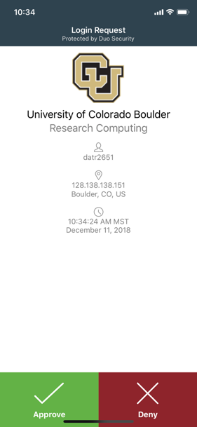
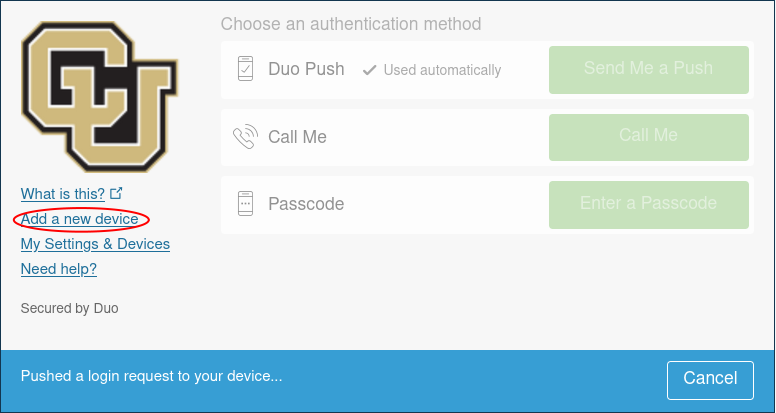
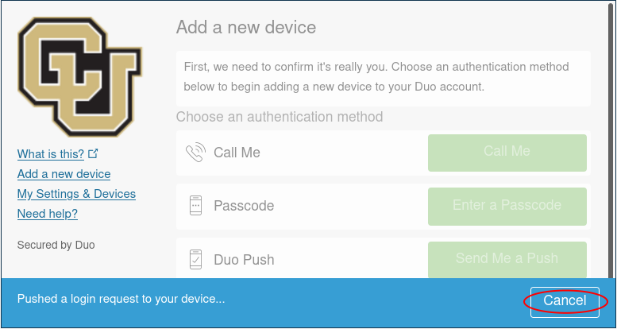
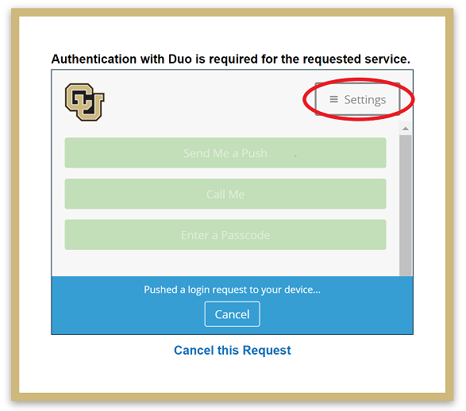

# Frequently Asked Questions

```{tip}
See our [Navigating CURC Documentation](./navigating_docs) page for information on core areas of our documentation each user should become familiar with.
```

## How do I acknowledge use of CURC Resources?

::::{dropdown} Show 
:icon: note

On our [Acknowledging CURC Resources](./acknowledge_curc_resources.md) page, we provide material on how to acknowledge CURC resources. 

::::

## Duo Multi-Factor Authentication 

### How do I setup Duo?
:::{dropdown} Show 
:icon: note 
- CU Boulder users can follow these steps:
    1. Download the Duo mobile app to your phone (available via Apple App Store or Google Play Store).
	2. Once installed, visit <https://duo.colorado.edu> to enroll.  
- CSU users please see [CSU's documentation on Duo 2-factor authentication](https://it.colostate.edu/duo-two-factor-authentication/)
	- CSU users can manage their account at [https://it.colostate.edu/duo-two-factor-authentication/](https://it.colostate.edu/duo-two-factor-authentication/)
- AMC or RMACC users please see [Duo's documentation on 2-factor authentication](https://guide.duo.com/)
	- AMC and RMACC users can manage their account at [https://cilogon.org/?selected_idp=httsp%3A%2F%2Faccess-ci.org%2Fidp&skin=access](https://cilogon.org/?selected_idp=httsp%3A%2F%2Faccess-ci.org%2Fidp&skin=access)
:::

### As a CU Boulder user, how can I login with Duo? 
::::::{dropdown} Show 
:icon: note

Duo offers a variety of methods to log into your account. Depending on what you select when setting up your Duo account, you should have several different methods of 2-factor authentication when logging into RC Resources. 

(tabset-ref-ucb-duo-login-methods)=
`````{tab-set}
:sync-group: tabset-ucb-duo-login-methods

````{tab-item} Duo Mobile Push
:sync: ucb-duo-login-methods-push

**Duo Mobile Push is Research Computing's recommended method of 2-factor authentication.** Because Duo Push is tied to your physical smart device instead of a phone number or account, Duo Push provides a more secure method of 2-factor authentication than either SMS or phone call.

1. Type: `ssh <username>@login.rc.colorado.edu` into the command line. For example, if my username is jodo2018 I would type `ssh jodo2018@login.rc.colorado.edu`.
2. Enter your identikey password when prompted. 
3. Wait for a push to your phone.  

	 

```{note} 
Duo push is tied to your device so [you will need to add or remove your device if you get a new phone.](#as-a-cu-boulder-user-how-can-i-manage-my-duo-devices)

There is also an option to generate a temporary passcode from within the Duo app. This passcode can be used to log into <https://duo.colorado.edu>.
```

````

````{tab-item} Duo SMS
:sync: ucb-duo-login-methods-sms

If you prefer to not use the Duo app or if you don't have a smart device, then Duo offers an SMS method of 2-factor authentication:

1. Type: `ssh <username>@login.rc.colorado.edu` into the command line. For example, if my username is jodo2018 I would type `ssh jodo2018@login.rc.colorado.edu`.
2. Enter your password when prompted, as `mypassword,sms`. For example, if my password is Ih3artdu0 I would type: `Ih3artdu0,sms`.
3. A list of one-time-passwords (OTPs) will be texted to you via SMS. Another login prompt will appear on your screen. Using the first OTP in the list, login with your password as `mypassword,OTP`. For example, if my password is Ih3artdu0 and my OTP is 330456 I would type (without quotes): `Ih3artdu0,330456`.
4. Note that the next time you login, you can either request a new list of OTPs using Step 2 and then enter the first OTP via Step 3, or you can just use the next OTP in the list, and skip directly to Step 3.

````

````{tab-item} Duo Phone Call
:sync: ucb-duo-login-methods-call

Duo also provides a phone call solution for 2-factor authorization if you only have a land line, or prefer to not use Push or SMS:

1. Type: `ssh username@login.rc.colorado.edu` into the command line. For example, if my username is jodo2018 I would type `ssh jodo2018@login.rc.colorado.edu`.
2. Enter your password when prompted, as `mypassword,phone`. For example, if my password is Ih3artdu0 I would type: `Ih3artdu0,phone`.
3. Wait for a phone call. Answer the call, select option #1, and you will automatically be logged in.

````

````{tab-item} Duo Token
:sync: ucb-duo-login-methods-token

This documentation is for customers who have [registered a Yubikey with CU Boulder](https://oit.colorado.edu/tutorial/register-yubikey-otp).

1. Type: `ssh username@login.rc.colorado.edu` into the command line. For example, if my username is jodo2018 I would type `ssh jodo2018@login.rc.colorado.edu`.
2. Enter your password when prompted, as `mypassword,6-digit-number`. The 6-digit number is given to you on the Duo token.  For example, if my password is Ih3artdu0, and I press the button on the token and it is 123456, I would type: `Ih3artdu0,123456`.

````

`````

::::::

### I have a new phone. As a CU Boulder user, how do I move my Duo onto it?
::::{dropdown} Show 
:icon: note

You can add a new device to your duo account by visiting <a href="https://duo.colorado.edu">https://duo.colorado.edu</a>.
After a CU authorization page you will be directed to a Duo authentication page. **Ignore the Duo Push prompt and instead click "Add a new device":** 



Duo will then try to authenticate your account by push notification to verify your identity. Cancel this push notification...  



...and click on "Enter a Passcode", or "Call Me". 
- If you select "Call Me" the simply receive the call and press 1. 
- If you select "Enter a Passcode" then click "Text me new codes" and you will be sent a list of one time passwords. Type in any one of the codes and you will be authenticated. 

Once you have verified your identity, follow the instructions provided by Duo to add your device.

If you cannot authenticate your account (e.g. do not have your old device), we suggest reviewing the [Duo FAQ page](https://oit.colorado.edu/services/identity-access-management/multi-factor-remote-access/faq) or contacting <oithelp@colorado.edu>. 

::::

### As a CU Boulder user, how can I manage my Duo devices? 
::::{dropdown} Show 
:icon: note

Users can manage their own Duo devices by visiting <https://duo.colorado.edu>. This enables users to add or remove activated devices at their discretion.

After a CU authorization page, you will be directed to a Duo authentication page. Do not respond to the Push notification and instead click the "Settings" button: 



This will bring up a menu that provides several options on device management and general help. 

Clicking "Add a new device" will allow you to add a new smart phone, tablet, or land-line. Simply select the option you wish to add and follow the steps provided by Duo to complete setting up your new device. 

Selecting "My Settings & Devices" provides a more detailed list of all devices you have registered. From here you can also add a new device, set your default device, and change your default authentication method when you attempt to log in.
::::

### None of the FAQs for Duo resolved my issue, how do I proceed as a CU Boulder user? 
::::{dropdown} Show 
:icon: note

If none of the above resolved the issues you were experiencing, then your Duo account may have expired. The university purges Duo accounts after six months of non-use. You can
re-enroll by visiting <https://duo.colorado.edu>. If that did not resolve your issue, then we suggest contacting the University helpdesk at <oithelp@colorado.edu> or calling
303-735-4357.
::::

## General High Performance Computing

### How can I add users to a Linux group?
::::{dropdown} Show 
:icon: note

Before requesting users be added to a Linux group, please fully read the [Workspace Sharing](../compute/filesystems.md#workspace-sharing) section, which provides an alternative approach for workspace sharing. If you would like to proceed with adding someone to a Linux group, please submit a [support request form](https://colorado.service-now.com/req_portal?id=ucb_sc_rc_form) using the following: 

1. Select `Storage` for `Nature of request`
2. Select `I would like to add a collaborator to my directory` for `Issue type`
3. Fill out the requested additional information
4. Provide any justification or additional details in `Detailed description`

::::

### When will my job start?
::::{dropdown} Show 
:icon: note

You can pull up information on your job's start time using the `squeue` command: 
```
squeue --user=your_rc-username --start
```
Note that Slurm's estimated start time can be a bit inaccurate. This is because Slurm calculates this estimation off the jobs that are currently running or queued in the system. Any job that is added in later with a higher priority may delay your job.

For more information on the `squeue` command, [take a look at our Useful Slurm Commands tutorial.](../running-jobs/slurm-commands.md) Or visit the Slurm page on [squeue](https://slurm.schedmd.com/squeue.html)

Note that you can also see system level wait times and how they change through time by visiting the [CURC metrics portal](../compute/monitoring-resources.md) at [https://xdmod.rc.colorado.edu](https://xdmod.rc.colorado.edu)
::::

### How can I get metrics about CURC systems such as how busy they are, wait times, and account usage?
::::{dropdown} Show 
:icon: note

Please refer to our [XDMoD](../compute/monitoring-resources.md#xdmod) documentation, which is a portal that allows users to easily see CURC system metrics. 
::::

### How much memory did my job use?
::::{dropdown} Show 
:icon: note

You can check how much memory your job utilized by using the `sacct` command and refering to the `MaxRSS` metric. This is done as follows where you can replace `YYYY-MM-DD` with the date you ran the job and specify your JobID:

```
sacct --starttime=YYYY-MM-DD --jobs=your_job_id --format=User,JobName,JobId,MaxRSS
```

If you'd like to monitor memory usage on jobs that are currently running, use the `sstat` command:

```
sstat --jobs=your_job_id --format=User,JobName,JobId,MaxRSS
```

For more information on `sstat` or `sacct` commands, [take a look at our Useful Slurm Commands tutorial.](../running-jobs/slurm-commands.md) Or visit the Slurm reference pages on [sstat](https://slurm.schedmd.com/sstat.html) and [sacct](https://slurm.schedmd.com/sacct.html). 

You can also view information related to service unit (SU) usage and CPU & RAM efficiency [using slurm commands](../compute/monitoring-resources.md#monitoring-through-slurm-commands). Note that CPU & RAM efficiency statistics will be included in emails sent when a job completes, if requested. 
::::

### Why am I not seeing GPU memory or utilization metrics for my job?
::::{dropdown} Show 
:icon: note

- GPU metrics are available for most NVIDIA GPUs across Alpine and Blanca. At this time, GPU memory and utilization metrics are not available on the following configurations: AMD GPUs and GH200s on Alpine, and the P100s and A40s on Blanca.
- GPU metrics can only be collected if your code utilizes CUDA 12 or newer.
- GPU metrics are partially available on MIG-enabled NVIDIA GPUs. You can get GPU utilization values, but GPU memory usage metrics are not reported for individual MIG partitions.
- Core cluster GPUs (e.g., core-gpu[0-4], viz1, viz2), which power Core Desktop and MATLAB GUI, do not currently support GPU memory or utilization metrics.
- Users running jobs on unsupported GPUs or older CUDA versions will see zeros or infinite values for GPU memory and utilization fields. Make sure your jobs are running on compatible hardware to obtain meaningful GPU metrics.
::::

### How can I see my current FairShare priority?
::::{dropdown} Show 
:icon: note

There are a couple ways you can check your FairShare priority:

1. Using the `levelfs` command. `levelfs` shows the current fair share priority of a specified user.

	Using `levelfs` on your username:
	```
	$ levelfs $USER
	```
	* A value of 1 indicates average priority compared to other users in an account.
	* A value of < 1 indicates lower than average priority (longer than average queue waits) 
	* A value of > 1 indicates higher than average priority (shorter than average queue waits)
<br/><br/>
2. Using the `sshare` command:
	```
	sshare -U -l
	```
	The `sshare` command will print out a table of information regarding your usage and priority on all allocations. The `-U` flag will specify the current user and the `-l` flag will print out more details in the table. The field we are looking for is the _LevelFS_. The LevelFS holds a number from 0 to infinity that describes the fair share of an association in relation to its other siblings in an account. Over-serviced accounts will have a LevelFS between 0 and 1. Under-serviced accounts will have a LevelFS greater than 1. Accounts that haven't run any jobs will have a LevelFS of infinity (inf).

	For more information on fair share the `sshare` command, [take a look at Slurm's documentation on fair share](https://slurm.schedmd.com/fair_tree.html) Or [check out the Slurm reference page on sshare](https://slurm.schedmd.com/sshare.html)
::::

### Why is my job pending with reason `ReqNodeNotAvail`?
::::{dropdown} Show 
:icon: note

The `ReqNodeNotAvail` message usually means that your node has been reserved for maintenance during the period you have requested within your job script. This message often occurs in the days leading up to our regularly scheduled maintenance, which is performed the first Wednesday of every month. So, for example, if you run a job with a 72 hour wall clock request on the first Monday of the month, you will receive the `ReqNodeNotAvail` error because the node is reserved for maintenance within that 72-hour window. You can confirm whether the requested node has a reservation by typing `scontrol show reservation` to list all active reservations. 

If you receive this message, the following solutions are available: 
1. Run a shorter job or modify your current job's time so that it does not intersect with the maintenance window. One can modify your current job's time by using the `scontrol` command:

	```bash
	$ scontrol update jobid=<jobid> time=<time>
	```
2. Wait until after maintenance window has finished. Once maintenance has completed, your job will resume automatically.
::::

### How can I check what accounts (allocations) I belong to?
::::{dropdown} Show 
:icon: note

You can check the allocations you belong to with the `sacctmgr` command. This can be done by typing the following from a login or compute node:
```bash
sacctmgr -p show associations user=$USER
```
This will print out an assortment of information including allocations and QoS available to you. For more information on sacctmgr, please refer to [Slurm's documentation](https://slurm.schedmd.com/sacctmgr.html). 
::::

### Why do I get an `LMOD` error when I try to load Slurm?
::::{dropdown} Show 
:icon: note
The `slurm/alpine` and `slurm/blanca` module environments cannot be loaded from compute nodes. It should only be loaded from login nodes when attempting to switch between Blanca and Alpine environments. This error can be disregarded, as no harm is done.
::::

## Software 

### How can I submit a software installation request? 
::::{dropdown} Show 
:icon: note

Before submitting a software installation request, please review our [Software installation policies](../additional-resources/policies.md#software-installations). To proceed with a software installation request, you should submit a [support request form](https://colorado.service-now.com/req_portal?id=ucb_sc_rc_form). Within this form you should make the following selections:

1. Select `Software` for `Nature of request`
2. Select the cluster you would like to run this software on for `Cluster`
3. Select `Software installation request` for `Issue type`
4. Complete all fields requested in the form
5. Submit the form
::::

### How do I install Python libraries?
::::{dropdown} Show 
:icon: note

For individuals who need to install Python libraries not included in our base Python or Anaconda modules, we recommend using Conda environments through the Anaconda module. Instructions for creating a custom Conda environment can be found on our [Python and R with Anaconda](../software/python.md) documentation page. 
::::

## Alpine 

### Why do I get an `Invalid Partition` error when running an Alpine job?
::::{dropdown} Show 
:icon: note

This error usually means users do not have an allocation that would provide the service units (SUs) required to run a job.  This can occur if a user has no valid allocation, specifies an invalid allocation, or specifies an invalid partition.  Think of SUs as "HPC currency": you need an allocation of SUs to use the system. Allocations are free. New CU users should automatically get added to a `ucb-general` allocation upon account creation which will provide a modest allocation of SUs for running small jobs and testing/benchmarking codes. However, if this allocation expires and you do not have a new one you will see this error.  `ucb-general` allocations are intended for benchmarking and testing and it is expected that users will move to a project allocation.  To request a Project and apply for a Project Allocation visit our [allocation documentation](../clusters/alpine/allocations.md).
::::

## Blanca 

### Why do I get an `Invalid Partition` error when running a Blanca job?
::::{dropdown} Show 
:icon: note

If you are getting an `Invalid Partition` error on a Blanca job which you know you have access to or have had access to before, you may have the `slurm/alpine` module loaded. From a login node, run `module load slurm/blanca` to access the Slurm job scheduler instance for Blanca, then try to resubmit your job.
::::

## General Storage

### How do I check how full my directories are?
::::{dropdown} Show 
:icon: note

You have three directories allocated to your username (`$USER`). These include `/home/$USER` (2 G), `/projects/$USER` (250 G) and `/scratch/alpine/$USER` (10 T).  To see how much space you've used in each, from a login node, type `curc-quota` as follows:

```
[janedoe@login11 ~]$ curc-quota
------------------------------------------------------------------------
									Used         Avail    Quota Limit
------------------------------------------------------------------------
/home/janedoe                          1.7G          339M           2.0G
/projects/janedoe                       67G          184G           250G
/scratch/alpine1                      1050G         8950G         10000G
```

You can also check the amount of space being used by any directory with the `du -sh --apparent-size` command or the directory's contents with the `du -h` command: 

```
[janedoe@c3cpu-a7-u26-3 ~]$ du -h /scratch/alpine/janedoe/WRF
698M	WRF/run
698M	WRF
```
::::

### How can I request an increase in my scratch storage space?
::::{dropdown} Show 
:icon: note

Before requesting an increase to your scratch storage space, please review our policies for [Alpine scratch quota increases](../additional-resources/policies.md#alpine-scratch-quota-increases). Once you have reviewed the policies, you can submit a [support request form](https://colorado.service-now.com/req_portal?id=ucb_sc_rc_form) using the following:

1. Select `Storage` for `Nature of request`
2. Select `I would like to request an increase to my scratch space` for `Issue type`
3. In the `Detailed description` box, provide a brief (approximately one paragraph) justification describing why a workflow requires the requested increase.

::::


## PetaLibrary 

### Why does my PetaLibrary allocation report less storage than I requested?
::::{dropdown} Show 
:icon: note

Every ZFS-based PetaLibrary allocation has snapshots enabled by default. ZFS snapshots are read-only representations of a ZFS filesystem at the time the snapshot is taken. For more information on ZFS Snapshots, please refer to our [ZFS Snapshots](../petalibrary/zfs_snapshots.md) documentation. 

PetaLibrary allocation sizes are set with quotas, and ZFS snapshot use does count against your quota. Removing a file from your filesystem will only return free space to your filesystem if no snapshots reference the file. Filesystem free space does not increase until a file on a filesystem and all snapshots referencing said file are removed. Because snapshots can cause confusion about how space is utilized within an allocation, the default snapshot schedule discards snapshots that are more than one week old.

If you would like to set a custom snapshot schedule for your allocation, please submit a [support request form](https://colorado.service-now.com/req_portal?id=ucb_sc_rc_form). Note that the longer you retain snapshots, the longer it will take to free up space by deleting files from your allocation.
::::

### Are there any alternatives to using PetaLibrary for data backups?
::::{dropdown} Show 
:icon: note


Offsite backup options are available from cloud-based storage providers. 

(tabset-ref-alt-storage-methods)=
`````{tab-set}
:sync-group: tabset-alt-storage-methods

````{tab-item} Microsoft OneDrive
:sync: alt-storage-methods-onedrive

- _Access details:_  
	- CU Boulder affiliates all have 5 TB of space in Microsoft OneDrive. You can use [Globus or rclone](../petalibrary/data_transfer/onedrive.md) to copy data between PetaLibrary and OneDrive.  
- _Pros:_ 
	- Free up to 5 TB using OneDrive 
	- Copy of data is off-campus 
- _Cons:_ 
	- Limits on [file sizes](https://support.microsoft.com/en-us/office/restrictions-and-limitations-in-onedrive-and-sharepoint-64883a5d-228e-48f5-b3d2-eb39e07630fa#individualfilesize)
	- OneDrive can be sensitive to [unconventional file names and long paths](https://support.microsoft.com/en-us/office/restrictions-and-limitations-in-onedrive-and-sharepoint-64883a5d-228e-48f5-b3d2-eb39e07630fa#invalidcharacters)  

````
````{tab-item} AWS S3
:sync: alt-storage-methods-awss3
 
- _Access details:_ 
	- You can use `Rclone` to copy your data to AWS for a monthly fee. Submit a [support request form](https://colorado.service-now.com/req_portal?id=ucb_sc_rc_form) for options to establish access to AWS. 
- _Pros:_ 
	- No data volume limit 
	- AWS data integrity assurance is very high 
	- Copy of data is off-campus 
- _Cons:_ 
	- You incur additional costs 

````

`````

::::

### I am a BioKEM facility user, how do I have my data deposited to my PetaLibrary Allocation?
::::{dropdown} Show 
:icon: note

If you are a BioKEM facility user, you can choose to have your data deposited directly into your PetaLibrary allocations. This process involves creating a biokem-deposit directory in your allocation’s root directory and setting permissions to a biokem specific owner and group. Visit [our documentation](../additional-resources/biokem-facility.md) on the BioKEM facility to learn about the process.
::::

## Open OnDemand
	
### Why is my Jupyter session throwing a `QOSMaxSubmitJobPerUserLimit` error?
::::{dropdown} Show 
:icon: note

Some of our Open OnDemand applications allocate resources, which can be limited to one session. All Open OnDemand applications that submit jobs to Alpine's `ahub` partition have this limitation. Currently, all applications utilizing the presets configurations will be submitted to the `ahub` partition. This partition provides users with rapid start times, but limits users to one Jupyter session (or any one job using the partition). In order to spawn another Jupyter session, you first need to close the current job. You can do so by shutting down your current Jupyter session or by [canceling your job manually](../running-jobs/slurm-commands.md#stopping-jobs-with-scancel). 
::::
