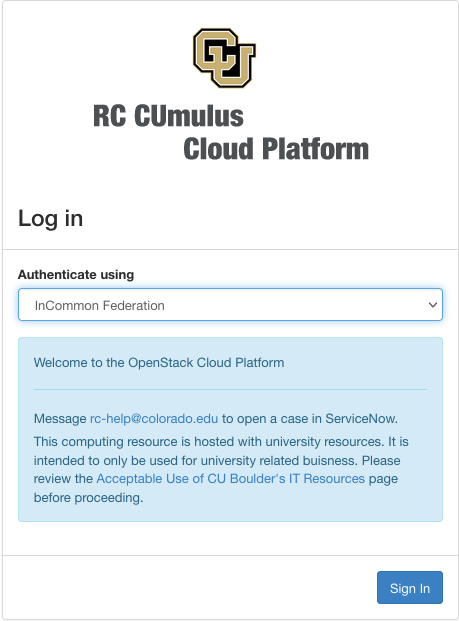
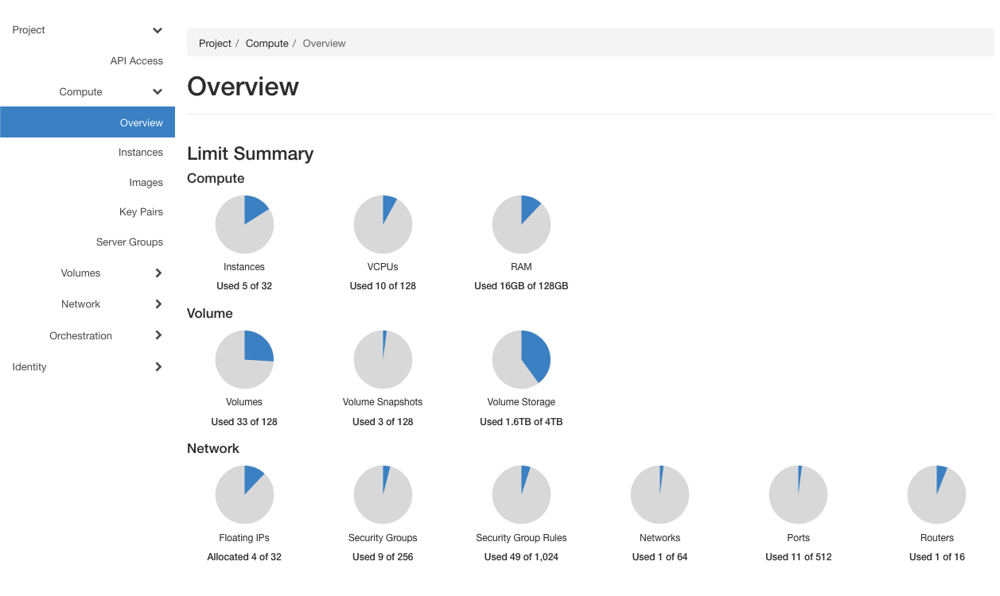
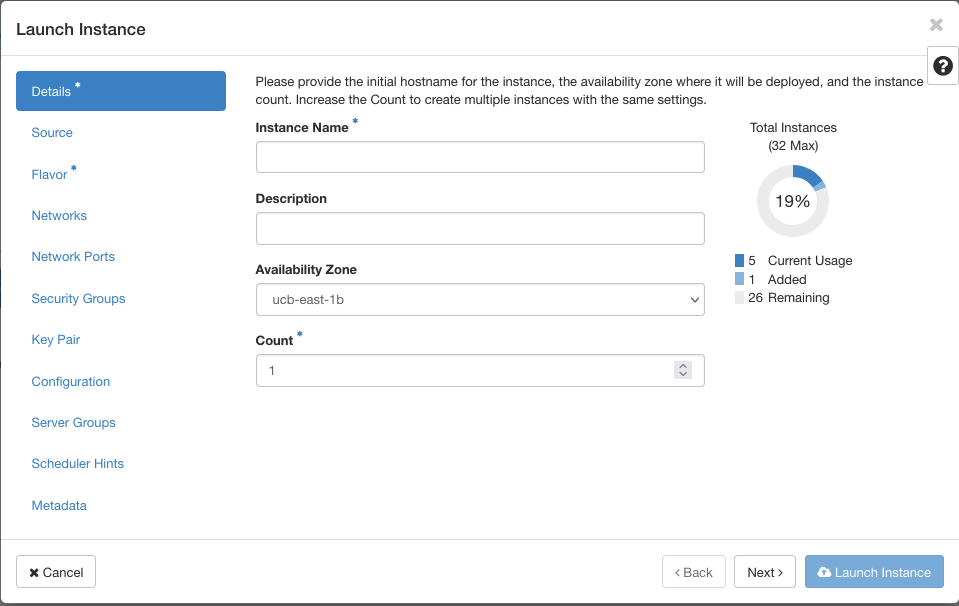
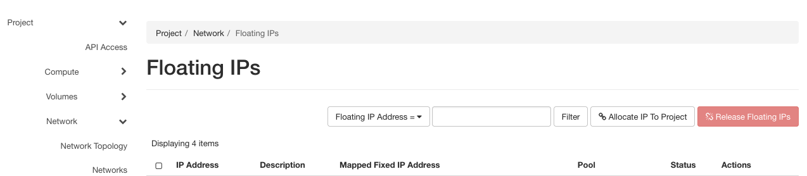
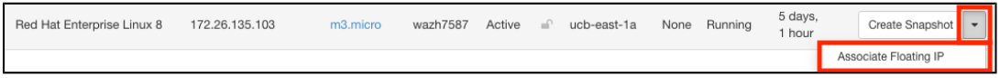
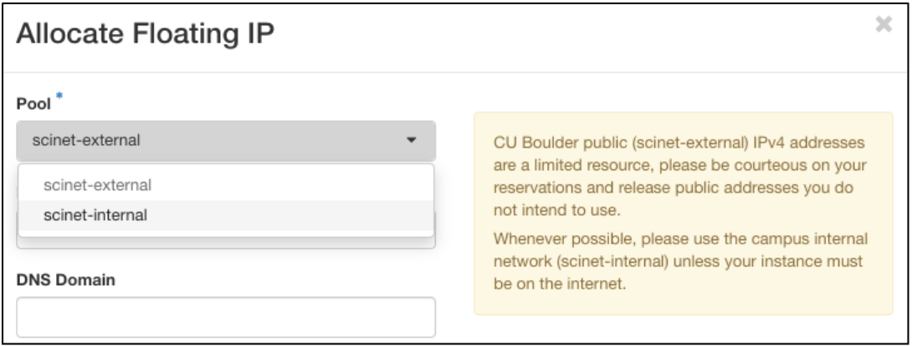
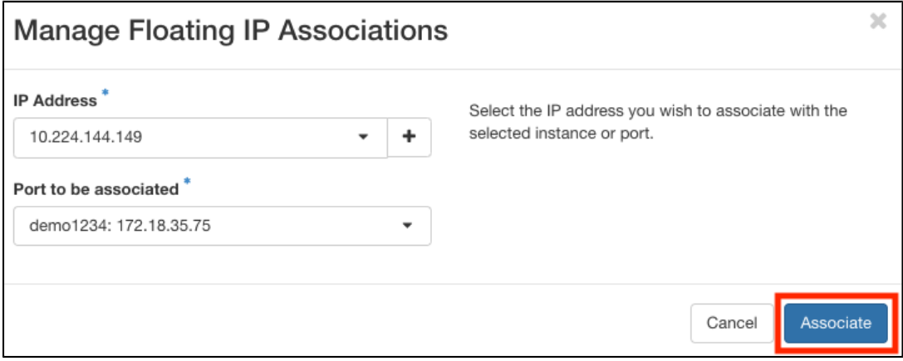
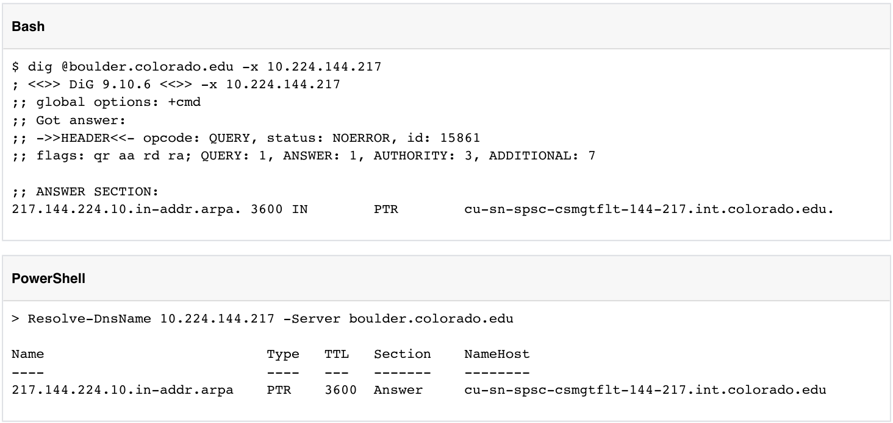

## CUmulus _(On-Premise Cloud)_

CU Research Computing hosts a free-to-use on-premise cloud service, called _CUmulus_, which supports cases not well-suited for HPC such as webservers, databases, and long-running services. 

The CUmulus service includes access to a Virtual Private Cloud (VPC) which provides users with a logically isolated section of the cloud with a small number of outside routable floating IP addresses.  Within this VPC customers will be given an allocation of:
 - CPU cores
 - Memory
 - Storage

which can be used to host virtual machines and volumes to host workloads.

#### CUmulus Quick Start

1) Request a CUmulus application by contacting the RC helpdesk at [rc-help@colorado.edu](rc-help@colorado.edu)
2) Once your application has been accepted, manage your project at [cumulus.rc.colorado.edu/](cumulus.rc.colorado.edu/).
- Create virtual instances with specific operating systems and storage requirements
- Manage network configurations 

#### Features
- Virtual machine creation
- Storage volume creation/snapshot
- Basic Infrastructure monitoring
- Assignment of routable "floating IPs" (e.g., for web-hosting)
- High availability in the event of underlying hardware failure
- Load balancing of virtual resources across multiple physical machines
- Console access to hosted VMs

> CUmulus Resources
> - 244 total CPU cores
> - 4GB RAM per CPU core
> - 101.3TB of object-oriented storage

#### Eligibility

CUmulus is a free-to-use cloud system where:
- 80% of cycles: CU Boulder faculty, staff, students, and affiliates
- 20% of cycles: RMACC affiliates (CSU, Wyoming, UC system campuses, [and many more](https://rmacc.org/partners)) 

> To ensure optimal usage, unused cycles are preemptively available to the Open Science Grid ([OSG](https://opensciencegrid.org/))

#### Expectations

CU Research Computing manages the resources and address systems-level issues as they arise. Users will be expected to deploy and manage their cloud instances, including selecting security policies and networking protocols, installing and maintaining software, and running computational workflows. Users are essentially “system administrators” of their cloud instance. 

> **_NOTE:_** _CU Research Computing does not support administration within CUmulus cloud instances._

##### Appropriate use cases:
- Workflow management software that monitors/schedules jobs on Summit, Alpine, or Blanca
- Running a research database/website application that queries data stored on CURC PetaLibrary 
- Web-based research “Hubs” (JupyterHub, Shiny Apps)

##### Inappropriate use cases: 
- Running workflows that you could run on Summit, Alpine or Blanca
- Websites that do not require connectivity to CURC resources
- Serverless applications

> **_NOTE:_** _If neither CUmulus nor other CURC resources (Summit, Alpine, Blanca) are appropriate for your use case, we have limited access to Amazon Web Services and may be able to provide you with AWS resources that suit your needs._
> Possible AWS Cases:
> - Workflow that cannot be run on Summit/Alpine/Blanca and resource needs are too big for CUmulus
> - Workflow that require access to very large datasets that are only hosted on AWS (e.g., some NASA satellite datasets)

###  Requesting Access to CUmulus

The application process for CUmulus requires users to submit an proposal for your use case, which can be requested by emailing [rc-help@colorado.edu](rc-help@colorado.edu). In this proposal you will:
- Describe your CUmulus workflow
- Describe why this workflow is appropriate for CUmulus and cannot be accommodated by other CURC resources (Summit, Alpine or Blanca)
- Estimate the resources you require (operating system, CPU cores, disk space, memory)

Once we receive your request the allocation committee will review it. If the case is deemed appropriate by the allocations committee the following will occur.

- 30 day trial period to allow you to set up your instance and test it:

	We will review trial usage with you at 30 days. 

- Production period: 

	If trial period was successful, adjust resources based on trial period and grant 1-year allocation.  

### Project Management

Once your application has been accepted you will be notified that a project has be created and cloud access is ready. Projects are managed through CUmulus's graphical management interface (Horizon) at: [cumulus.rc.colorado.edu/](cumulus.rc.colorado.edu/). Project owners can access the CUmulus management interface with InCommon Federation (select the "InCommon Federation" from the authentication pull-down).



The first attempt to login will automatically fail because you have not been assigned to any groups or roles. Once you have attempted to login please respond to your acceptance email that you have attempted to login and your username will be processed. 

Once your username is processed you will be able to login. The landing page for CUmulus is the "Overview page" which provides you basic information about your project (compute, volume, and network usage). You can select a period of time to query usage below the main overview graphics as well as view all current vm instances.



#### Navigate to Instances

1) Select a project
2) Navigate to "Compute"
3) Select "Instances"
4) Select "Launch Instance" (to create new instance)


#### Create New Instance

Instances are virtual machines (VM) within your Virtual Private Cloud's (VPC) project. You can view the resources each instance is using at the bottom of the "Overview" page. In order to create an instance you must specify the resources you wish to allocate from your project.

To create a new VM instance click on "Launch Instance" button on the top bar from the "Instances" page (step 4 above). This will bring up the instance launch window which will guide you in creating a new instance by selecting your operating system, allocating resources, choosing security groups, and adding ssh keys. Follow the steps and images below.

1) Details: Fill out Instance details, including a name and description (availability zone and count can be left as defaults).
> _**Note:**_ if launching Windows Server, the hostname will be truncated if greater than 15 characters in the OS

2) Source: You can choose an operating system from the images CURC provides (below). "Image" should be pre-selected from the "Select Boot Source" pull-down. Select your Operating System from the list of images available. You will also select your volume size (default 1GB) and can choose to have volume deleted upon instance deletion (default: volume _not_ deleted).
> Available Operating Systems:
> - CentOS 7
> - CentOS 8
> - Debian 10
> - Red Hat Enterprise Linux 8
> - Ubuntu Server 18.04 LTS
> - Ubuntu Server 20.04 LTS
> - Windows 10 Enterprise 20H2
> - Windows 10 Enterprise LTSC 2019

> _Note:_ be aware that if you choose to _not_ delete volume upon instance deletion and do not intend to use them you will have "zombie" volumes which will continue to take up storage.

3) Flavor: Choose from a list of pre-selected resources (these "flavors" manage the sizing for the compute, memory, and storage of the instance).
> _Note:_ keep in mind your OS prerequisites.

4) Networks: Select a project network, which determines routability of either a public/internet or campus/internal floating IP. Keep defaults.

5) Security Groups: Security Groups act as a virtual firewall for your instance to control inbound and outbound traffic. Select the secrity groups to launch the instance in (e.g. ssh-restricted in order to ssh into your vm, icmp to ping your instance).
> _Note:_ Security groups act at the instance level.

6) Review default account information.

7) Key Pair: A key pair allows you to SSH into your new instance. You may select an existing key pair, import a key pair, or generate a new key pair. 
> Documentation to generate an ssh-key pair from your local machine ([ssh documentation](https://www.ssh.com/academy/ssh/public-key-authentication)). Upload the public key via the "Import Key Pair" button.

8) Add a 1-time script (optional)

9) Launch the instance.



#### Associate Floating IP to instance

To add an outside routable "floating IP" to your instance navigate to Project -> Network -> Floating IPs. This page will show you a list of currently available "floating IP" addresses. Select "Associate IP" from the list under the "Actions" column to associate with an instance (or the "Associate IP to Project button). 



or 

Expand the instance action menu, and select "Associate Floating IP"



If no available addresses are allocated to the project, allocate one.


Depending on which network was selected in Step 4 from above, allocate either an public/internet floating IP, (scinet-external) or a campus internal floating IP. (scinet-internal)



Associate the IP Address to your instance



> Note: If an instance is terminated, the floating IP will be disassociated but remain with the project as an available address. If the floating IP is  it is returned to the SN IP pool and can be difficult to re-allocate if the same address is desired.

#### Adding Users to your Project

Project access is managed through the Grouper application. Grouper is an enterprise access management system that empowers users to manage access, without the need for central IT. Group creation will be handled during project creation (if you don't see your group in "My Groups" in the Grouper application please email [rc-help@colorado.edu](rc-help@colorado.edu)).

To view your groups in Grouper navigate to [mygroups.colorado.edu](mygroups.colorado.edu) and sign in using InCommon Federated Authentication (identikey & password). Find your group under the "Groups I Manage" section on the landing page (or click on the "My groups" button on the side bar).
>_Note:_ If you do not see your group, please contact [rc-help@colorado.edu](rc-help@colorado.edu) to create a group with the correct permissions and connections to CUmulus (_do not create your own group_).


Detailed instructions to add and remove members from your group can be found here: [Add/Remove Members](https://oit.colorado.edu/tutorial/grouper-manage-members-email-enabled-groups).

#### Get the default DNS name (optional)

1) All Floating IP's have a default A record, this can optionally be used in place of an IP address.
2) Perform a reverse lookup:



3) If a specific record is desired, contact NEO via [oithelp@colorado.edu](oithelp@colorado.edu).

#### Access Linux Instances for the first time via SSH

1) Determine the default username; which will vary based on the Image maintainer. Review in the "Launch Instances" screenshot above.
2) SSH into your new Linux instance


or ssh directly with public floating IP:
```
ssh -i ~/.ssh/demo_id_rsa cloud-user@<floating IP>
```

3) If desired, set a password on the root account to make troubleshooting easier via the recovery console if the instance loses network connectivity.


