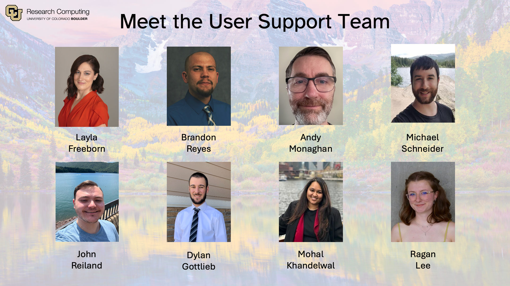

# CU Research Computing User Guide

Welcome to CU Research Computing's (CURC's) user guide! CURC offers a variety of services encompassing High Performance Computing (HPC), cloud computing assistance, and storage solutions. Many of these services are available to users associated with CU Boulder, Anschutz Medical Campus (AMC), Colorado State University (CSU), and institutions that are members of the Rocky Mountain Advanced Computing Consortium (RMACC). 

```{tip}
- Documentation can be overwhelming. If you would like guidance on navigating CURC documentation, please see our [Navigating CURC Documentation](./getting_started/navigating_docs.md) page.
- Can't find what you need or want to contribute to our documentation? Please see our [Contributing to CURC Documentation](./additional-resources/contrib_curc_docs.md) page.   
- To provide feedback on CURC services, please see our [We want to hear from you!](./additional-resources/feedback) page.
- For more information on the CU Research Computing group, please see <https://www.colorado.edu/rc>.
- If you have any questions on documentation or CURC services, please feel free to contact our user support team at <rc-help@colorado.edu>.
```

## Meet the RC User Support Team!



----

::::{dropdown} Click to show the full index for all documentation
:icon: list-unordered

```{toctree}
:maxdepth: 1
:caption: Getting Started

getting_started/navigating_docs
getting_started/logging-in
getting_started/faq
getting_started/current-sem-trainings
getting_started/acknowledge_curc_resources
```

```{toctree}
:maxdepth: 1
:caption: The Compute Environment

compute/node-types
compute/filesystems
compute/modules
compute/data-transfer
compute/compiling
compute/monitoring-resources

```

```{toctree}
:maxdepth: 1
:caption: Clusters

clusters/alpine/index
clusters/blanca/blanca
clusters/summit/summit

```

```{toctree}
:maxdepth: 2
:caption: Portals & Gateways

open_ondemand/index

```

```{toctree}
:maxdepth: 1
:caption: Running Jobs

running-jobs/job-resources
running-jobs/slurm-commands
running-jobs/squeue-status-codes
running-jobs/running-apps-with-jobs
running-jobs/batch-jobs
running-jobs/interactive-jobs
running-jobs/roce-enabled

```

```{toctree}
:maxdepth: 1
:caption: Storage

storage/petalibrary/index

```
   
```{toctree}
:maxdepth: 2
:caption: Cloud

cloud/aws/index
cloud/azure/index
cloud/gcp/index
cloud/cumulus

```

```{toctree}
:maxdepth: 2
:caption: Software

software/curc_software_stack
software/loadbalancer
software/gaussian
software/matlab
software/python
software/GNUParallel
software/vasp
software/containerization
software/alphafold
software/spack
software/sratoolkit
software/uv

```

```{toctree}
:maxdepth: 2
:caption: Programming, Profiling, and Parallelization
   
programming/coding-best-practices
programming/parallel-programming-fundamentals
programming/MPIBestpractices
programming/MPI-C
programming/MPI-Fortran
programming/OpenMP-C
programming/OpenMP-Fortran
programming/profiling-nvidia-gpu-performance

```
   
```{toctree}
:maxdepth: 1
:caption: Additional resources

additional-resources/policies
additional-resources/courses_using_curc_resources
additional-resources/feedback
additional-resources/contrib_curc_docs
additional-resources/CURC-cheatsheet
additional-resources/amc_ssh_auth
additional-resources/registrycilogon-instructions
additional-resources/blanca-MOU
additional-resources/facilities_equip_other
additional-resources/biokem-facility
additional-resources/csu-xsede-usernames

```

::::