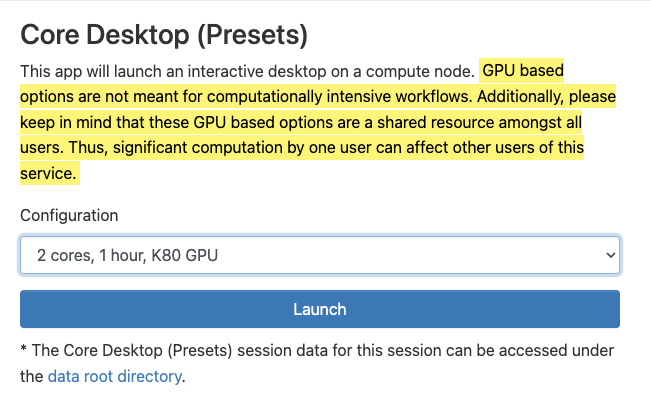
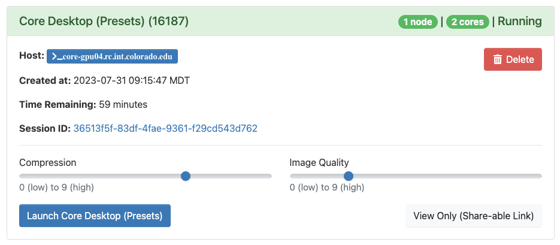
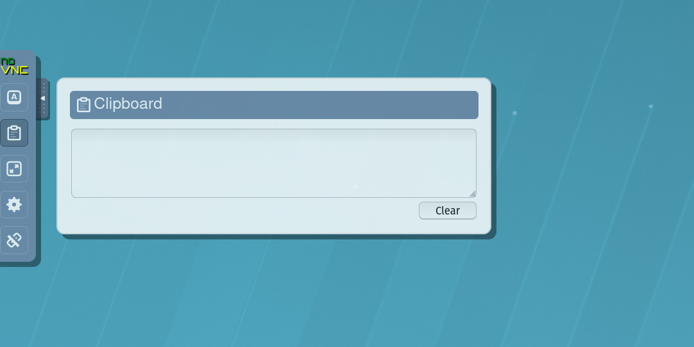

# Core Desktop (remote desktop)

1. To start a remote desktop session, you can select either `Core Desktop` or `Core Desktop (Presets)` from the interactive applications menu. When starting a `Core Desktop` session, you may customize the runtime and number of cores for the session. If you select `Core Desktop (Presets)`, you may select from standard configurations we provide.

  

2. Once either option is selected, click “Launch” to submit the remote desktop job to the queue. The wait time depends on the number of other users presently on the resource. Requesting smaller and shorter jobs may facilitate shorter wait times. 
3. When your remote desktop is ready, you can click the "Launch Core Desktop" or "Launch Core Desktop (Presets)" button to bring up a web page with the remote desktop. In most cases, the default compression and image quality will suffice. If you do have problems with image quality you can adjust these settings as necessary. 

  

4. With the remote desktop session running and open, you should be able to run standard Linux desktop applications that have a graphical user interface (GUI). 

## Notes
* <mark style="background-color: #FFF36D">
  GPU based options are not meant for computationally intensive workflows. Additionally,
  please keep in mind that these GPU based options are a shared
  resource amongst all users. Thus, significant computation by one
  user can affect other users of this service.
  </mark>
* You can copy/paste into/out of the VNC desktop using the clipboard in the "hidden" tab on the left-hand-side of the virtual desktop.

  

* Closing the window will not terminate the job. You can use the “My Interactive Sessions” tab to view all open interactive sessions and terminate them.
