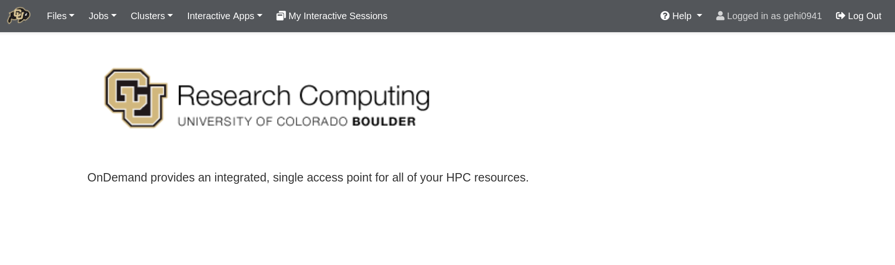

# Getting started with Open OnDemand
 
To connect to CURC Open OnDemand, visit [https://ondemand.rc.colorado.edu](https://ondemand.rc.colorado.edu/) if you are a CU Boulder user and [https://ondemand-rmacc.rc.colorado.edu](https://ondemand-rmacc.rc.colorado.edu/) otherwise. The first page of CURC Open OnDemand will bring you to a login prompt. Use your CU Research Computing credentials and Duo 2-factor authentication to login. If you need a CU Research Computing account please visit [our account request page](../access/logging-in.md) to get started. If you are an RMACC member, please follow our provided instructions on accessing [Alpine resources for RMACC members](../access/rmacc.md).

`````{tabs}

````{tab} CU Boulder

To connect to CURC Open OnDemand, you must first have a CU Research Computing account. If you do not have an account, please consult [our account request page](../access/logging-in.md) to get started. Once you have a CU Research Computing account you can connect to Open OnDemand by visiting <https://ondemand.rc.colorado.edu>. The first page of CURC Open OnDemand will bring you to a login prompt. Use your CU Research Computing credentials and Duo 2-factor authentication to login.


````

````{tab} CSU

To connect to CURC Open OnDemand, you must first have a CU Research Computing account. If you do not have an account, please consult [CSU's Getting Started with Alpine](https://it.colostate.edu/research-computing-and-cyberinfrastructure/compute/get-started-with-alpine/) documentation. Once you have obtained an account, you can connect to CURC Open OnDemand by visiting <https://ondemand-rmacc.rc.colorado.edu>. This will bring you to a CILogon page. Once on this page, click the drop-down menu under the "Select an Identity Provider" and select "Colorado State University". 
```{eval-rst}
.. figure:: ./OnDemand/csu_select_identity.png
   :align: center
```
This will bring you to a login prompt where you should use your CSU NetID and Duo 2-factor authentication to login. 
```{eval-rst}
.. figure:: ./OnDemand/csu_ood_login.png
   :align: center
```

````

````{tab} AMC

Pears are green.

````

````{tab} RMACC

Oranges are Oranges.

````
`````


_**Notes on logging out:**_ 
* You must **completely quit your browser in order for "logout" to occur**. If after reopening your browser you are still logged in, please clear your cookies. If you are on a Chromebook or Chromebox, you will need to reboot your device in order to "quit the browser" and thus "logout".  
* **Tip: Using a "private browsing mode"** window while using OnDemand is a great way to handle "auto-logout", as closing your browser window will remove all associated cookies and session information. 

## Features

When you have successfully logged into CU Open OnDemand, you will see the landing page with the following features broken into tabs along the top of the page: __Files__, __Jobs__, __Clusters__ (shell access), __Interactive Apps__, and __My Interactive Sessions__.



## Interactive Applications Menu

The _Interactive Applications_ menu contains options to launch certain applications that have graphical user interfaces (GUIs) for interactive use on CURC clusters. Currently supported applications include a __remote desktop__, __MATLAB__, __Jupyter session__, __RStudio session__, and __VS Code-Server__.

## My Interactive Sessions

The _My Interactive Sessions_ menu will let you view and manage all of your current open Interactive applications. From this window, you can view the node/core count, status, as well as time remaining for current sessions. 

Closing the window an interactive application is opened in will not terminate the session. You will need to click the “Delete” button for the individual session.
