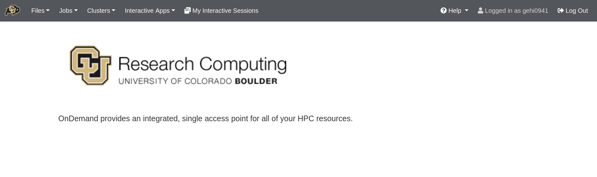
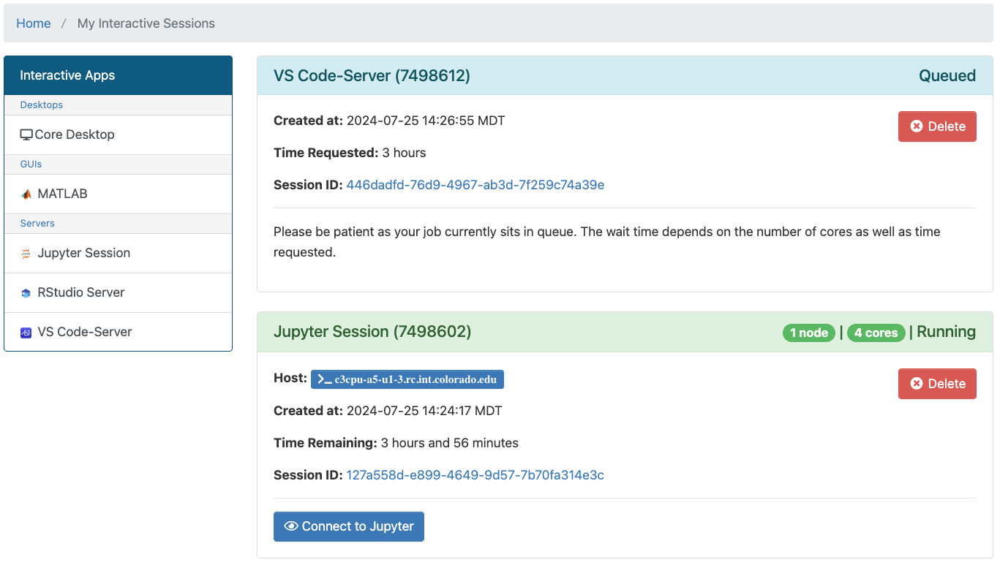

# Open OnDemand _(Browser Based HPC Portal)_

CURC Open OnDemand is a browser based, integrated, single access point for all of your high performance computing (HPC) resources at CU Research Computing. CURC Open OnDemand provides a graphical interface to view, edit, download, and upload files; manage and create job templates for CURC's clusters; and access CURC interactive applications (Virtual Desktops, Matlab, Jupyter Notebooks, and RStudio). All of these actions are completed via a web browser and require only minimal knowledge of Linux and scheduler commands.

<iframe width="560" height="315" src="https://www.youtube.com/embed/cP6lfRWywk0" frameborder="0" allow="autoplay; encrypted-media" allowfullscreen></iframe>

## Getting started with CURC Open OnDemand
 
To connect to CURC Open OnDemand, visit [https://ondemand.rc.colorado.edu](https://ondemand.rc.colorado.edu/). The first page of CURC Open OnDemand will bring you to a login prompt. Use your CU Research Computing credentials and Duo 2-factor authentication to login. If you need a CU Research Computing account please visit [our account request page](../access/logging-in.md) to get started. If you are an RMACC member, please follow our provided instructions on accessing [Alpine resources for RMACC members](../access/rmacc.md).


_**Notes on logging out:**_ 
* You must **completely quit your browser in order for "logout" to occur**. If after reopening your browser you are still logged in, please clear your cookies. If you are on a Chromebook or Chromebox, you will need to reboot your device in order to "quit the browser" and thus "logout".  
* **Tip: Using a "private browsing mode"** window while using OnDemand is a great way to handle "auto-logout", as closing your browser window will remove all associated cookies and session information. 

## Features

When you have successfully logged into CU Open OnDemand, you will see the landing page with the following features broken into tabs along the top of the page: __Files__, __Jobs__, __Clusters__ (shell access), __Interactive Apps__, and __My Interactive Sessions__.



## Interactive Applications Menu

The _Interactive Applications_ menu contains options to launch certain applications that have graphical user interfaces (GUIs) for interactive use on CURC clusters. Currently supported applications include a __remote desktop__, __MATLAB__, __Jupyter session__, __RStudio session__, and __VS Code-Server__.

## My Interactive Sessions

The _My Interactive Sessions_ menu will let you view and manage all of your current open Interactive applications. From this window, you can view the node/core count, status, as well as time remaining for current sessions. 

Closing the window an interactive application is opened in will not terminate the session. You will need to click the “Delete” button for the individual session.



## Running _Custom_ Interactive applications

The Matlab, Jupyter, VS Code-Server, and RStudio interactive applications each have `Custom` menus available for starting sessions (jobs) in addition to `Preset` menus. The `Custom` menus are intended to provide the ability to start jobs that require unconventional resources that aren't available through the `Preset` menu, for example: 

* access to GPU nodes;
* access to high-memory nodes;
* large numbers of cores;
* longer job durations.

To help you use the `Custom` menu for interactive applications, below is a table describing each field and possible options. 

| Input | Description |
| --- | ----------- |
| Cluster | Possible options are [Alpine](../clusters/alpine/index.md) and [Blanca](../clusters/blanca/blanca.md).  |
| Account | The account you would like to use. If you do not have a project allocation, then CU Boulder users specify `ucb-general`; CSU users specify `csu-general`; RMACC users specify `rmacc-general`; and AMC users provide `amc-general`. If you have a project allocation you can use this allocation e.g. `ucbXXX_asc1`. |
| Partition | Specifies a particular node type to use. For example, you can provide `ahub` for quicker access or utilize another [partition on Alpine](../clusters/alpine/alpine-hardware.md#partitions).  Blanca users may use their `blanca-<groupname>` partition.  |
| Number of cores<sup>1</sup> | The number of physical CPU cores for the job. Jobs started on the OnDemand interactive apps may use up to 32 cores.  All jobs are limited to a single compute node. |
| Memory [GB]<sup>1</sup> | The total amount of memory allocated for the Job. Memory in GB should be roughly the number of cores multiplied by 3.8 for standard Alpine `amilan` nodes. For specifications on memory for each Alpine partition, see [Alpine hardware](../clusters/alpine/alpine-hardware.md). |
| QoS Name | Quality of Service (QoS) constrains or modifies certain job characteristics. On most Alpine partitions you can specify `normal` for jobs of up to 24 hours and `long` for jobs of up to 7 days in duration. For more information see [Alpine QoS](../clusters/alpine/alpine-hardware.md#quality-of-service-qos). Blanca users should specify their `blanca-<groupname>` for QoS. |
| Time<sup>1</sup> | The duration of the job, in hours. This is dependent on both the partition and the QoS on Alpine (see above).  On Blanca, users may specify jobs of up to 7 days (168 hours) in duration. |

<sup>1</sup>Please note that jobs scheduled on partitions other than `ahub` may take up to several hours to start depending on the number of cores, memory and duration.

----

For more information on features, interactive applications, and more Open OnDemand content, see: 

```{toctree}
:maxdepth: 1
:caption: Accessing RC Resources

files_app
jobs_app
clusters_app
core_desktop
matlab
jupyter_session
rstudio
vs_code-server

```

