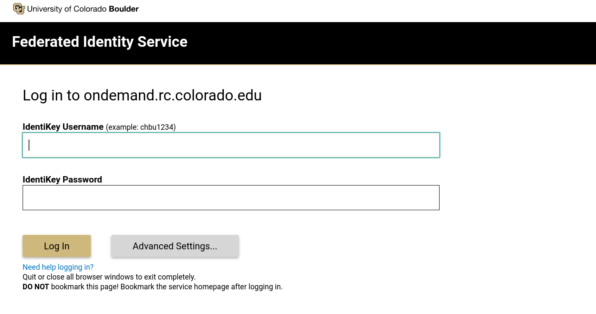

# Open OnDemand _(Browser Based HPC Portal)_

Open OnDemand is a browser based, integrated, single access point for all of your high performance computing (HPC) resources at CU Research Computing. Open OnDemand provides a graphical interface to manage files; create and view job Slurm jobs on CURC's clusters; and access interactive applications (such as Jupyter and RStudio). All of these actions are completed via a web browser and require only minimal knowledge of Linux and scheduler commands.

## Getting started with Open OnDemand

`````{tabs}

````{tab} CU Boulder

To connect to Open OnDemand, you must first have a CU Research Computing account. If you do not have an account, please consult [our account request page](../access/logging-in.md) to get started. Once you have a CU Research Computing account you can connect to Open OnDemand by visiting <https://ondemand.rc.colorado.edu>. This link will bring you to a login page for Open OnDemand. Use your CU Research Computing credentials and Duo 2-factor authentication to login.



````

````{tab} CSU

To connect to Open OnDemand, you must first have a CU Research Computing account. If you do not have an account, please consult [CSU's Getting Started with Alpine](https://it.colostate.edu/research-computing-and-cyberinfrastructure/compute/get-started-with-alpine/) documentation. Once you have obtained an account, you can connect to Open OnDemand by visiting <https://ondemand-rmacc.rc.colorado.edu>. This will bring you to a CILogon page. Once on this page, click the drop-down menu under **"Select an Identity Provider"** and select **"Colorado State University"**. 
```{eval-rst}
.. figure:: ./OnDemand/csu_select_identity.png
   :align: center
```
This will bring you to a login prompt where you should use your CSU NetID and Duo 2-factor authentication to login. 
```{eval-rst}
.. figure:: ./OnDemand/csu_ood_login.png
   :align: center
```

````

````{tab} AMC

To connect to Open OnDemand, you must first have a CU Research Computing account. If you do not have an account, please first create an XSEDE/ACCESS account by following the instructions [here](https://identity.access-ci.org/new-user) for new user registration. Please direct any questions about new accounts to the [ACCESS ticketing system](https://access-ci.atlassian.net/servicedesk/customer/portal/2/create/30). Next, sign and fill out [CU Anschutz's Alpine form](https://ucdenverdata.formstack.com/forms/alpine_eua_and_intake). Once filled out, you will receive an email from <hpcsupport@cuanschutz.edu> in approximately 1-2 weeks confirming your CU Research Computing account has been created. Once you have obtained an account, you can connect to Open OnDemand by visiting <https://ondemand-rmacc.rc.colorado.edu>. This will bring you to a CILogon page. Once on this page, click the drop-down menu under **"Select an Identity Provider"** and select **"ACCESS CI (XSEDE)"**. 
```{eval-rst}
.. figure:: ./OnDemand/access_select_identity.png
   :align: center
```
This will bring you to a login prompt where you should use your XSEDE/ACCESS account information and Duo 2-factor authentication to login. 
```{eval-rst}
.. figure:: ./OnDemand/access_ood_login.png
   :align: center
```

````

````{tab} RMACC

To connect to Open OnDemand, you must first have a CU Research Computing account. For more information on creating a CU Research Computing account, please see [Requesting an RMACC Account on CURC Resources](../access/rmacc.md#requesting-an-rmacc-account-on-curc-resources). Once you have obtained an account, you can connect to Open OnDemand by visiting <https://ondemand-rmacc.rc.colorado.edu>. This will bring you to a CILogon page. Once on this page, click the drop-down menu under **"Select an Identity Provider"** and select **"ACCESS CI (XSEDE)"**. 
```{eval-rst}
.. figure:: ./OnDemand/access_select_identity.png
   :align: center
```
This will bring you to a login prompt where you should use your XSEDE/ACCESS account information and Duo 2-factor authentication to login. 
```{eval-rst}
.. figure:: ./OnDemand/access_ood_login.png
   :align: center
```

````
`````

````{important}
_**When logging out**_ you must **completely quit your browser in order for "logout" to occur**. If after reopening your browser you are still logged in, please clear your cookies. If you are on a Chromebook or Chromebox, you will need to reboot your device in order to "quit the browser" and thus "logout".  
```{tip}
Using a **"private browsing mode"** window while using OnDemand is a great way to handle "auto-logout", as closing your browser window will remove all associated cookies and session information. 
```
````

## Overview of Open OnDemand's graphical interface 

When you have successfully logged into Open OnDemand, you will see the landing page with the following features broken into tabs along the top of the page: __Files__, __Jobs__, __Clusters__ (shell access), __Interactive Apps__, and __My Interactive Sessions__. These tabs are your main gateway to the amazing features Open OnDemand has available! For more information on these features, please see the section [What should I read next?](#what-should-i-read-next) at the bottom of this page. 
```{eval-rst}
.. figure:: ./OnDemand/landing_page.png
   :align: center
```
All interactive applications can be accessed via the **"Interactive Apps"** drop-down menu (pictured left). This drop-down menu is meant as a convenience feature to get you quick access to your interactive applications. Although this is nice, sometimes you need to see more information about your interactive applications, such as currently running sessions, sessions waiting in the queue, and sessions that have completed. To obtain this information you can use select the **"My Interactive Sessions"** tab (pictured right).
```{eval-rst}
.. figure:: ./OnDemand/interactive_access.png
   :align: center
```

---

## What should I read next? 

```{toctree}
:maxdepth: 1

configuring_apps
core_desktop
matlab
jupyter_session
rstudio
vs_code-server
files_app
jobs_app
terminal_app

```
