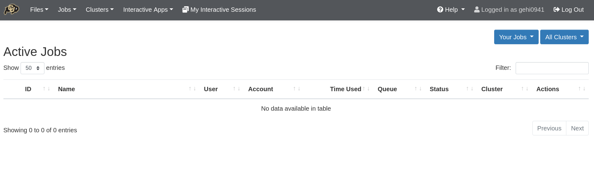

# Jobs application

Jobs can be monitored, created, edited and scheduled with the job management tools under the _Jobs_ menu.

* __Active Jobs:__ Under the “Active Jobs” tab you can view active jobs. You can choose to view your jobs (or all jobs) as well as choose from specific clusters (Alpine, Core, or All Clusters). From this menu you can also cancel your own jobs.

* __Job Composer:__ Create and edit job scripts and schedule jobs under this menu.

> See [OSC's Job Management help page](https://www.osc.edu/resources/online_portals/ondemand/job_management) for detailed use of the job composer feature.

