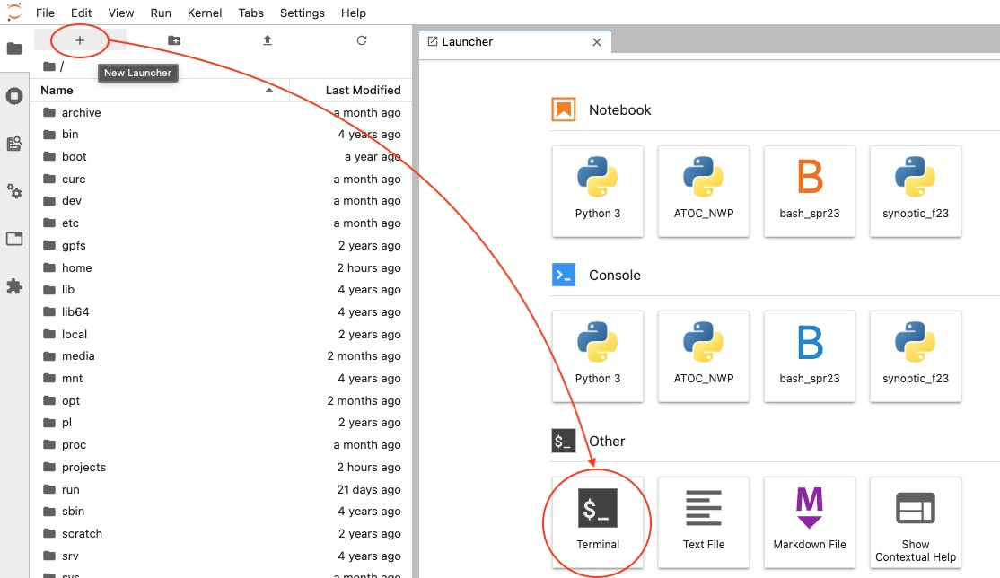

# Jupyter Session

[Jupyter Notebooks](https://jupyter.org/) are an excellent resource for interactive development and data analysis using _Python_, _R_, and other languages. Jupyter notebooks can contain live code, equations, visualizations, and explanatory text, which provide an integrated environment to use, learn, and teach interactive data analysis. Users can obtain quick access to Jupyter sessions using Open OnDemand. The JupyterLab interface is a fantastic tool that provides a highly customizable graphical user interface (GUI) that allows users to easily navigate multiple Jupyter Notebooks and the CURC filesystem. 

1. When starting an interactive Jupyter session job, you may select `Jupyter Session (Custom)` or `Jupyter Session (Presets)` from the menu. The `Jupyter Session (Custom)` option allows you to modify the resources and Slurm configurations for the job. For more information on these options, please see the [Running Custom Interactive applications](./index.md#running-custom-interactive-applications) section. If you select `Jupyter Session (Presets)`, you may select from standard configurations we provide.  Most use cases can be accommodated by one of the presets. The `Jupyter Session (Presets)` option submits jobs to Alpine's `ahub` partition. This partition provides users with rapid start times, but __limits users to one Jupyter session__ (or any one job using the partition).

    

2. Click “Launch” to submit the Jupyter session job to the queue. The wait time depends on the number of cores and time requested. The preset options generally start within a few moments. 
3. Once your Jupyter Notebook session is ready, you can click “Connect to Jupyter”. An interactive Jupyter session will be started in a new window.

    

**_Notes:_** 
* When the session starts, the file navigator panel displays CURC root. You can navigate to one of your CURC spaces by selecting `home` or `projects` from the file panel on the left. Alternatively, you can go to "File" then "Open Path" and enter your path in the field (e.g. `/projects/<your username>`).
* For more information on running Jupyter sessions see all sections below.
* Closing the window will not terminate the job, you can use the “My Interactive Sessions” tab to view all open interactive sessions and terminate them.
* One can access a single GPU via the `Jupyter Session (Custom)` application by following the instructions provided in the [GPU access for Jupyter Sessions](#gpu-access-for-jupyter-sessions) section below. 


## Navigating the JupyterLab Interface

The following features are available in the [JupyterLab Interface](https://jupyterlab.readthedocs.io/en/stable/user/interface.html):

* _Left sidebar:_ Click on a tab to change what you see in the left menu bar.  Options include the file browser, a list of running kernels and terminals, a command palette, a notebook cell tools inspector, an extension manager, and a tabs list.
* _Left menu bar:_ 
  * The _file browser_ will be active when you log in. 
    * You can navigate to your other CURC directories by clicking the folder next 
to `/` or going to "File" then "Open Path" and entering your path in the field. Your other CURC file systems are available too: 
`/projects/<username>`, `/pl/active` (for users with PetaLibrary allocations), 
`/scratch/alpine/<username>` (Alpine only), and `/rc_scratch/<username>` (Blanca 
only).
    * To open an existing notebook, just click on the notebook name in the file browser (e.g., _mynotebook.ipynb_).
    * Above your working directory contents are buttons to add a new Launcher, create a new folder, upload files from your local computer, and refresh the working directory. 
* _Main Work Area:_ Your workspaces will be in this large area on the right hand side. Under the "Launcher" tab you can: 
  * Open a new notebook with any of the kernels listed:
      * __Python 3 (idp)__: Python3 notebook (Intel Python distribution)
      * __Bash__: BASH notebook
      * __R__: R notebook 
      * ...and any other custom kernels you add on your own _(see the [section below](#creating-your-own-custom-jupyter-kernel) on creating your own custom kernels)._
   * Open a new console (command line) for any of the kernels.
   * Open other functions; the "Terminal" function is particularly useful as it enables you to access the command line on the Alpine or Blanca node your Jupyter Session
job is currently running on. 
* See Jupyter's [documentation on the JupyterLab Interface for additional information.](https://jupyterlab.readthedocs.io/en/stable/user/interface.html)

## Find packages available to you within a notebook

The ___Python 3 (idp)___ notebook kernels have many preinstalled packages. To query a list of available packages from a python notebook, you can use the following nomenclature:

```python
from pip._internal import main as pipmain 
pipmain(['freeze'])
```

If the packages you need are not available, you can create your own custom environment and Jupyter kernel.

## Creating your own custom Jupyter kernel

[Anaconda](http://anaconda.com) is an open-source software that provides access to _python_ and _R_ distributions, and it includes the _conda_ package manager to easily install software and packages. Software and associated Jupyter [kernels](https://github.com/jupyter/jupyter/wiki/Jupyter-kernels) other than _python_ and _R_ can also be installed using _conda_. The following steps describe how to create your own custom Anaconda environments and associated Jupyter kernels for use within a Jupyter Session. 

Follow these steps from a terminal session. You can get a new terminal session directly from Jupyter using `New`-> `Terminal`.

### 1.  Configure your conda settings

Follow our Anaconda documentation for [steps on configuring your conda settings via ~.condarc](../software/python.md#configuring-conda-with-condarc).

### 2. Activate the CURC Anaconda environment

```
[johndoe@c3cpu-a5-u15-4 ~]$ module load anaconda
```

You will know that you have properly activated the environment because you should see `(base)` in front of your prompt. For example, 

```
(base) [johndoe@c3cpu-a5-u15-4 ~]$
```

### 3. Create a new custom environment 

Follow our Anaconda documentation for [steps on creating your own custom conda environment](../software/python.md#create-your-own-custom-environment) and [Creating a Jupyter Session Conda Environment](#creating-a-jupyter-session-conda-environment) below.

### 4. Activate your new environment

```
(base) [johndoe@c3cpu-a5-u15-4 ~]$ conda activate mycustomenv
```

> Note: We assume here that you've named your environment _mycustomenv_; please replace _mycustomenv_ with whatever name you gave your environment!

### 5. Create your own custom kernel, which will enable you to use this environment in your Jupyter Session

__For a _python_ kernel__

```
(mycustomenv) [johndoe@c3cpu-a5-u15-4 ~]$ conda install -y ipykernel
(mycustomenv) [johndoe@c3cpu-a5-u15-4 ~]$ python -m ipykernel install --user --name mycustomenv --display-name mycustomenv
```

* The first command will install the _ipykernel_ package if not installed already. 
* The second command will create a _python_ kernel with the name _mycustomenv_ with the Jupyter display name _mycustomenv_ (note: the name and display-name are not required to match the environment name -- call them anything you want). By specifying the `--user` flag, the kernel will be installed in `/home/$USER/.local/share/jupyter/kernels` (a directory that is in the default __JUPYTER_PATH__) and will ensure your new kernel is available to you the next time you launch a Jupyter Session.

__For an _R_ kernel__

```
(mycustomenv) [johndoe@c3cpu-a5-u15-4 ~]$ conda install -y r-irkernel
(mycustomenv) [johndoe@c3cpu-a5-u15-4 ~]$ R
> IRkernel::installspec(name = 'mycustomenv', displayname = 'mycustomenv')
```

* The first command will install the _irkernel_ package if not installed already. 
* The second command will start _R_. The third command, executed from within _R_, will create an _R_ kernel with the name _mycustomenv_ with the Jupyter display name _mycustomenv_ (note: that the name and display-name are not required to match the environment name -- call them anything you want). The kernel will be installed in `/home/$USER/.local/share/jupyter/kernels` (a directory that is in the default __JUPYTER_PATH__) and will ensure your new kernel is available to you the next time you launch a Jupyter Session.

### Notes:
* If you have already installed your own version of Anaconda or Miniconda, it is possible to create Jupyter kernels for your preexisting environments by following _Step 4_ above from within the active environment.  
* If you need to use custom kernels that are in a location other than `/home/$USER/.local/share/jupyter` (for example, if your research team has a group installation of Anaconda environments located in `/pl/active/<some_env>`), you can create a file in your home directory named `~/.jupyterrc` containing the following line:
```
export JUPYTER_PATH=/pl/active/<some_env>/share/jupyter
```

If you need assistance creating or installing environments or Jupyter kernels, contact us at <rc-help@colorado.edu>. 

## Creating a Jupyter Session Conda Environment

In Jupyter Session applications you have the option to launch a Jupyter session using a Conda environment that you have created. This becomes extremely useful if you are using a package that requires extensions be installed in the environment that is launching the Jupyter session. In order to configure your environment so that it launches correctly, you need to ensure that the appropriate packages are installed in it. Below we provide the process needed to correctly create your environment using a Jupyter Session terminal. 

1. Obtain a compute node by launching a Jupyter session using the Anaconda version of your choice and using the `base` environment

    

2. Once the Jupyter session has been launched, open up a terminal in Jupyter

    

3. In your terminal, load the Anaconda version you wish to use e.g.
   ```
   [user@c3cpu-a2-u3-4 ~]$ module load anaconda/2020.11
   ``` 

4. Create a Conda environment with the name and Python version of your choice (here we use `my-conda-env` and Python version 3.10)
   ```
   [user@c3cpu-a2-u3-4 ~]$ conda create -n my-conda-env python=3.10
   ```
5. Activate your conda environment
   ```
   [user@c3cpu-a2-u3-4 ~]$ conda activate my-conda-env
   ```
6. Install either JupyterLab **or** Jupyter Notebook (it is preferred that users install JupyterLab)
   - If you would like to install JupyterLab:
       ```
       (my-conda-env) [user@c3cpu-a2-u3-4 ~]$ conda install -c conda-forge jupyterlab
       ```
   - If you would like to install Jupyter Notebook (the classic version of Jupyter)
      ```
      (my-conda-env) [user@c3cpu-a2-u3-4 ~]$ conda install -c conda-forge notebook
      ```
7. You can now install the rest of the packages you require in this environment. 


Now that we have our environment correctly created, we can launch a Jupyter session utilizing this environment. This can be done as follows: 
1. Launch the Jupyter session using the environment you created:
  
2. Once the session is launched, it is also important to ensure that your environment is being correctly utilized. To do this, open up a terminal application and determine what Python and Jupyter are being used:
   ```
   [user@c3cpu-a2-u3-4 ~]$ which python
   /projects/user/software/anaconda/envs/my-conda-env/bin/python
   [user@c3cpu-a2-u3-4 ~]$ which jupyter
   /projects/user/software/anaconda/envs/my-conda-env/bin/jupyter
   ```

   - The provided output should be utilizing the environment you created, as seen by the output `anaconda/envs/my-conda-env`. 
   - If your environment is not being used, this is usually due to one of two reasons:
       - You have incorrectly provided the name of your Conda environment
       - You have chosen an Anaconda version that is not the same as the one you used to install your Conda environment
       
  In both of these scenarios, you can confirm that your environment is not being used by looking at the `output.log` for your job:

  1. Select "My Interactive Sessions"
  
  2. Click the link next to the "Session ID" for your running job
  
  3. Open the file `output.log` by clicking it
  
  4. If you see an `EnvironmentNameNotFound` this means that your environment is **NOT** being used
  

## GPU access for Jupyter Sessions

When launching custom Jupyter sessions, one can access a single GPU on Alpine by specifying the correct partition and QoS name. However, only the testing partitions are valid on Jupyter sessions and they are limited to a run time of one hour. For GPU jobs that require more resources or more time, please submit a [batch job](../running-jobs/batch-jobs.md) using the standard `ami100` or `aa100` partitions. The table below provides the inputs needed to start a Jupyter session with a GPU:

| Partition | QoS Name | Type of GPU |
| --- | ----------- | --------------
| atesting_a100 | testing |   NVIDIA A100 |
| atesting_mi100 | testing |   AMD MI100 |

## Troubleshooting

* If you are a CSU or ACCESS user and are having trouble with packages that employ PERL (due to the `@` symbol), visit our documentation on setting up a user variable that links to alternate paths without the `@` symbol in [CSU and XSEDE/ACCESS usernames](../additional-resources/csu-xsede-usernames.md)

## See Also

* [CURC Anaconda distribution](../software/python.md)
* [JupyterLab homepage](https://jupyterlab.readthedocs.io)