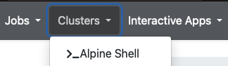

# RStudio Server

RStudio is an integrated development environment (IDE) for R. It can be an extremely useful tool when developing and running R code. It allows users to navigate the filesystem, edit and run code, view plots, and much more all in the same place. In Open OnDemand we allow users to easily access this functionality using the **RStudio Server** application. Furthermore, each RStudio session is launched from a [container](../software/Containerizationon.md), which allows users to customize it to their needs. For more information on customizing your container, see [Installing dependencies for RStudio Server](#installing-dependencies-for-rstudio-server) below. 

```{eval-rst}
.. figure:: ./OnDemand/rstudio_gui.png
   :align: center
```

## Launching a RStudio Server

1. Navigate to either the __Interactive Apps__ or __My Interactive Sessions__ tab and select **RStudio Server**. 

2. Select the RStudio version you would like to launch the application with.

```{eval-rst}
.. figure:: ./OnDemand/rstudio_config.png
   :align: center
```

3. Specify a **"Configuration type"** and select the resources you would like to use. For more information on this functionality see [Configuring Open OnDemand interactive applications](./configuring_apps.md). 
    ```{important}
    Please note that the first time you launch RStudio it may take 15 minutes or more to create a [persistent overlay](https://apptainer.org/docs/user/main/persistent_overlays.html), if 1 core is used. Persistent overlays are the secret sauce that allow for highly customizable RStudio sessions. For this reason, we recommend using 4 cores or more during your first launch of an RStudio session. Subsequent sessions will not require the creation of the persistent overlay; therefore 1 core may be sufficient.
    ```

4. When your RStudio session is ready, you can click the **"Connect to RStudio Server"** button to bring up a web page with the RStudio IDE. 

```{eval-rst}
.. figure:: ./OnDemand/rstudio_launch.png
   :align: center
   :scale: 50%
```

5. After connecting to RStudio Server, you should then be able to utilize RStudio as if it were on your own computer! 

6. To shut down an RStudio server, go to the **"File"** menu at the top and choose **"Quit session..."**. Shutting down the server or closing the window will not terminate the job, you can use the **“My Interactive Sessions”** tab to view all open interactive sessions and terminate them.

````{important}
* Packages installed in the **RStudio Server** application are placed in `/projects/$USER/Rstudio_libs/<R-version>`. 

* If you would like to run code developed in the **RStudio Server** application in batch jobs or from the command line, then please follow the [Running code developed in the RStudio Server application](#running-code-developed-in-the-rstudio-server-application) section below. 
````


## Installing dependencies for RStudio Server

As previously mentioned, the RStudio application is run from an Ubuntu [container](../software/Containerizationon.md). More specifically, the application uses an Ubuntu container paired with a [persistent overlay](https://apptainer.org/docs/user/main/persistent_overlays.html), which is unique to each user. For this reason, when installing a library via `install.packages`, you may receive an error because the container and overlay do not have a dependency required by the library. For example, let's try to install the library `XVector` using the Bioconductor package manager `BiocManager`, using the below commands in the R command prompt.
```r
install.packages("BiocManager")
library(BiocManager)
BiocManager::install("XVector")
```

```{note}
If you are ever provided the prompt "Update all/some/none? [a/s/n]:",  always choose "n". You will not be able to update the items because RStudio needs to be launched using a read only container, which cannot be modified. However, choosing the wrong option should not harm anything.
```

When the above lines are executed, we will eventually reach a state in the `XVector` install where we receive the following error.


This install failed because our container and overlay do not have `zlib` installed. To remedy this, we can install `zlib` by modifying our overlay. To do this, we must first completely close the RStudio session __AND__ delete the job. This is necessary because our overlay cannot be changed if it is being used. Next, open up a terminal in Open OnDemand by selecting **"Clusters"** -> **"Alpine Shell"** from the top menu bar.



Next, start an interactive session on a compute node (here we start up an Alpine `acompile` session).
```
acompile --ntasks=4
```
```{warning}
If you do not install dependencies using the same cluster (Alpine or Blanca) that you initially launched the RStudio Server from, you may receive errors. 
```

Once on a compute node, you can then modify the overlay by launching the overlay using fakeroot. To do this, first specify the version of R that you are using (here we use R version 4.4.1).
```
export r_app_version="4.4.1"
```
With the environment variable set, you can then utilize the below command to launch the container and associated overlay. 
```
apptainer shell --fakeroot --bind /projects,$SCRATCHDIR,$CURC_CONTAINER_DIR_OOD --overlay /projects/$USER/.rstudioserver/rstudio-${r_app_version}/rstudio-server-${r_app_version}_overlay.img $CURC_CONTAINER_DIR_OOD/rstudio-server-${r_app_version}.sif
```
You should now be in a terminal starting with `Apptainer>`. In this shell we can install anything using the standard Ubuntu package manager. Let's go ahead and install `zlib1g-dev`, which will give us `zlib.h`.
```
apt-get update 
apt install zlib1g-dev
```
Once completed, the overlay will be updated and you can exit the shell and compute node by executing `exit` twice.
```
exit
exit
```
Now, we can startup a new Rstudio session and attempt the XVector install.
```r
BiocManager::install("XVector")
```
We should now see that the XVector install goes through!


## Running code developed in the RStudio Server application

As mentioned above, the **RStudio Server** application is held within a container. This means code utilizing packages installed within the container or custom container configurations may only work if the code is ran inside the container. Thus, users who want to run code developed in the **RStudio Server** application from the command line need to do this using Apptainer. Below we provide two methods that can be used once a user has access to a compute node:

-  To utilize R in an interactive session, first specify the version of R that you are using (here we use R version 4.4.1).
    ```
    export r_app_version="4.4.1"
    ```
    With the environment variable set, you can execute the following command to start the container.
    ```
    apptainer shell --bind /projects,$SCRATCHDIR,$CURC_CONTAINER_DIR_OOD --overlay /projects/$USER/.rstudioserver/rstudio-${r_app_version}/rstudio-server-${r_app_version}_overlay.img:ro $CURC_CONTAINER_DIR_OOD/rstudio-server-${r_app_version}.sif
    ```
    You can then launch R and interact with it (you can also utilize `Rscript` here too).
    ```
    Apptainer> R
    > library(XVector)
    ```

- To execute the script `test_R.r` without an interactive session, first specify the version of R that you are using (here we use R version 4.4.1).
    ```
    export r_app_version="4.4.1"
    ```
    With the environment variable set, you can then execute the following command. 
    ```
    apptainer exec --bind /projects,$SCRATCHDIR,$CURC_CONTAINER_DIR_OOD --overlay /projects/$USER/.rstudioserver/rstudio-${r_app_version}/rstudio-server-${r_app_version}_overlay.img:ro $CURC_CONTAINER_DIR_OOD/rstudio-server-${r_app_version}.sif Rscript test_R.r
    ```
