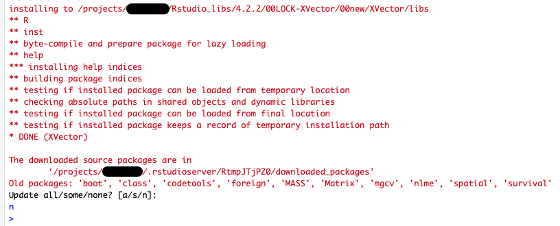

# RStudio

1. To start an interactive RStudio job, select `RStudio Server (Custom)` or `RStudio Server (Presets)` from the menu. The `RStudio Server (Custom)` option allows you to modify the resources and Slurm configurations for the job. For more information on these options, please see the [Running Custom Interactive applications](./index.md#running-custom-interactive-applications) section. The `RStudio Server (Presets)` application provides configurations for your convenience. Most use cases can be accommodated by one of the presets. The `RStudio Server (Presets)` option submits jobs to Alpine's `ahub` partition. This partition provides users with rapid start times, but __limits users to one RStudio Server session__ (or any one job using the partition; for example if you have a Jupyter session that is also using the `ahub` partition, you will not be able to start an RStudio Server session using the preset options).

2. Click “Launch” to submit the RStudio job to the queue. The wait time depends on the number of cores and time requested.  The preset options provided generally start within a few moments. 
3. Once your RStudio session is ready, you can click “Connect to RStudio Server”. An interactive RStudio session will be started in a new window.

- Please note that the first time you launch the session it may take awhile before you can connect to the session. This is because we are creating a unique [persistent overlay](https://apptainer.org/docs/user/main/persistent_overlays.html) for you that can give you the ability to install dependencies. Subsequent launches will not take as long. 
4. To shut down an RStudio server, go to the "File" menu at the top and choose "Quit session...". If you have made changes to the workspace, then you will be asked if you would like to save them to `~/.RData`, this is not necessary, but can be helpful. Once completed, a prompt will notify you that your R session has ended and will give you the option to restart a server, if desired. However, it is important to note that quitting the session will not cancel the job you are running. Additionally, closing the window will not terminate the job. To terminate the job, you can use the “My Interactive Sessions” tab in Open OnDemand to terminate running sessions.

**_Important Notes:_** 
* We have designed the RStudio app in Open OnDemand such that it employs versions of R that match the versions of R that are also available in the CURC module stack. This is done to facilitate moving between using RStudio for interactive work, and running larger R workflows as batch jobs on Alpine or Blanca. Due to system constraints, packages you install in a given version of R in RStudio will not be available if you load the equivalent version of the R module, and vice versa. You will need to (re-)install the packages you need when using the equivalent module. This is due to the fact that RStudio is run from an Ubuntu [container](../software/Containerizationon.md).

## Installing dependencies for RStudio (currently available only on Alpine)

As previously mentioned, the RStudio application is run from an Ubuntu [container](../software/Containerizationon.md). More specifically, the application uses an Ubuntu container paired with a [persistent overlay](https://apptainer.org/docs/user/main/persistent_overlays.html) that is unique to each user. For this reason, when installing a library via `install.packages`, you may receive an error because the container and overlay do not have a dependency required by the library. For example, let's try to install the library `XVector` using the Bioconductor package manager `BiocManager`, using the below commands in the R command prompt.
```r
install.packages("BiocManager")
library(BiocManager)
BiocManager::install("XVector")
```
- Please note that if you are ever provided the prompt "Update all/some/none? [a/s/n]:",  always choose "n". You will not be able to update the items because RStudio needs to be launched using a read only container, which cannot be modified. However, choosing the wrong option should not harm anything.

When the above lines are executed, we will eventually reach a state in the `XVector` install where we receive the following error.


This install failed because our container and overlay do not have `zlib` installed. To remedy this, we can install `zlib` by modifying our overlay. To do this, we must first completely close the RStudio session __AND__ delete the job. This is necessary because our overlay cannot be changed if it is being used. Next, open up a terminal in Open OnDemand by selecting "Clusters" -> "Alpine Shell" from the top menu bar.


Next, start an interactive session on a compute node.
```
acompile --ntasks=4
```
Once on a compute node, we can now modify the overlay by launching the overlay using fakeroot.
```
apptainer shell --fakeroot --bind /projects,/scratch/alpine,$CURC_CONTAINER_DIR_OOD --overlay /projects/$USER/.rstudioserver/rstudio-server-4.2.2_overlay.img $CURC_CONTAINER_DIR_OOD/rstudio-server-4.2.2.sif
```
You should now be in a terminal starting with `Apptainer>`. In this shell we can install anything using the standard Ubuntu package manager. Let's go ahead and install `zlib1g-dev`, which will give us `zlib.h`.
```
apt-get update 
apt install zlib1g-dev
```
Once completed, the overlay will be updated and you can exit the shell and compute node by executing `exit` twice.
```
exit
exit
```
Now, we can startup a new Rstudio session and attempt the XVector install.
```r
BiocManager::install("XVector")
```
We should now see that the XVector install goes through!



**_Important Notes:_** 
- Currently, this functionality is only available on Alpine. Once we update the operating system on Blanca, we will enable this functionality. 
- For users who want to utilize the command line version of R or run a script without RStudio, this can be done using Apptainer. Below we provide two methods that can be used once a user has access to an Alpine compute node:
    -  To utilize R in an interactive session, you can execute the following command to start the container.
    ```
    apptainer shell --bind /projects,/scratch/alpine,$CURC_CONTAINER_DIR_OOD --overlay /projects/$USER/.rstudioserver/rstudio-server-4.2.2_overlay.img:ro $CURC_CONTAINER_DIR_OOD/rstudio-server-4.2.2.sif
    ```
    You can then launch R and interact with it (you can also utilize `Rscript` here too).
    ```
    Apptainer> R
    > library(XVector)
    ```
    - To execute the script "test_R.r" without an interactive session, you can execute the following command. 
    ```
    apptainer exec --bind /projects,/scratch/alpine,$CURC_CONTAINER_DIR_OOD --overlay /projects/$USER/.rstudioserver/rstudio-server-4.2.2_overlay.img:ro $CURC_CONTAINER_DIR_OOD/rstudio-server-4.2.2.sif Rscript test_R.r
    ```
