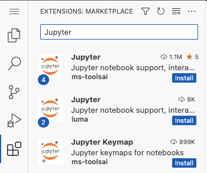

# VS Code-Server

[Visual Studio Code (VS Code)](https://code.visualstudio.com/) is an extremely popular and powerful code editor. In Open OnDemand, we utilize [Code-Server](https://coder.com/docs/code-server/latest) to bring our users VS Code. Code-Server is a modified version of VS Code that allows VS Code to be accessed via a browser. Due to some modifications, certain VS Code features may not be available in VS Code-Server or may function differently. One feature that can function differently is installing extensions. For more information on installing extensions, see the section [Installing VS Code-Server Extensions](#installing-vs-code-server-extensions) below. 

```{eval-rst}
.. figure:: ./OnDemand/vs_code_server_gui.png
   :align: center
```

## Launching a VS Code-Server

1. Navigate to either the __Interactive Apps__ or __My Interactive Sessions__ tab and select **VS Code-Server**. 

2. Select the VS Code-Server version you would like to launch the application with.

```{eval-rst}
.. figure:: ./OnDemand/vs_code_server_config.png
   :align: center
```

3. Specify a **"Configuration type"** and select the resources you would like to use. For more information on this functionality see [Configuring Open OnDemand interactive applications](./configuring_apps.md). 

4. When your VS Code-Server session is ready, you can click the **"Connect to VS Code"** button to bring up a web page with the VS Code-Server editor. 

```{eval-rst}
.. figure:: ./OnDemand/vs_code_server_launch.png
   :align: center
   :scale: 50%
```

## Installing VS Code-Server Extensions

The provided VS Code application is utilizing [VS Code-Server](https://coder.com/docs/code-server/latest). For this reason, some aspects of the application may differ from the 
standard installation of VS Code. One of these differences is accessing and installing extensions. While a majority of extensions are available in the Marketplace within the 
application (and installable), some extensions may be missing. Although this is the case, thankfully one can download extensions directly from the [VS Code Marketplace](https://marketplace.visualstudio.com/vscode) and then install them within the application. Below we provide a video that demonstrates three ways one can install extensions from within
the application. Additionally, we provide a short description of these methods below the video.


<iframe width="700" height="400" src="https://www.youtube.com/embed/2kgZQmm5TF4?si=NUVzamnXYojcd79e" frameborder="0" allow="autoplay; encrypted-media" allowfullscreen></iframe>


When attempting to install an extension, we suggest the following methods (listed in order of preference):
- If possible, install extensions using the Marketplace from within the application.
    1. On the left-hand side of the screen select the `Extensions` button. 
    2. Use the provided search bar to search for the application you want. 
    3. Select the application and then click the `Install` button.

        
        
- Install the application by dragging the downloaded file into the **extensions column** (for visual representation, please see above video).
    1. Navigate to the [VS Code Marketplace](https://marketplace.visualstudio.com/vscode) in your browser.
    2. Select the application you want and click `Download Extension` on the right-hand side. Some applications require that you chose the operating system. For 
    these applications, select the drop-down menu next to `Download Extension` and then select `Linux x64`.
    3. Drag and drop the downloaded file into the **extensions column** within the VS Code-Server application. 
- Install the application by dragging the downloaded file into the **folder column** (for visual representation, please see above video).
    - **Note:** This option is sometimes necessary if the extensions rely on dependencies located in the downloaded file.
    1. Navigate to the [VS Code Marketplace](https://marketplace.visualstudio.com/vscode) in your browser.
    2. Select the application you want and click `Download Extension` on the right-hand side. Some applications require that you chose the operating system. For 
    these applications, select the drop-down menu next to `Download Extension` and then select `Linux x64`.
    3. Drag and drop the downloaded file into the **folder column** within the VS Code-Server application. 
    4. Right click the downloaded file and select `Install Extension VSIX`.

 ## Using conda environments in VS Code-Server

The following steps will make available to VS Code-Server any [conda environments you previously installed on CU Research Computing resources](../software/python.md).

1. Navigate to `Extensions` and install the basic `Python` extension.

2. While still in `Extensions` select the Python extension you just installed.

3. In the `Extension: Python` window, select the settings icon that is next to the blue `Disable` and `Uninstall` buttons, and choose `Extension Settings` in the drop-down menu.

4. In the `Settings` window select the `Remote [ondemand.rc.colorado.edu]` tab.

5. In the "Remote" window, add the following conda path to the `Python: Conda Path` category:
```
/curc/sw/install/miniforge3/24.11.3-0/bin/conda
```
6. Now navigate back to the main `Extension: Python` window and select `disable`, then `reload required` and then `enable`.

7. You should now be able to find and load any of your conda environments when selecting your python interpreter for a given session (it may take a few moments to display them all the first time).

