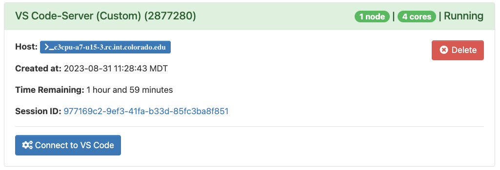

# VS Code-Server

1. To start an interactive [Visual Studio Code (VS Code)](https://code.visualstudio.com/) job, you may select `VS Code-Server (Custom)` or `VS Code-Server (Presets)` from the menu. The `VS Code-Server (Custom)` option allows you to modify the resources and Slurm configurations for the job. For more information on these options, please see the [Running Custom Interactive applications](./index.md#running-custom-interactive-applications) section. If you select `VS Code-Server (Presets)`, you may select from standard configurations we provide.  Most use cases can be accommodated by one of the presets. The `VS Code-Server (Presets)` option submits jobs to Alpine's `ahub` partition. This partition provides users with rapid start times, but __limits users to one VS Code-Server session__ (or any one job using the partition).

2. Click “Launch” to submit the VS Code-Server job to the queue. The wait time depends on the number of cores and time requested. The preset options generally start within a few moments. 
3. Once your VS Code-Server session is ready, you can click “Connect to VS Code”. An interactive VS Code-Server session will be started in a new window.

**_Notes:_** 
* One can access a single GPU via the `VS Code-Server (Custom)` application by following the instructions provided in the [GPU access for Jupyter Sessions](./jupyter_session.md#gpu-access-for-jupyter-sessions) section. 

## Installing VS Code-Server Extensions

The provided VS Code application is utilizing [VS Code-Server](https://coder.com/docs/code-server/latest). For this reason, some aspects of the application may differ from the 
standard installation of VS Code. One of these differences is accessing and installing extensions. While a majority of extensions are available in the Marketplace within the 
application (and installable), some extensions may be missing. Although this is the case, thankfully one can download extensions directly from the [VS Code Marketplace](https://marketplace.visualstudio.com/vscode) and then install them within the application. Below we provide a video that demonstrates three ways one can install extensions from within
the application. Additionally, we provide a short description of these methods below the video.

<iframe width="700" height="400" src="https://www.youtube.com/embed/2kgZQmm5TF4?si=NUVzamnXYojcd79e" frameborder="0" allow="autoplay; encrypted-media" allowfullscreen></iframe>

When attempting to install an extension, we suggest the following methods (listed in order of preference):
- If possible, install extensions using the Marketplace from within the application.
    1. On the left-hand side of the screen select the `Extensions` button. 
    2. Use the provided search bar to search for the application you want. 
    3. Select the application and then click the `Install` button.

        
        
- Install the application by dragging the downloaded file into the **extensions column** (for visual representation, please see above video).
    1. Navigate to the [VS Code Marketplace](https://marketplace.visualstudio.com/vscode) in your browser.
    2. Select the application you want and click `Download Extension` on the right-hand side. Some applications require that you chose the operating system. For 
    these applications, select the drop-down menu next to `Download Extension` and then select `Linux x64`.
    3. Drag and drop the downloaded file into the **extensions column** within the VS Code-Server application. 
- Install the application by dragging the downloaded file into the **folder column** (for visual representation, please see above video).
    - **Note:** This option is sometimes necessary if the extensions rely on dependencies located in the downloaded file.
    1. Navigate to the [VS Code Marketplace](https://marketplace.visualstudio.com/vscode) in your browser.
    2. Select the application you want and click `Download Extension` on the right-hand side. Some applications require that you chose the operating system. For 
    these applications, select the drop-down menu next to `Download Extension` and then select `Linux x64`.
    3. Drag and drop the downloaded file into the **folder column** within the VS Code-Server application. 
    4. Right click the downloaded file and select `Install Extension VSIX`. 