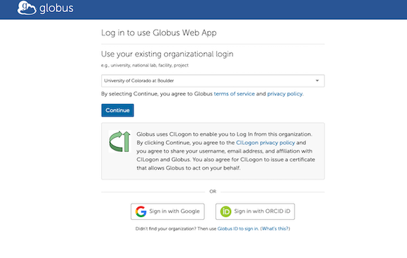
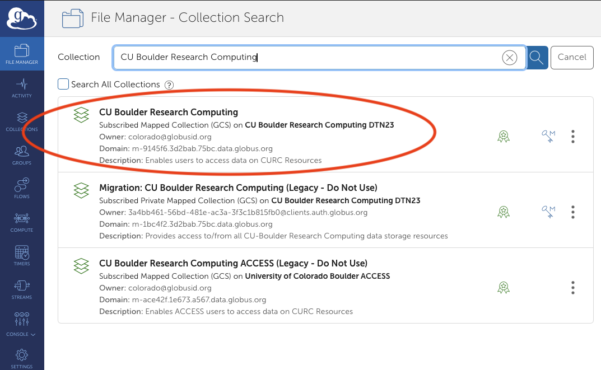
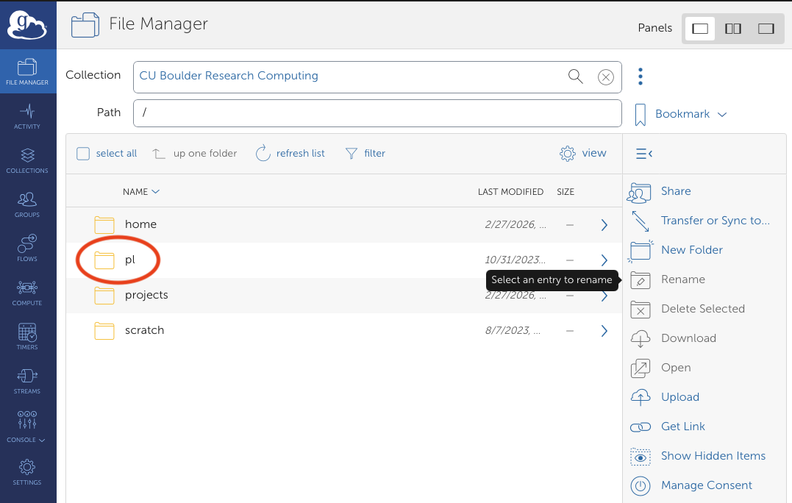
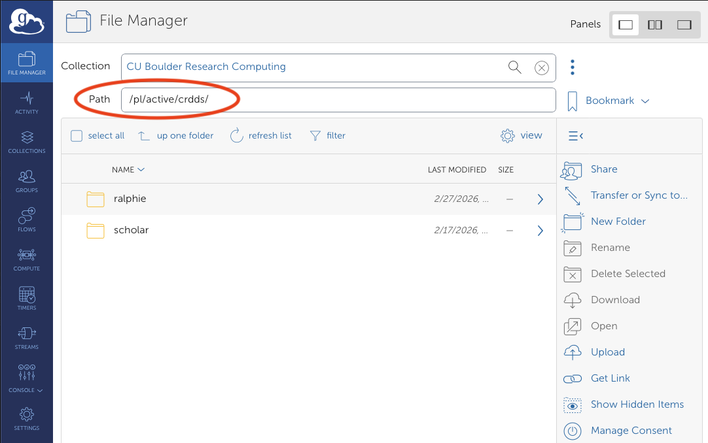
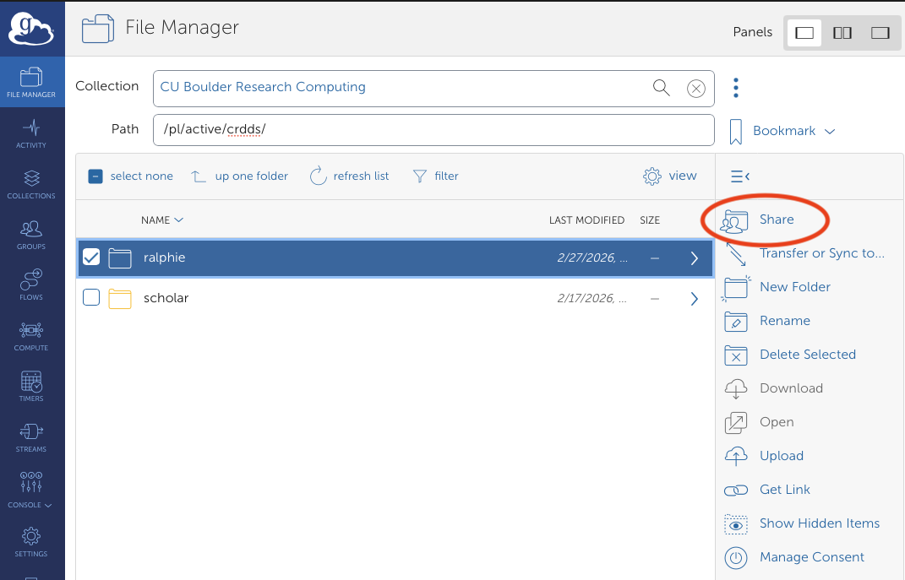
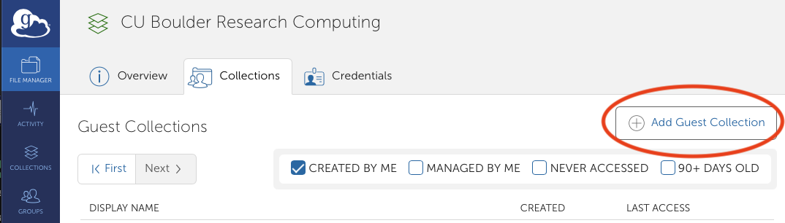
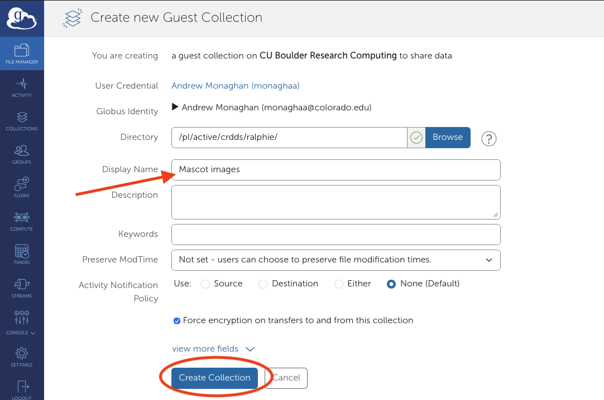
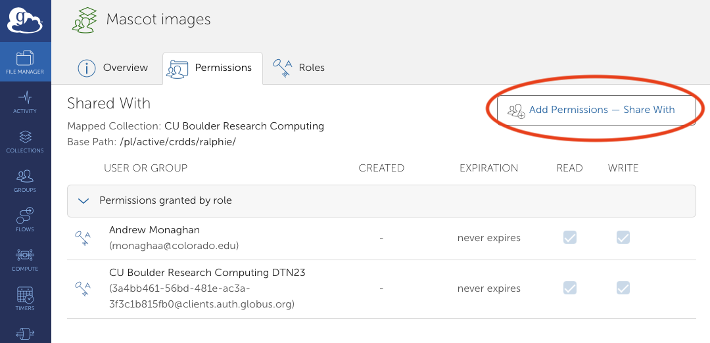
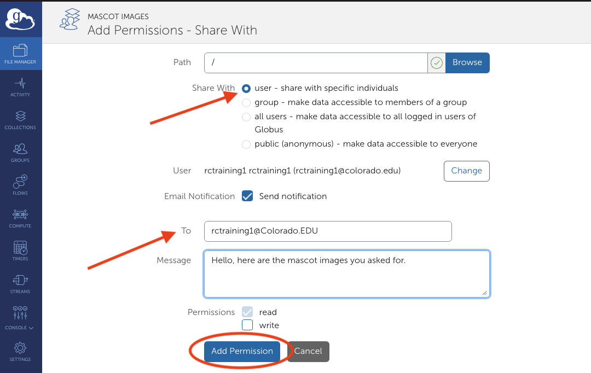

# Data sharing with a Globus Guest Collection

Globus Guest Collections (formerly known as "Shared Endpoints") enable PetaLibrary customers to share a given folder in a PetaLibrary `active` or `archive` allocation with anyone -- regardless of whether they have a CURC account -- simply by using their email address.  Guest collections are a great way to share data with external collaborators. Below we outline the steps to share data from your PetaLibrary allocation on CURC. 

```{note}
Additional information on Guest Collections is available at
[docs.globus.org](https://docs.globus.org/how-to/share-files/).
``` 


## Step 1: Log into the Globus Web App
Visit [https://app.globus.org](https://app.globus.org) and log in with your institutional credentials (University of Colorado Boulder in this example).



## Step 2: Open the CURC endpoint
All of your files on CU Research Computing, including those in your PetaLibrary allocation, can be accessed in Globus by opening the CURC endpoint (also known as a "collection"). In the Collection Search box, enter: "CU Boulder Research Computing".



There may be several choices that meet this search criterion. Select the one that is associated with "DTN23" and is _not_ marked as "Legacy".  Once you have selected the endpoint, you'll be asked to log in using your CURC Credentials; after clicking `Authenticate`, you should receive a Duo push on your Duo device which you will need to confirm.

Once authenticated, you will see a list of filesystems available to you (`/home`, `/pl`, `/projects`, `/scratch`). To access Petalibrary select `/pl` and proceed to your allocation. 



## Step 3: Navigate to the folder you would like to share

Within your allocation, navigate the the folder that contains the folder you would like to share. In this example, we navigate to `/pl/active/crdds`, which contains the folder `ralphie` we would like to share.



```{important}
Sharing is available for folders. Individual files can only be shared by sharing the folder that contains them.  Your ability to create a Guest Collection depends on your permissions for the folder. For example, if you have read-only permissions to a folder, you can create a read-only Guest Collection for it (but not a Guest Collection with _write_ permissions).
```

## Step 4: Create a Guest Collection

Now highlight the folder you would like to share by single clicking on the folder name. In this example we highlight `ralphie`, and then select **Share**.



Next, select the **Add Guest Collection** button.



Provide a name for the Guest Collection. In this example we choose `Mascot Images`, then select the **Create Collection** button.



```{note}
If it is not already highlighted, check the box next to `Force encryption on transfers to and from this collection` prior to selecting the **Create Collection** button.
```
```{warning}
Guest Collections are only valid as long as the folder they point to still exists. If you delete the folder associated with the Guest Collection, it will be invalid.
``` 

## Step 5: Add permissions to share the Guest Collection

After creating the collection, you'll be taken to the `Permissions` tab.  The Guest collection is already shared with you as well as the parent collection, "CU Boulder Research Computing". Now select the button for **Add Permissions - Share With** to share with an additional collaborator.



Now you can "Share With" a user, a [group](https://docs.globus.org/guides/tutorials/manage-identities/manage-groups), or [everyone on Globus](https://docs.globus.org/api/transfer/permissions). It is most common to share data with a single person, so in this example we select `user` and enter their email address in the `To` field (rctraining1@colorado.edu here), as well as a brief `Message` indicating what we are sharing. Complete this step by selecting the **Add Permission** button.



```{warning}
The default sharing mode is read-only. Granting _write_ access to a folder allows users to modify and delete files and folders within the folder.
```

```{important}
The person you are sharing with _must already have a Globus ID_. Globus IDs are free and available to anyone. Many organizations are already part of Globus which enables you to login via your institutional credentials. To check if your organization is part of Globus, go to the [Globus login page](https://app.globus.org) and search for your institution in the dropdown list. If not, you (or your collaborator) can [create a new Globus ID](https://www.globusid.org/create).
```

## Step 6: Confirm the email has been received

After receiving the email notification, your colleague can click on the link to log into Globus and access the guest collection. 