# Dask

## What is Dask?

[Dask](https://docs.dask.org/en/stable/index.html) is a parallel computing library in Python that allows you to scale computations from a single machine to a distributed cluster. It is particularly useful when:

* Your data does not fit in memory
* Your code is CPU-bound and slow
* You want to parallelize Python workflows without rewriting everything

Dask integrates well with familiar libraries like `NumPy` and `pandas`, making it easier to scale existing workflows.

## Dask Distributed Cluster

We can basically think of the Dask scheduler as our task orchestrator. To perform work, a scheduler must be assigned resources in the form of a Dask cluster. The Dask cluster has three main components for processing computations in parallel. These are the client, the scheduler and the workers.

* When we code, we communicate directly with the client, which is responsible for submitting tasks to be executed to the scheduler. It allows you to:
    - Submit work
    - Monitor progress
    - Access the dashboard

* After receiving the tasks from the client, the scheduler determines how tasks will be distributed among the workers and coordinates them to process tasks in parallel. It:
    - Receives tasks from your Python code
    - Decides how to execute them
    - Distributes them to workers

* Finally, the workers compute tasks and store and return computations results. Workers can be threads, processes, or separate machines in a cluster. Each worker:
    - Runs tasks assigned by the scheduler
    - Uses CPU cores and memory
    - Can run on the same node or across multiple nodes

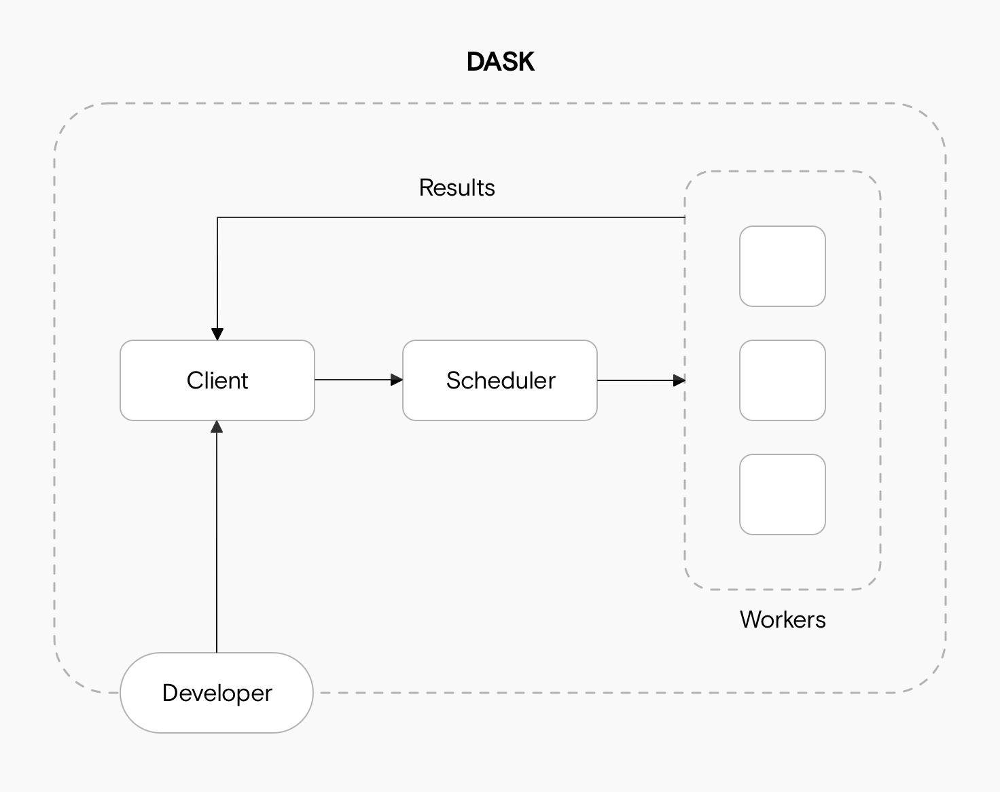 

### Setting up a Local Cluster

A `LocalCluster` runs all components on a single node and is useful for development and small-scale parallel workloads.

For this we need to set up a `LocalCluster` using `dask.distributed` and connect a `client` to it.

```
from dask.distributed import LocalCluster, Client

cluster = LocalCluster(
    n_workers=4,          
    threads_per_worker=2,
    memory_limit='auto'
)
cluster
```
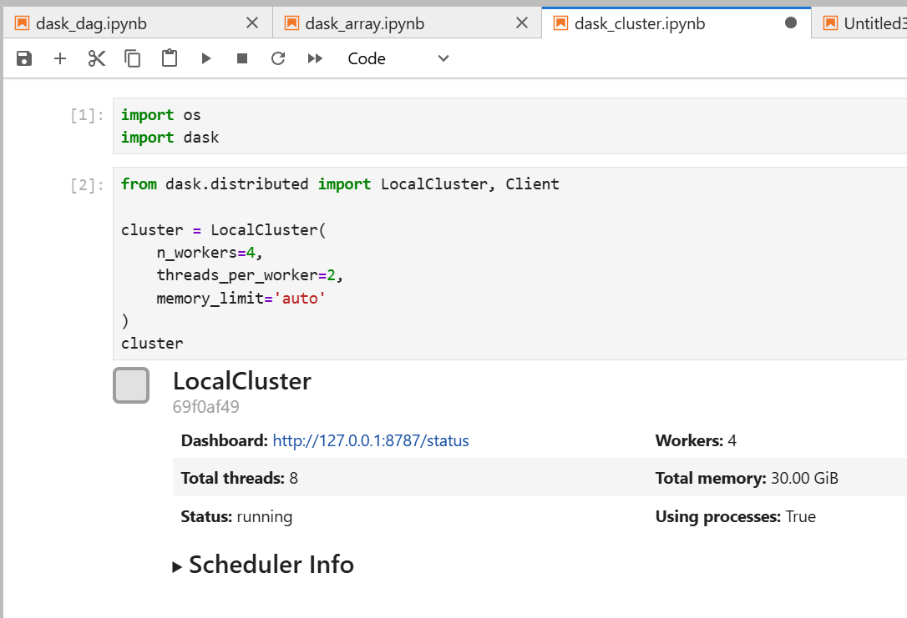 

If no arguments are provided, Dask will automatically configure workers based on available CPU cores and memory. In an Open OnDemand Jupyter session, this corresponds to the resources requested for that session.

```{note}
`LocalCluster()` takes a lot of optional arguments, allowing you to configure the number of processes/threads, memory limits and other settings.
```

And then we create a `client` to connect to our cluster, passing the `Client` function the cluster object.

```
client = Client(cluster)
client
```
From here, you can continue to run `Dask` commands as normal.

When finished, close the client to release resources:
```
client.close()
```

## Dask Dashboard

Dask comes with a really handy interface: the Dask Dashboard. It is a web interface that provides real-time insights into task execution, CPU and memory usage and worker activity. You can retrieve the dashboard link using:

```
client
```
And in the dropdown menu on *Cluster Info*:
```
Dashboard http://127.0.0.1:8787/status
Total threads: 2
Status: running
Workers: 4
Using processes: True
```
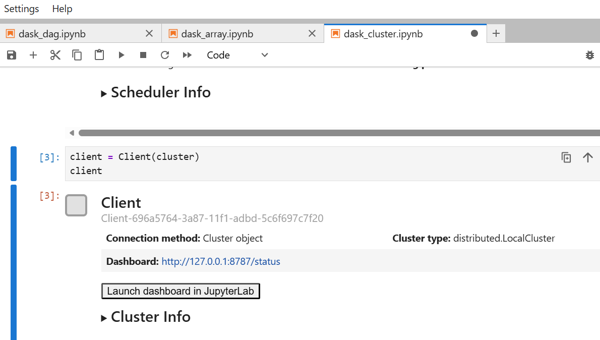 


You can also find your cluster dashboard link using :
```
cluster.dashboard_link
```

Direct access to this link will not work in an Open OnDemand session. Instead, the dashboard must be accessed through the Jupyter proxy. For this append `/proxy/8787/status` to you current session's url like such:
`https://<ood-session-url>/proxy/8787/status`

Example: 
`https://ondemand.rc.colorado.edu/node/<node-name>/<port-number>/proxy/8787/status`

We will use the [JupyterLab plugin for Dask](https://github.com/dask/dask-labextension) to access the dashboard. This extension provides a graphical interface for launching clusters and viewing embedded dashboard panels directly within JupyterLab. Because JupyterLab extensions are tied to specific environments, you will need to create and use a dedicated Conda environment with the extension installed.

Step 1: Create a Conda Environment

```
module load anaconda
conda create -n dask_lab_env python=3.10 -y
conda activate dask_lab_env
```

Step 2: Install Required Packages

```
(dask_lab_env)[johndoe@c3cpu-a5-u11-1 ~]$ conda install -c conda-forge jupyterlab dask distributed
```
Then you can install the [JupyterLab plugin for Dask](https://github.com/dask/dask-labextension)
```
(dask_lab_env)[johndoe@c3cpu-a5-u11-1 ~]$ conda install -c conda-forge nodejs
(dask_lab_env)[johndoe@c3cpu-a5-u11-1 ~]$ conda install -c conda-forge dask-labextension
```

Step 3: Launch a Jupyter Session using your custom environment

Once your environment is set up, launch a Jupyter Session using the `dask_lab_env` environment that includes the extension. 

Refer to the documentation here for detailed instructions on selecting and launching a [jupyter session with custom Conda environment](../open_ondemand/jupyter_session.md#launching-a-jupyter-session-using-my-conda-env-conda-environment)

Step 4: Use the Extension

After launching JupyterLab, open the Dask tab from the left sidebar. 
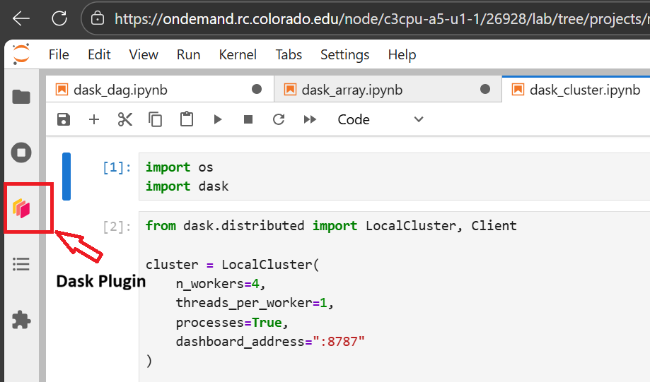 

From there, add the url to connect to the dashboard. You will just need too look at the html link you have for your jupyterlab, and Dask dashboard port number, as highlighted in the figure below.

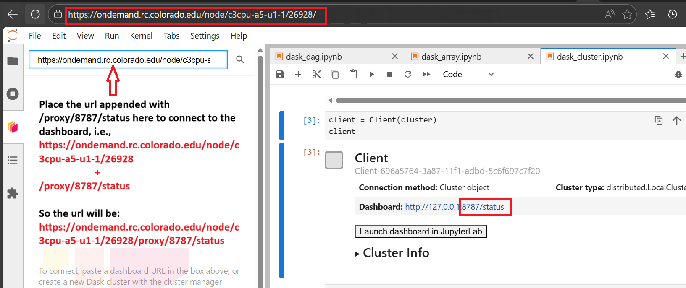 

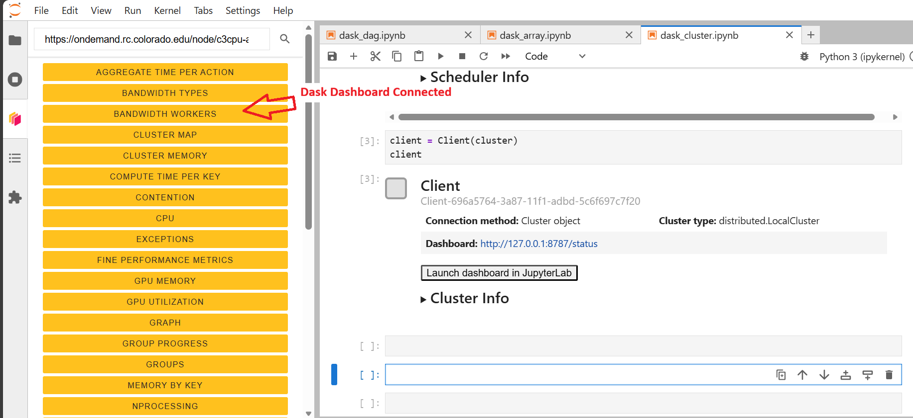 

You can click on any of the orange panels shown in the figure and drag them to arrange the layout as needed. This makes it much easier to understand how your computation is progressing and how tasks are distributed across workers.

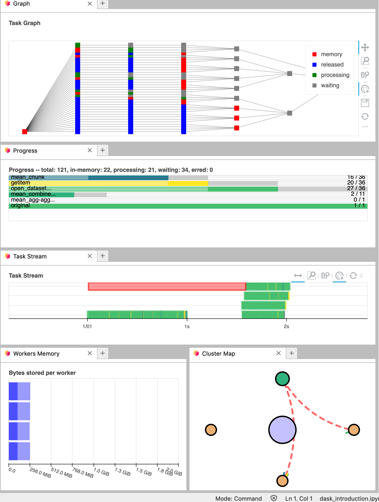 

There’s much to say about interpreting the Dask dashboard’s diagnostics. We recommend this documentation to understand the [basics of the dashboard diagnostics](https://docs.dask.org/en/latest/dashboard.html#dashboard-memory) and [this video](https://www.youtube.com/watch?v=N_GqzcuGLCY) as a deeper dive into the dashboard’s functions.

## Example: Estimating π with NumPy and Dask

In this example, we estimate the value of π using a Monte Carlo method. The initial implementation uses NumPy and runs serially.

This approach avoids explicit Python loops by leveraging vectorized NumPy operations. The computation generates random (x, y) points and determines how many fall inside the unit circle. As the number of sampled points increases, the estimate of π improves.

```
import numpy as np

def calculate_pi(size_in_bytes):
    
    """Calculate pi using a Monte Carlo method."""
    
    rand_array_shape = (int(size_in_bytes / 8 / 2), 2)
    
    # 2D random array with positions (x, y)
    xy = np.random.uniform(low=0.0, high=1.0, size=rand_array_shape)
    
    # check if position (x, y) is in unit circle
    xy_inside_circle = (xy ** 2).sum(axis=1) < 1

    # pi is the fraction of points in circle x 4
    pi = 4 * xy_inside_circle.sum() / xy_inside_circle.size

    print(f"\nfrom {xy.nbytes / 1e9} GB randomly chosen positions")
    print(f"   pi estimate: {pi}")
    print(f"   pi error: {abs(pi - np.pi)}\n")
    
    return pi
```

Run the function:
```
%time calculate_pi(10000)
```
This execution is entirely serial and runs on a single core.

Output:
```
from 1e-05 GB randomly chosen positions
   pi estimate: 3.072
   pi error: 0.06959265358979305

CPU times: user 2.06 ms, sys: 1.44 ms, total: 3.5ms
Wall time: 2.78 ms

3.072
```

Let's parallelize this with Dask

Dask can parallelize this computation without modifying the original function. By using `dask.delayed`, we construct a task graph that represents the computation.

```
from dask.distributed import Client
import dask

client = Client(n_workers=2, threads_per_worker=2, memory_limit="auto")

dask_calpi = dask.delayed(calculate_pi)(10000)
```
At this stage, the computation has not yet been executed. The delayed object defines the task, but execution is deferred.

To run the computation, use `dask.compute`:

```
%time dask.compute(dask_calpi)
```

Dask provides tools to visualize how computations are structured. This can help identify parallelism and bottlenecks.

```
dask.visualize(dask_calpi)
```

```{note}
To use `dask.visualize` within JupyterLab, install the required dependency: `conda install ipycytoscape`.
```

The resulting graph shows a single task, indicating that no parallelism is being utilized.

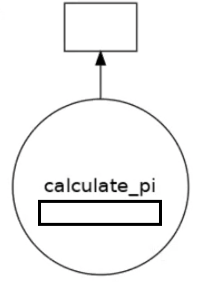 

To take advantage of parallel execution, the workload must be split into multiple independent tasks. This can be done by invoking the function multiple times with different inputs.

```
results = []

for i in range(5):
    dask_calpi = dask.delayed(calculate_pi)(10000 * (i + 1))
    results.append(dask_calpi)

dask.visualize(results)

# Execute all tasks
# dask.compute(*results)
```

This produces a task graph with multiple independent tasks that can be executed concurrently across available workers.

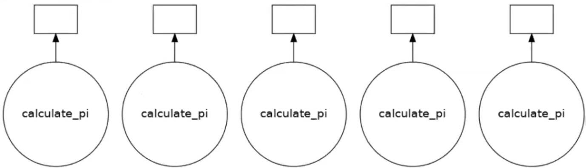 


## Dask Arrays

Dask Arrays are basically parallelized version of NumPy arrays for processing *larger-than-memory* data sets. Each of these NumPy arrays within the `dask.array` is called a chunk. Choosing how these chunks are arranged within the `dask.array` and their size can significantly affect the performance of our code. 

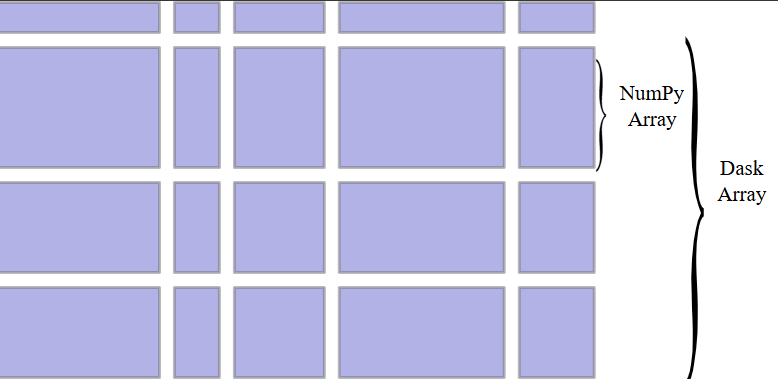 


In the following example, we create a large random array using Dask and explicitly define how the array is divided into chunks.

```
import dask.array as da
x = da.random.random((10000, 10000), chunks=(1000, 1000))
```
The array has a total shape of 10,000 by 10,000, and it is divided into chunks of size 1,000 by 1,000. This means the full array is broken into multiple smaller blocks that can be processed independently.

At this stage, no computation is performed. Dask only constructs a task graph that describes how the array should be computed. 

### Lazy Computation

We now define a computation on the array by combining it with its transpose and computing the mean.
```
y = (x + x.T).mean()
```
This operation creates a new expression that includes element-wise addition and a reduction step. However, no actual numerical computation is executed at this point. Instead, Dask continues to build the task graph that represents the computation. This lazy evaluation model allows Dask to optimize and schedule work before any data is loaded into memory.

To execute the computation and obtain a result, we explicitly call the compute method.
```
y.compute()
```

When this function is called, Dask evaluates the task graph by dividing the work into chunks, distributing the computation across available workers, executing tasks in parallel, and finally combining the intermediate results into a single output.

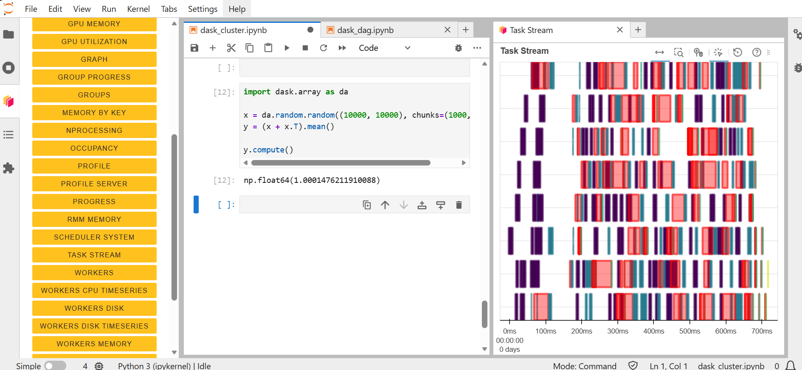 


If you want a a more complex workflow involving multiple chained operations, use the following example:

```
x = da.random.random((20000, 20000), chunks=(2000, 2000))
y = (x + x.T).mean(axis=0)
z = y.std()

result = z.compute()
result
```

Here we first create a large 20,000 by 20,000 random array and divide it into chunks of 2,000 by 2,000. This results in a grid of independent blocks that can be processed in parallel. Then compute the sum of the array and its transpose, followed by a mean across axis 0. This operation reduces the dimensionality of the dataset but still remains in a lazy state. We perform a second transofrmation, computing the standard deviation of the intermediate result. Finally, we call compute on the result. 

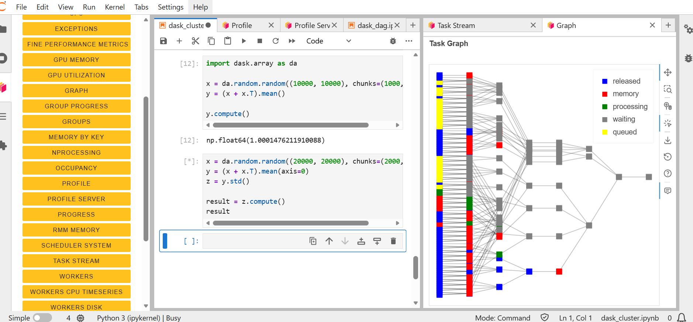 


### Blocked Algorithms
Dask Arrays are implemented using blocked algorithms. These algorithms break up a computation on a large array into many computations on smaller pieces of the array. This minimizes the memory load (amount of RAM) of computations and allows for working with larger-than-memory datasets in parallel.

Let’s see what this means in an example:

```
x = da.random.random(20, chunks=5)
result = x.sum()

result.compute()
# result.visualize() #uncomment to visualise it
```
This will generate a random array, and it will automatically create the tasks, and from there the sums will be parallelised. This is similar to what you would see in MPI, but much easier to implement.

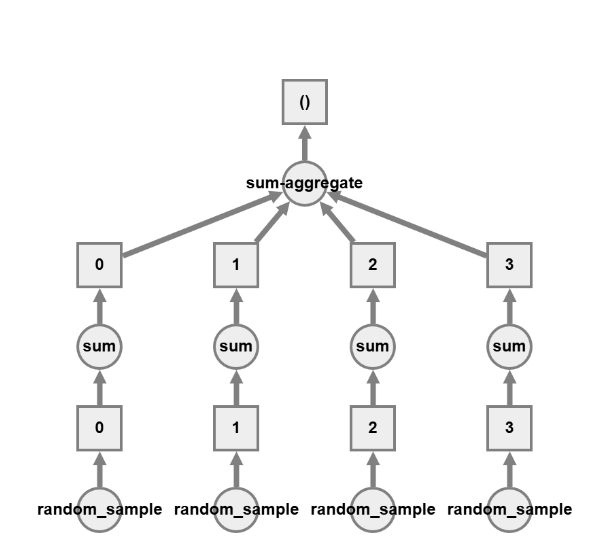 

## Dask Dataframes

When we analyze tabular data, we usually start our analysis by loading it into memory as a Pandas DataFrame. But what if this data does not fit in memory? In such cases, Dask’s scalable alternative to a Pandas DataFrame is the `dask.dataframe`. A `dask.dataframe` comprises many `pd.DataFrames`, each containing a subset of rows of the original dataset. We call each of these pandas pieces a partition of the `dask.dataframe`.

In short: Dask DataFrames extend pandas for parallel and *out-of-core* data processing.

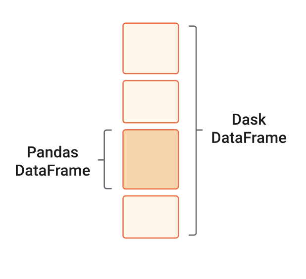 

A simple example for this would be:

1. Creating a Dask DataFrame
```
import dask.dataframe as dd
df = dd.read_csv("data/file.csv")
df
```
This creates a lazy DataFrame composed of many partitions.

2. Then we can perform some basic operations:
```
#filter operation
filtered = df[df["column"] > 10]

# Groupby operation
grouped = filtered.groupby("category").mean()
grouped
```
Keep in mind that nothing is computed yet.

3. To trigger Computation:
```
result = grouped.compute()
```

Now Dask processes each partition in parallel and combines results. 

```{tip}
Before calling compute on an object, open the Dask dashboard to see how the parallel computation is happening.
```