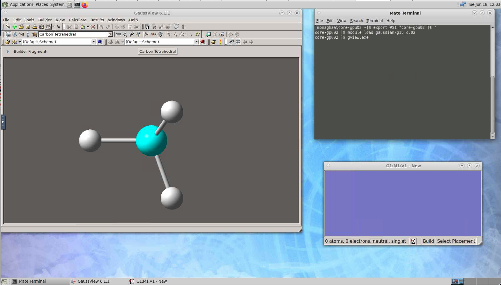

# Gaussian

__Important:__ Gaussian is available on Alpine and Blanca, only to members of universities that have purchased Gaussian licenses. It cannot be run by other users. Please note and abide by the licensing, rights, and citation information shown at the top of your Gaussian output files.

This document describes how to run G16 jobs efficiently on Alpine. It does not attempt to teach how to use Gaussian for solving science/engineering questions.

Good general instructions can be found [here](http://gaussian.com/running/); however some minor modifications are needed when running on Alpine.

## Running G16

### Quick notes on configuration

_Software environment:_ To set up your environment to use G16, load the Gaussian software module (`module load gaussian/g16_c.02`). You do
not need to source g16.login or g16.profile!

_Scratch storage:_ It is important to specify `GAUSS_SCRDIR` to tell G16 where to put its large scratch files. These should always be on a [scratch storage system](../compute/filesystems.md) (`/scratch/alpine/$USER` on Alpine or `rc_scratch/$USER` on Blanca). 

_Memory:_ The default dynamic memory request in G16 is frequently too small to support the amount of memory that needs to be allocated to efficiently
support computations on even modest-sized molecules. If too little memory is requested, the job can crash. Thus, use the '-m' flag in
your g16 command line (e.g. `-m=48gb`) to specify at least 50% of the amount of memory your Slurm job has requested.

### Single-node parallel jobs (SMP)

Many G16 functions scale well to 8 or more cores on the same node. You can specify how many cores to use via the '-p' flag to g16 (e.g. `-p=64`). This value should correspond to the number of cores that your Slurm job has requested. You should test your G16 computations with several different core counts to see how well they scale, as there may be diminishing returns beyond a certain number of cores.  The batch script below demonstrates how to run `g16` on a single node with multiple cores. A sample input file is at the bottom of this documentation page.

__Example SMP job script:__

```bash
#!/bin/bash

#SBATCH --job-name=g16-test
#SBATCH --partition=amilan
#SBATCH --nodes=1
#SBATCH --ntasks-per-node=1
#SBATCH --cpus-per-task=64
#SBATCH --time=00:50:00
#SBATCH --output=g16-test.%j.out

# load gaussian c.02
module purge
module load gaussian/g16_c.02

# Always specify a scratch directory on a fast storage space
# (not /home or /projects!)
export GAUSS_SCRDIR=/scratch/alpine/$USER/$SLURM_JOBID
mkdir $GAUSS_SCRDIR

# the next line prevents OpenMP parallelism from conflicting
# with Gaussian's internal parallelization
export OMP_NUM_THREADS=1

# run gaussian!
g16 -m=20gb -p=${SLURM_CPUS_PER_TASK} my_input.com

```


### Multi-node parallel jobs (Linda)

In order to run on more than 64 cores in the "amilan" partition on Alpine, your job will need to span multiple nodes using the Linda network parallel communication model. We advise using one Linda worker per node, with multiple (up to 64) SMP cores per node. The nodes on which `g16` will run will be determined once the job starts, before invoking `g16` The batch script example below demonstrates how to run `g16` across multiple nodes. A sample input file is at the bottom of this documentation page.

__Example Linda Parallel job script__

```bash
#!/bin/bash

#SBATCH --job-name=g16-test
#SBATCH --partition=amilan
#SBATCH --nodes=2
#SBATCH --ntasks-per-node=1
#SBATCH --cpus-per-task=64
#SBATCH --time=00:50:00
#SBATCH --output=g16-test.%j.out

# load gaussian c.02
module purge
module load gaussian/g16_c.02

for n in `scontrol show hostname | sort -u`; do
 echo ${n}
done | paste -s -d, > tsnet.nodes.$SLURM_JOBID

# Always specify a scratch directory on a fast storage space
# (not /home or /projects!)
export GAUSS_SCRDIR=/scratch/alpine/$USER/$SLURM_JOBID
mkdir $GAUSS_SCRDIR

# the next line prevents OpenMP parallelism from conflicting
# with Gaussian's internal parallelization
export OMP_NUM_THREADS=1

# the next line increases the verbosity of Linda output messages
export GAUSS_LFLAGS="-v"

# run gaussian!
g16 -m=20gb -p=${SLURM_CPUS_PER_TASK} -w=`cat tsnet.nodes.$SLURM_JOBID` my_input.com

# remove nodefile 
rm tsnet.nodes.$SLURM_JOBID
```

_Note:_ Not all G16 computations scale efficiently beyond a single node! According to the G16 documentation: "HF, CIS=Direct, and DFT calculations are Linda parallel, including energies, optimizations, and frequencies. TDDFT energies and gradients and MP2 energies and gradients are also Linda parallel. Portions of MP2 frequency and CCSD calculations are Linda parallel." As with SMP parallelism, testing the scaling of your Linda parallel computation is very important.

### G16 on Alpine NVIDIA GPUs

Please see the [Gaussian GPU documentation](https://gaussian.com/running/?tabid=5)] for information on how configure Gaussian input files to run on GPUs. CURC presently does not have example job scripts for running Gaussian on GPUs. The Gaussian GPU documentation will also enable you to determine whether the A100 GPUs in Alpine's "aa100" partition will be effective for your calculations. In many cases, SMP parallelization across all of the cores in an amilan node will provide better speedup than offloading computational work to a GPU.  

_Note:_ G16 can not use the AMD MI100 GPUs in Alpine's "ami100" partition.

## Running GaussView

Gaussview can be run within a [Core Desktop session in CURC OnDemand](../gateways/OnDemand.md#core-desktop-remote-desktop).  Once you've spawned a Core Desktop session, do the following to invoke `GaussView`:

_Step 1:_ Open a terminal by selecting the "MATE Terminal" icon in the upper menu bar.

_Step 2:_ Type the following in the terminal to load and invoke `GaussView`: 

```
$ module load gaussian/g16_c.02
$ gview.exe
```

...this will start the `GaussView` graphical user interface.  Your screen should look similar to the following example: 



## Sample input file

Here's an input file, `my_input.com`, that can be used for testing:

```
#P b3lyp/6-31g* test stable=(opt,qconly)

Gaussian Test Job 135:
Fe=O perpendicular to ethene, in triplet state.

0 3
X
Fe X  RXFe
C1 X  RXC  Fe  90.
C2 X  RXC  Fe  90.  C1  180.
O  X  RXO  C1  90.  Fe	0.
H1 C1 RCH  C2 CCH   Fe  Angle1
H2 C1 RCH  C2 CCH   Fe -Angle1
H3 C2 RCH  C1 CCH   Fe  Angle2
H4 C2 RCH  C1 CCH   Fe -Angle2

RXFe  1.7118
RXC   0.7560
RXO   3.1306
RCH   1.1000
Angle1 110.54
Angle2 110.53
CCH   117.81
```

