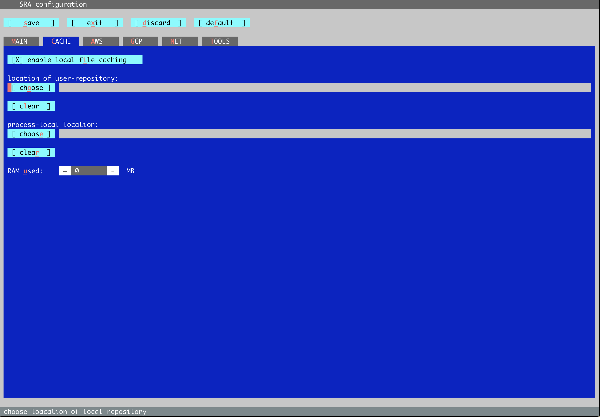

# SRA Toolkit on Alpine

SRA Toolkit provides tools for downloading data, converting data into SRA format, and extracting SRA data into other data formats.

## Loading the Module

From an Alpine compute node:
``` bash
module load sra-toolkit
```

## Configuring SRA Toolkit 

Some SRA Toolkit commands, such as `fasterq-dump`, generate large temporary files that are approximately the size of the final output file(s). SRA Toolkit writes these 
temporary, 
or cache, files to `/home/$USER`. CURC `/home/$USER` is limited to 2 GB, so users must direct this cache somewhere else. We recommend `/scratch/alpine`, since each user has up 
to 10 TB and it is automatically purged every 90 days. 

Users should redirect the cache using SRA Toolkit's `vdb-config -i`. Settings are saved and persist across sessions, so this is only necessary the first time you run SRA 
Toolkit on CURC Alpine.

Before running the configuration command, create an `sra` directory in your scratch space.

``` bash
mkdir /scratch/alpine/$USER/sra
```
This directory must be empty, so don't add anything to it.

Now start the `vdb-config` program.

``` bash
module load sra-toolkit
vdb-config -i
```

A configuration window will open in your terminal.

 

Navigate to the CACHE tab using your tab key. Press enter when the red cursor lands on CACHE. Keep pressing tab until the red cursor is on `location of user-repository: [ 
choose ]`. 



Press enter. A `select directory` window will appear.


Tab over to `[ Goto ]` and press enter. A new pop-up window will appear. Delete the existing file path (e.g., `/home/lrf20@xsede.org`) using your delete/backspace key and enter 
the absolute path of your new `sra` cache directory. 

`vdb-config -i` requires your specified directory to exist (it won't create it for you) and be an *empty* directory. You must also have read/write permissions. The program will 
not save your selection if these criteria aren't met. 


Tab over to `[ OK ]` and press enter. Confirm the directory listed at the top of the 'select directory' window says `/scratch/alpine/<your username/sra>` Tab over to `[ OK ]` 
and press enter.


A window asking you to confirm the change will appear. Select `[ yes ]`.


Tab over to `[ save ]` and press enter. A window will appear telling you the changes have been saved successfully. Select `[ ok ]`.

Tab to `[ exit ]` and press enter.

SRA Toolkit is ready for use!

## Common SRA Toolkit Issues

- Download errors are common with commands like `prefetch`, `fasterq-dump`, and `hisat2`, as the NCBI SRA server can be overwhelmed. 


