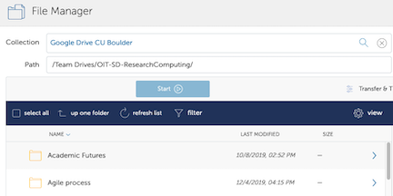
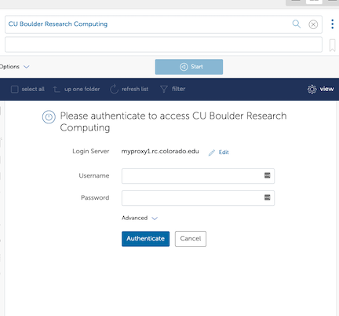
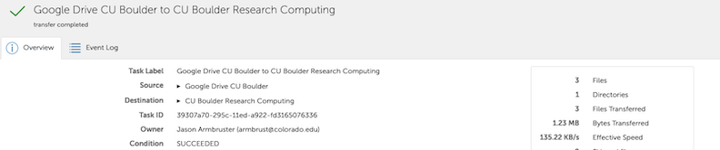

# Data Transfer between Google Drive and PetaLibrary

## Using Globus

### Step 1: Log into the Globus Web App
Visit https://app.globus.org and log in with your Colorado.edu credentials


### Step 2: Open your Google Drive (left pane)
In the Collection search (left pane) enter: Google Drive CU Boulder - this should show your Google Drive contents

* If you'd like to transfer from Team Drives click the "Up One Directory" button and then select Team Drives



### Step 3: Open CURC (right pane)
In the Collection search (right pane) enter: CU Boulder Research Computing

* You'll be asked to log in using your CURC Credentials - after clicking Authenticate you should receive a Duo push on your Duo device which you will need to confirm



* Once Authenticated you should see your CURC home directory - to access Petalibrary click "Up One Directory" and then select /pl


### Step 4: Select files/folders from Google Drive to be transferred and initiate the transfer
* In the left pane, select the file or folder you'd like to transfer and click Start - this will initiate a Globus Transfer job


* View progress of your transfer under the Activity tab in the Globus App



## Using RClone

### Step 1: Login to a compile node on Alpine

* Login to Alpine
* Load module Slurm, then start a compile job, then load module rclone
   ```
   $ module load slurm
   $ acompile
   $ module load rclone
   ```
* To test, run `rclone --version` at your prompt; if the software is installed a version number will be reported back to you, similar to:

   ```
   $ rclone --version
   rclone v1.58.0
   ```

### Step 2: configure google drive remote configuration

_Note: the steps below are also outlined in the [Rclone Documentation for Google Drive](https://rclone.org/drive/). We only list the critical steps. If a step is left out, assume you can select the default setting._

* Type `rclone config` to create a new profile for transferring files between Google Drive and PetaLibrary
* When prompted for whether to configure a “new” or “existing” profile type `n` for "new remote"
* When prompted to name the new profile provide any descriptive name you like (e.g., `gdrive_johndoe_cu`)
* When prompted for the type of storage to configure, select the number of the option for "Google Drive" (e.g., the number is "17" for _rclone_ v1.58.0)
* When prompted for Client ID, leave the field blank
* When prompted for Client Secret, leave the field blank
* When prompted for scope that rclone should use when requesting access from Drive enter '1' for full drive access
* When prompted for root_folder_id, leave the field blank unless you'd like to specify a different root folder
* When prompted for service_account_file, leave the field blank
* When prompted to edit advanced config, choose "N" for no (default)
* When prompted for "Use Auto config?” choose "N" for no (default). Rclone will print a command in the form of:
   ```
   $ rclone authorize "drive" "<token>"
   ```
   Copy this command and run it on your local machine (rclone must be installed). This will open your web browser to authenticate with your Google account.
* Once you are in your browser, you may be asked to authenticate to your Google account, and then you will be asked to allow Rclone to access the files in your `gdrive`. Complete this step to grant access.  If successful you'll receive a "success" message. 
* On your local machine, rclone will print out a token. Copy everything between the arrows as directed and paste in the config_token field in your Alpine terminal
* When prompted for whether you want to configure this as a Shared Drive (Team Drive). Choose the appropriate answer; if this is your personal Drive account then choose `no` (default)
* Finally, you will be prompted to review the configuration and confirm whether it is okay. If everything looks okay, choose `yes` (default)
* Now type `q` to quit the configuration. 

#### Now test your Google Drive remote!

On your local machine type:
```bash
$ rclone ls gdrive_johndoe_cu
```
If this step fails, your Google Drive remote is not configured properly. Try reconfiguring your Google Drive remote again or contact rc-help@colorado.edu for assistance.

### Step 3: Create your PetaLibrary remote configuration

See instructions for creating an [Rclone remote configuration for PetaLibrary](./rclone.html#configure-rclone)


* [Rclone documentation](https://rclone.org/)
* [CURC data transfer documentation](../../compute/data-transfer.html)

